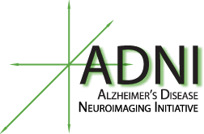

## Project Summary

The aim of this project is to model Alzheimer's Disease with the ultimate goal of predicting whether or not a patient has or will ever develop the disease from the diverse data available in the Alzheimer’s Disease Neuroimaging Initiative (ADNI). More specifically, we hope to answer the question:

> What are the key clinical, genetic, and biospecimen-related features that can predict whether an individual has developed or will develop Alzheimer’s Disease at later point in time? 

A 2015 report by the World Health Origanization estimated 29.8 million people with Alzheimer's Disease. Researchers have intensely studied both Alzheimer's Disease and the ADNI study since the  the onset of the study in 2004. The ADNI data set appears in the analyses of more than 1000 publications. As such, other studies have well-characterized many of the key biological correlates of Alzheimer's Disease from ADNI such the Amyloid-beta and Tau proteins. We therefore took a more wholistic approach, attempting characterize the complete data set with an additional emphasis on lesser-known or weaker predictors of the disease.

{:.center}

## Principal Challenges and Features

The scope of the ADNI study spans 14 years, 63 clincal sites and a diversity of measures including neuroimaging, cognitive tests, genetic screenings, chemical profiling, and patient history. The nature of the data and data collection presents unique challenges in modeling the disease. These challenges and our approaches to solving them are outlined here but are detailed in their respective sections. Briefly, we aimed to address the following in this project:

- **Data Cleaning** - The ADNI data is distributed throughout hundreds of raw data files with inconsistent formats. In the section, we: research the raw data, separate the relevant data from meta data, standardize data types for continuous and categorical data, convert all missing values to a standard indicator

- **Data Aggregation** - The ADNI data is organized in a longitudinal format with a single observation corresponding to a single visit for a particular patient. In this section, we: identify and compare methods for converting the data from a longitudinal format to a format with a single entry per patient.

- **Imputation** - Many of values are missing in the per patient data set above. In this section we compare methods for filtering and imputing the data to generate complete design matrices ready for modeling.

- **Modeling** - With the data cleaned, aggregated by patient, and imputed to replace missing values, we train and compare the performance of Random Forest and ADA Boost models in predicting Alzheimer's Disease diagnoses.
