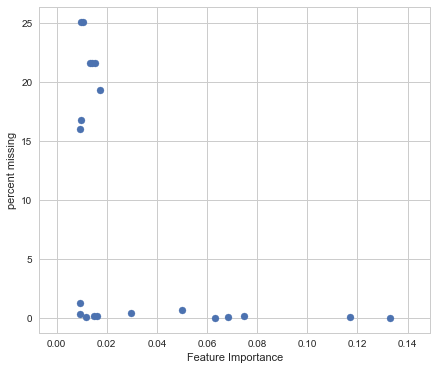
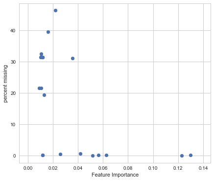
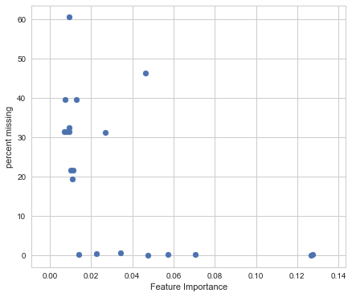

title: 
notebook: 
section: 
subsection: 

## Contents
{:.no_toc}
*  
{: toc}

## Modeling with Random Forest
(Shristi Pandey)


```python
import pandas as pd 
import datetime
import numpy as np 
import scipy as sp
from scipy.stats import mode
import matplotlib
import matplotlib.pyplot as plt
import seaborn as sns
import missingno as msno
from pandas.plotting import scatter_matrix
from sklearn.metrics import mean_squared_error
from sklearn.model_selection import train_test_split
from sklearn.model_selection import cross_val_score
from sklearn.utils import resample
from sklearn.ensemble import RandomForestClassifier
from sklearn.model_selection import RandomizedSearchCV
from sklearn.model_selection import GridSearchCV
import matplotlib.pyplot as plt

from sklearn.metrics import accuracy_score

%matplotlib inline

import seaborn as sns
sns.set(style='whitegrid')
pd.set_option('display.width', 1500)
pd.set_option('display.max_columns', 100)
```


```python
data_b4_impute = pd.read_csv("../data/Per_Patient/pat_merge_b4_impute.csv")
data_model_50pc = pd.read_csv("../data/Imputed/data_modeled_upto_50pct_missing.csv")
data_model_30pc = pd.read_csv("../data/Imputed/data_modeled_upto_30pct_missing.csv")
data_model_100pc = pd.read_csv("../data/Imputed/data_modeled_upto_100pct_missing.csv")
data_mean_30pc = pd.read_csv("../data/Imputed/data_mean_upto_30pct_missing.csv")
data_mean_50pc = pd.read_csv("../data/Imputed/data_mean_upto_50pct_missing.csv")
```


```python
print(data_b4_impute.shape)
print(data_mean_50pc.shape)
print(data_model_50pc.shape)
```


    (2065, 178)
    (2065, 166)
    (2065, 170)
    


```python
data_mean_50pc.describe()
```


<div>
<style scoped>
    .dataframe tbody tr th:only-of-type {
        vertical-align: middle;
    }

    .dataframe tbody tr th {
        vertical-align: top;
    }

    .dataframe thead th {
        text-align: right;
    }
</style>
<table border="1" class="dataframe">
  <thead>
    <tr style="text-align: right;">
      <th></th>
      <th>RID</th>
      <th>AGE</th>
      <th>PTEDUCAT</th>
      <th>APOE4</th>
      <th>FDG</th>
      <th>AV45</th>
      <th>ABETA</th>
      <th>TAU</th>
      <th>PTAU</th>
      <th>CDRSB</th>
      <th>ADAS11</th>
      <th>ADAS13</th>
      <th>ADASQ4</th>
      <th>MMSE</th>
      <th>RAVLT_immediate</th>
      <th>RAVLT_learning</th>
      <th>RAVLT_forgetting</th>
      <th>RAVLT_perc_forgetting</th>
      <th>LDELTOTAL</th>
      <th>TRABSCOR</th>
      <th>FAQ</th>
      <th>MOCA</th>
      <th>EcogPtMem</th>
      <th>EcogPtLang</th>
      <th>EcogPtVisspat</th>
      <th>EcogPtPlan</th>
      <th>EcogPtOrgan</th>
      <th>EcogPtDivatt</th>
      <th>EcogPtTotal</th>
      <th>EcogSPMem</th>
      <th>EcogSPLang</th>
      <th>EcogSPVisspat</th>
      <th>EcogSPPlan</th>
      <th>EcogSPOrgan</th>
      <th>EcogSPDivatt</th>
      <th>EcogSPTotal</th>
      <th>Ventricles</th>
      <th>Hippocampus</th>
      <th>WholeBrain</th>
      <th>Entorhinal</th>
      <th>Fusiform</th>
      <th>MidTemp</th>
      <th>ICV</th>
      <th>mPACCdigit</th>
      <th>mPACCtrailsB</th>
      <th>Month</th>
      <th>APGEN1</th>
      <th>APGEN2</th>
      <th>BCVOMIT</th>
      <th>BCENERGY</th>
      <th>...</th>
      <th>HMT40</th>
      <th>HMT15</th>
      <th>RCT6</th>
      <th>RCT392</th>
      <th>HMT13</th>
      <th>HMT19</th>
      <th>RCT20</th>
      <th>RCT8</th>
      <th>RCT12</th>
      <th>HMT9</th>
      <th>RCT29</th>
      <th>HMT18</th>
      <th>RCT11</th>
      <th>BAT126</th>
      <th>HMT102</th>
      <th>RCT14</th>
      <th>MH9ENDO</th>
      <th>MH7DERM</th>
      <th>MH15DRUG</th>
      <th>MH4CARD</th>
      <th>MH18SURG</th>
      <th>MH16SMOK</th>
      <th>MH11HEMA</th>
      <th>MH13ALLE</th>
      <th>MH12RENA</th>
      <th>MH3HEAD</th>
      <th>MH17MALI</th>
      <th>MH10GAST</th>
      <th>MHPSYCH</th>
      <th>MH6HEPAT</th>
      <th>MH5RESP</th>
      <th>MH14ALCH</th>
      <th>MH2NEURL</th>
      <th>MH8MUSCL</th>
      <th>HMSCORE</th>
      <th>MMSCORE</th>
      <th>NXVISUAL</th>
      <th>NXAUDITO</th>
      <th>NXMOTOR</th>
      <th>NXCONSCI</th>
      <th>NXFINGER</th>
      <th>NXABNORM</th>
      <th>NXNERVE</th>
      <th>NXTREMOR</th>
      <th>NXGAIT</th>
      <th>NXOTHER</th>
      <th>NXPLANTA</th>
      <th>NXSENSOR</th>
      <th>NXTENDON</th>
      <th>NXHEEL</th>
    </tr>
  </thead>
  <tbody>
    <tr>
      <th>count</th>
      <td>2065.000000</td>
      <td>2065.000000</td>
      <td>2065.000000</td>
      <td>2065.000000</td>
      <td>2065.000000</td>
      <td>2065.000000</td>
      <td>2065.000000</td>
      <td>2065.000000</td>
      <td>2065.000000</td>
      <td>2065.000000</td>
      <td>2065.000000</td>
      <td>2065.000000</td>
      <td>2065.000000</td>
      <td>2065.000000</td>
      <td>2065.000000</td>
      <td>2065.000000</td>
      <td>2065.000000</td>
      <td>2065.000000</td>
      <td>2065.000000</td>
      <td>2065.000000</td>
      <td>2065.000000</td>
      <td>2065.000000</td>
      <td>2065.000000</td>
      <td>2065.000000</td>
      <td>2065.000000</td>
      <td>2065.000000</td>
      <td>2065.000000</td>
      <td>2065.000000</td>
      <td>2065.000000</td>
      <td>2065.000000</td>
      <td>2065.000000</td>
      <td>2065.000000</td>
      <td>2065.000000</td>
      <td>2065.000000</td>
      <td>2065.000000</td>
      <td>2065.000000</td>
      <td>2065.000000</td>
      <td>2065.000000</td>
      <td>2065.000000</td>
      <td>2065.000000</td>
      <td>2065.000000</td>
      <td>2065.000000</td>
      <td>2065.000000</td>
      <td>2065.000000</td>
      <td>2065.000000</td>
      <td>2065.0</td>
      <td>2065.000000</td>
      <td>2065.000000</td>
      <td>2065.000000</td>
      <td>2065.000000</td>
      <td>...</td>
      <td>2065.000000</td>
      <td>2065.000000</td>
      <td>2065.000000</td>
      <td>2065.000000</td>
      <td>2065.000000</td>
      <td>2065.000000</td>
      <td>2065.000000</td>
      <td>2065.000000</td>
      <td>2065.000000</td>
      <td>2065.000000</td>
      <td>2065.000000</td>
      <td>2065.000000</td>
      <td>2065.000000</td>
      <td>2065.000000</td>
      <td>2065.000000</td>
      <td>2065.000000</td>
      <td>2065.000000</td>
      <td>2065.000000</td>
      <td>2065.000000</td>
      <td>2065.000000</td>
      <td>2065.000000</td>
      <td>2065.000000</td>
      <td>2065.000000</td>
      <td>2065.000000</td>
      <td>2065.000000</td>
      <td>2065.000000</td>
      <td>2065.000000</td>
      <td>2065.000000</td>
      <td>2065.000000</td>
      <td>2065.000000</td>
      <td>2065.000000</td>
      <td>2065.000000</td>
      <td>2065.000000</td>
      <td>2065.000000</td>
      <td>2065.000000</td>
      <td>2065.000000</td>
      <td>2065.000000</td>
      <td>2065.000000</td>
      <td>2065.000000</td>
      <td>2065.000000</td>
      <td>2065.00000</td>
      <td>2065.000000</td>
      <td>2065.000000</td>
      <td>2065.000000</td>
      <td>2065.000000</td>
      <td>2065.000000</td>
      <td>2065.000000</td>
      <td>2065.000000</td>
      <td>2065.000000</td>
      <td>2065.000000</td>
    </tr>
    <tr>
      <th>mean</th>
      <td>3184.250363</td>
      <td>0.512990</td>
      <td>0.752603</td>
      <td>0.474576</td>
      <td>0.536265</td>
      <td>0.319630</td>
      <td>0.518807</td>
      <td>0.169792</td>
      <td>0.175688</td>
      <td>0.145956</td>
      <td>0.254211</td>
      <td>0.299899</td>
      <td>0.500679</td>
      <td>0.783051</td>
      <td>0.514344</td>
      <td>0.621096</td>
      <td>0.749577</td>
      <td>0.910976</td>
      <td>0.336693</td>
      <td>0.387486</td>
      <td>0.127323</td>
      <td>0.759982</td>
      <td>0.334067</td>
      <td>0.224522</td>
      <td>0.113264</td>
      <td>0.120317</td>
      <td>0.157714</td>
      <td>0.248965</td>
      <td>0.220020</td>
      <td>0.309481</td>
      <td>0.175611</td>
      <td>0.131741</td>
      <td>0.162294</td>
      <td>0.188315</td>
      <td>0.247378</td>
      <td>0.207109</td>
      <td>0.241021</td>
      <td>0.467491</td>
      <td>0.430901</td>
      <td>0.488354</td>
      <td>0.394462</td>
      <td>0.438367</td>
      <td>0.426257</td>
      <td>0.603510</td>
      <td>0.591558</td>
      <td>0.0</td>
      <td>3.001937</td>
      <td>3.389346</td>
      <td>1.009685</td>
      <td>1.173850</td>
      <td>...</td>
      <td>0.359411</td>
      <td>0.535965</td>
      <td>0.295411</td>
      <td>0.257332</td>
      <td>0.320509</td>
      <td>0.188639</td>
      <td>0.270699</td>
      <td>0.373022</td>
      <td>0.348177</td>
      <td>0.133654</td>
      <td>0.104543</td>
      <td>0.077540</td>
      <td>0.127020</td>
      <td>0.071207</td>
      <td>0.481622</td>
      <td>0.037438</td>
      <td>0.360775</td>
      <td>0.261017</td>
      <td>0.006295</td>
      <td>0.728814</td>
      <td>0.784504</td>
      <td>0.333172</td>
      <td>0.073608</td>
      <td>0.353511</td>
      <td>0.360775</td>
      <td>0.685714</td>
      <td>0.198063</td>
      <td>0.376271</td>
      <td>0.285714</td>
      <td>0.030993</td>
      <td>0.179661</td>
      <td>0.036804</td>
      <td>0.243584</td>
      <td>0.718160</td>
      <td>0.100161</td>
      <td>0.782744</td>
      <td>1.050847</td>
      <td>1.093947</td>
      <td>1.032930</td>
      <td>1.001453</td>
      <td>1.02615</td>
      <td>1.000969</td>
      <td>1.046005</td>
      <td>1.111864</td>
      <td>1.102663</td>
      <td>1.047458</td>
      <td>1.019855</td>
      <td>1.132688</td>
      <td>1.133172</td>
      <td>1.016465</td>
    </tr>
    <tr>
      <th>std</th>
      <td>2219.977926</td>
      <td>0.194470</td>
      <td>0.174440</td>
      <td>0.644339</td>
      <td>0.124683</td>
      <td>0.134817</td>
      <td>0.237267</td>
      <td>0.084695</td>
      <td>0.101588</td>
      <td>0.176336</td>
      <td>0.149086</td>
      <td>0.165281</td>
      <td>0.293897</td>
      <td>0.218411</td>
      <td>0.180730</td>
      <td>0.139059</td>
      <td>0.063423</td>
      <td>0.073210</td>
      <td>0.237972</td>
      <td>0.244101</td>
      <td>0.201257</td>
      <td>0.130931</td>
      <td>0.195748</td>
      <td>0.169904</td>
      <td>0.140091</td>
      <td>0.144709</td>
      <td>0.163598</td>
      <td>0.198715</td>
      <td>0.153049</td>
      <td>0.247174</td>
      <td>0.190226</td>
      <td>0.181918</td>
      <td>0.202654</td>
      <td>0.224112</td>
      <td>0.243581</td>
      <td>0.194971</td>
      <td>0.143820</td>
      <td>0.133440</td>
      <td>0.124693</td>
      <td>0.146943</td>
      <td>0.116968</td>
      <td>0.120736</td>
      <td>0.151339</td>
      <td>0.211086</td>
      <td>0.194493</td>
      <td>0.0</td>
      <td>0.404668</td>
      <td>0.492662</td>
      <td>0.097960</td>
      <td>0.379072</td>
      <td>...</td>
      <td>0.088243</td>
      <td>0.129019</td>
      <td>0.107760</td>
      <td>0.105834</td>
      <td>0.119489</td>
      <td>0.098523</td>
      <td>0.089468</td>
      <td>0.133733</td>
      <td>0.096200</td>
      <td>0.053720</td>
      <td>0.131333</td>
      <td>0.049675</td>
      <td>0.055458</td>
      <td>0.061996</td>
      <td>0.153088</td>
      <td>0.032463</td>
      <td>0.480342</td>
      <td>0.439296</td>
      <td>0.079113</td>
      <td>0.444680</td>
      <td>0.411266</td>
      <td>0.471462</td>
      <td>0.261195</td>
      <td>0.478175</td>
      <td>0.480342</td>
      <td>0.464343</td>
      <td>0.398636</td>
      <td>0.484567</td>
      <td>0.451863</td>
      <td>0.173340</td>
      <td>0.383998</td>
      <td>0.188326</td>
      <td>0.429348</td>
      <td>0.450005</td>
      <td>0.117805</td>
      <td>0.218489</td>
      <td>0.219739</td>
      <td>0.291825</td>
      <td>0.178496</td>
      <td>0.038097</td>
      <td>0.15962</td>
      <td>0.031114</td>
      <td>0.209546</td>
      <td>0.315276</td>
      <td>0.303592</td>
      <td>0.212667</td>
      <td>0.139535</td>
      <td>0.339319</td>
      <td>0.339843</td>
      <td>0.127286</td>
    </tr>
    <tr>
      <th>min</th>
      <td>2.000000</td>
      <td>0.000000</td>
      <td>0.000000</td>
      <td>0.000000</td>
      <td>0.000000</td>
      <td>0.000000</td>
      <td>0.000000</td>
      <td>0.000000</td>
      <td>0.000000</td>
      <td>0.000000</td>
      <td>0.000000</td>
      <td>0.000000</td>
      <td>0.000000</td>
      <td>0.000000</td>
      <td>0.000000</td>
      <td>0.000000</td>
      <td>0.000000</td>
      <td>0.000000</td>
      <td>0.000000</td>
      <td>0.000000</td>
      <td>0.000000</td>
      <td>0.000000</td>
      <td>0.000000</td>
      <td>0.000000</td>
      <td>0.000000</td>
      <td>0.000000</td>
      <td>0.000000</td>
      <td>0.000000</td>
      <td>0.000000</td>
      <td>0.000000</td>
      <td>0.000000</td>
      <td>0.000000</td>
      <td>0.000000</td>
      <td>0.000000</td>
      <td>0.000000</td>
      <td>0.000000</td>
      <td>0.000000</td>
      <td>0.000000</td>
      <td>0.000000</td>
      <td>0.000000</td>
      <td>0.000000</td>
      <td>0.000000</td>
      <td>0.000000</td>
      <td>0.000000</td>
      <td>0.000000</td>
      <td>0.0</td>
      <td>2.000000</td>
      <td>2.000000</td>
      <td>1.000000</td>
      <td>1.000000</td>
      <td>...</td>
      <td>0.000000</td>
      <td>0.000000</td>
      <td>0.000000</td>
      <td>0.000000</td>
      <td>0.000000</td>
      <td>0.000000</td>
      <td>0.000000</td>
      <td>0.000000</td>
      <td>0.000000</td>
      <td>0.000000</td>
      <td>0.000000</td>
      <td>0.000000</td>
      <td>0.000000</td>
      <td>0.000000</td>
      <td>0.000000</td>
      <td>0.000000</td>
      <td>0.000000</td>
      <td>0.000000</td>
      <td>0.000000</td>
      <td>0.000000</td>
      <td>0.000000</td>
      <td>0.000000</td>
      <td>0.000000</td>
      <td>0.000000</td>
      <td>0.000000</td>
      <td>0.000000</td>
      <td>0.000000</td>
      <td>0.000000</td>
      <td>0.000000</td>
      <td>0.000000</td>
      <td>0.000000</td>
      <td>0.000000</td>
      <td>0.000000</td>
      <td>0.000000</td>
      <td>0.000000</td>
      <td>0.000000</td>
      <td>1.000000</td>
      <td>1.000000</td>
      <td>1.000000</td>
      <td>1.000000</td>
      <td>1.00000</td>
      <td>1.000000</td>
      <td>1.000000</td>
      <td>1.000000</td>
      <td>1.000000</td>
      <td>1.000000</td>
      <td>1.000000</td>
      <td>1.000000</td>
      <td>1.000000</td>
      <td>1.000000</td>
    </tr>
    <tr>
      <th>25%</th>
      <td>913.000000</td>
      <td>0.381081</td>
      <td>0.625000</td>
      <td>0.000000</td>
      <td>0.493359</td>
      <td>0.234992</td>
      <td>0.362600</td>
      <td>0.126721</td>
      <td>0.119196</td>
      <td>0.000000</td>
      <td>0.148348</td>
      <td>0.178571</td>
      <td>0.300000</td>
      <td>0.666667</td>
      <td>0.380282</td>
      <td>0.500000</td>
      <td>0.720930</td>
      <td>0.853333</td>
      <td>0.130435</td>
      <td>0.220000</td>
      <td>0.000000</td>
      <td>0.730769</td>
      <td>0.208333</td>
      <td>0.111110</td>
      <td>0.000000</td>
      <td>0.000000</td>
      <td>0.055557</td>
      <td>0.083333</td>
      <td>0.121294</td>
      <td>0.125000</td>
      <td>0.037037</td>
      <td>0.000000</td>
      <td>0.000000</td>
      <td>0.000000</td>
      <td>0.000000</td>
      <td>0.056523</td>
      <td>0.142442</td>
      <td>0.393463</td>
      <td>0.357351</td>
      <td>0.413423</td>
      <td>0.331648</td>
      <td>0.378189</td>
      <td>0.328496</td>
      <td>0.451378</td>
      <td>0.451947</td>
      <td>0.0</td>
      <td>3.000000</td>
      <td>3.000000</td>
      <td>1.000000</td>
      <td>1.000000</td>
      <td>...</td>
      <td>0.319672</td>
      <td>0.473214</td>
      <td>0.227273</td>
      <td>0.210526</td>
      <td>0.253933</td>
      <td>0.125000</td>
      <td>0.220207</td>
      <td>0.292135</td>
      <td>0.300000</td>
      <td>0.103647</td>
      <td>0.000000</td>
      <td>0.051724</td>
      <td>0.100559</td>
      <td>0.040579</td>
      <td>0.428571</td>
      <td>0.021591</td>
      <td>0.000000</td>
      <td>0.000000</td>
      <td>0.000000</td>
      <td>0.000000</td>
      <td>1.000000</td>
      <td>0.000000</td>
      <td>0.000000</td>
      <td>0.000000</td>
      <td>0.000000</td>
      <td>0.000000</td>
      <td>0.000000</td>
      <td>0.000000</td>
      <td>0.000000</td>
      <td>0.000000</td>
      <td>0.000000</td>
      <td>0.000000</td>
      <td>0.000000</td>
      <td>0.000000</td>
      <td>0.000000</td>
      <td>0.666667</td>
      <td>1.000000</td>
      <td>1.000000</td>
      <td>1.000000</td>
      <td>1.000000</td>
      <td>1.00000</td>
      <td>1.000000</td>
      <td>1.000000</td>
      <td>1.000000</td>
      <td>1.000000</td>
      <td>1.000000</td>
      <td>1.000000</td>
      <td>1.000000</td>
      <td>1.000000</td>
      <td>1.000000</td>
    </tr>
    <tr>
      <th>50%</th>
      <td>4146.000000</td>
      <td>0.513514</td>
      <td>0.750000</td>
      <td>0.000000</td>
      <td>0.536265</td>
      <td>0.319630</td>
      <td>0.518807</td>
      <td>0.169792</td>
      <td>0.175688</td>
      <td>0.100000</td>
      <td>0.226623</td>
      <td>0.267857</td>
      <td>0.500000</td>
      <td>0.833333</td>
      <td>0.507042</td>
      <td>0.600000</td>
      <td>0.744186</td>
      <td>0.911111</td>
      <td>0.347826</td>
      <td>0.303333</td>
      <td>0.033333</td>
      <td>0.759982</td>
      <td>0.334067</td>
      <td>0.224522</td>
      <td>0.113264</td>
      <td>0.120317</td>
      <td>0.157714</td>
      <td>0.248965</td>
      <td>0.220020</td>
      <td>0.309481</td>
      <td>0.175611</td>
      <td>0.131741</td>
      <td>0.162294</td>
      <td>0.188315</td>
      <td>0.247378</td>
      <td>0.207109</td>
      <td>0.241021</td>
      <td>0.467491</td>
      <td>0.430901</td>
      <td>0.488354</td>
      <td>0.394462</td>
      <td>0.438367</td>
      <td>0.426257</td>
      <td>0.643316</td>
      <td>0.636468</td>
      <td>0.0</td>
      <td>3.000000</td>
      <td>3.000000</td>
      <td>1.000000</td>
      <td>1.000000</td>
      <td>...</td>
      <td>0.359411</td>
      <td>0.535965</td>
      <td>0.295411</td>
      <td>0.257332</td>
      <td>0.320509</td>
      <td>0.188639</td>
      <td>0.270699</td>
      <td>0.373022</td>
      <td>0.348177</td>
      <td>0.133654</td>
      <td>0.104543</td>
      <td>0.077540</td>
      <td>0.127020</td>
      <td>0.069845</td>
      <td>0.481622</td>
      <td>0.037438</td>
      <td>0.000000</td>
      <td>0.000000</td>
      <td>0.000000</td>
      <td>1.000000</td>
      <td>1.000000</td>
      <td>0.000000</td>
      <td>0.000000</td>
      <td>0.000000</td>
      <td>0.000000</td>
      <td>1.000000</td>
      <td>0.000000</td>
      <td>0.000000</td>
      <td>0.000000</td>
      <td>0.000000</td>
      <td>0.000000</td>
      <td>0.000000</td>
      <td>0.000000</td>
      <td>1.000000</td>
      <td>0.166667</td>
      <td>0.833333</td>
      <td>1.000000</td>
      <td>1.000000</td>
      <td>1.000000</td>
      <td>1.000000</td>
      <td>1.00000</td>
      <td>1.000000</td>
      <td>1.000000</td>
      <td>1.000000</td>
      <td>1.000000</td>
      <td>1.000000</td>
      <td>1.000000</td>
      <td>1.000000</td>
      <td>1.000000</td>
      <td>1.000000</td>
    </tr>
    <tr>
      <th>75%</th>
      <td>4958.000000</td>
      <td>0.648649</td>
      <td>0.875000</td>
      <td>1.000000</td>
      <td>0.593204</td>
      <td>0.319630</td>
      <td>0.521733</td>
      <td>0.169792</td>
      <td>0.175688</td>
      <td>0.200000</td>
      <td>0.328099</td>
      <td>0.392857</td>
      <td>0.700000</td>
      <td>0.916667</td>
      <td>0.647887</td>
      <td>0.700000</td>
      <td>0.790698</td>
      <td>1.000000</td>
      <td>0.521739</td>
      <td>0.450000</td>
      <td>0.166667</td>
      <td>0.846154</td>
      <td>0.375000</td>
      <td>0.259260</td>
      <td>0.113264</td>
      <td>0.133333</td>
      <td>0.166667</td>
      <td>0.250000</td>
      <td>0.233252</td>
      <td>0.333333</td>
      <td>0.175611</td>
      <td>0.131741</td>
      <td>0.162294</td>
      <td>0.188315</td>
      <td>0.250000</td>
      <td>0.207109</td>
      <td>0.288869</td>
      <td>0.550576</td>
      <td>0.504479</td>
      <td>0.572270</td>
      <td>0.450308</td>
      <td>0.501534</td>
      <td>0.505042</td>
      <td>0.772411</td>
      <td>0.744214</td>
      <td>0.0</td>
      <td>3.000000</td>
      <td>4.000000</td>
      <td>1.000000</td>
      <td>1.000000</td>
      <td>...</td>
      <td>0.401639</td>
      <td>0.605357</td>
      <td>0.340909</td>
      <td>0.315789</td>
      <td>0.364045</td>
      <td>0.200000</td>
      <td>0.310881</td>
      <td>0.438202</td>
      <td>0.400000</td>
      <td>0.148752</td>
      <td>0.250000</td>
      <td>0.086207</td>
      <td>0.128492</td>
      <td>0.071207</td>
      <td>0.571429</td>
      <td>0.039015</td>
      <td>1.000000</td>
      <td>1.000000</td>
      <td>0.000000</td>
      <td>1.000000</td>
      <td>1.000000</td>
      <td>1.000000</td>
      <td>0.000000</td>
      <td>1.000000</td>
      <td>1.000000</td>
      <td>1.000000</td>
      <td>0.000000</td>
      <td>1.000000</td>
      <td>1.000000</td>
      <td>0.000000</td>
      <td>0.000000</td>
      <td>0.000000</td>
      <td>0.000000</td>
      <td>1.000000</td>
      <td>0.166667</td>
      <td>0.916667</td>
      <td>1.000000</td>
      <td>1.000000</td>
      <td>1.000000</td>
      <td>1.000000</td>
      <td>1.00000</td>
      <td>1.000000</td>
      <td>1.000000</td>
      <td>1.000000</td>
      <td>1.000000</td>
      <td>1.000000</td>
      <td>1.000000</td>
      <td>1.000000</td>
      <td>1.000000</td>
      <td>1.000000</td>
    </tr>
    <tr>
      <th>max</th>
      <td>6582.000000</td>
      <td>1.000000</td>
      <td>1.000000</td>
      <td>2.000000</td>
      <td>1.000000</td>
      <td>1.000000</td>
      <td>1.000000</td>
      <td>1.000000</td>
      <td>1.000000</td>
      <td>1.000000</td>
      <td>1.000000</td>
      <td>1.000000</td>
      <td>1.000000</td>
      <td>1.000000</td>
      <td>1.000000</td>
      <td>1.000000</td>
      <td>1.000000</td>
      <td>1.000000</td>
      <td>1.000000</td>
      <td>1.000000</td>
      <td>1.000000</td>
      <td>1.000000</td>
      <td>1.000000</td>
      <td>1.000000</td>
      <td>1.000000</td>
      <td>1.000000</td>
      <td>1.000000</td>
      <td>1.000000</td>
      <td>1.000000</td>
      <td>1.000000</td>
      <td>1.000000</td>
      <td>1.000000</td>
      <td>1.000000</td>
      <td>1.000000</td>
      <td>1.000000</td>
      <td>1.000000</td>
      <td>1.000000</td>
      <td>1.000000</td>
      <td>1.000000</td>
      <td>1.000000</td>
      <td>1.000000</td>
      <td>1.000000</td>
      <td>1.000000</td>
      <td>1.000000</td>
      <td>1.000000</td>
      <td>0.0</td>
      <td>4.000000</td>
      <td>4.000000</td>
      <td>2.000000</td>
      <td>2.000000</td>
      <td>...</td>
      <td>1.000000</td>
      <td>1.000000</td>
      <td>1.000000</td>
      <td>1.000000</td>
      <td>1.000000</td>
      <td>1.000000</td>
      <td>1.000000</td>
      <td>1.000000</td>
      <td>1.000000</td>
      <td>1.000000</td>
      <td>1.000000</td>
      <td>1.000000</td>
      <td>1.000000</td>
      <td>1.000000</td>
      <td>1.000000</td>
      <td>1.000000</td>
      <td>1.000000</td>
      <td>1.000000</td>
      <td>1.000000</td>
      <td>1.000000</td>
      <td>1.000000</td>
      <td>1.000000</td>
      <td>1.000000</td>
      <td>1.000000</td>
      <td>1.000000</td>
      <td>1.000000</td>
      <td>1.000000</td>
      <td>1.000000</td>
      <td>1.000000</td>
      <td>1.000000</td>
      <td>1.000000</td>
      <td>1.000000</td>
      <td>1.000000</td>
      <td>1.000000</td>
      <td>1.000000</td>
      <td>1.000000</td>
      <td>2.000000</td>
      <td>2.000000</td>
      <td>2.000000</td>
      <td>2.000000</td>
      <td>2.00000</td>
      <td>2.000000</td>
      <td>2.000000</td>
      <td>2.000000</td>
      <td>2.000000</td>
      <td>2.000000</td>
      <td>2.000000</td>
      <td>2.000000</td>
      <td>2.000000</td>
      <td>2.000000</td>
    </tr>
  </tbody>
</table>
<p>8 rows × 160 columns</p>
</div>


Lets first use the imputed dataset to generate a tree based model. 


```python
#prepare data: 
to_drop = ['DX_BASE_2.0', 'DX_BASE_3.0',  'DX_bl_CN', 
           'DX_bl_MCI', 'DX_FINAL_2.0', 'DX_FINAL_3.0', 'DXCOMB_2.0', 'DXCOMB_3.0']


def prepare_data (data, to_drop):
    #separate train and test sets:
    train, test = train_test_split(data, test_size=.2, stratify=data[['DX_FINAL_2.0', 'DX_FINAL_3.0']],
                                  random_state= 42)

    #separate out the response variables: 
    X_train =  train.drop(to_drop, axis=1)
    y_train = train[['DX_FINAL_2.0', 'DX_FINAL_3.0']]
    X_test = test.drop(to_drop, axis=1)
    y_test = test[['DX_FINAL_2.0', 'DX_FINAL_3.0']]
    return X_train, y_train, X_test, y_test
    
```


```python
X_train_30pc, y_train_30pc, X_test_30pc, y_test_30pc = prepare_data(data_after_impute_30pc, to_drop)
X_train_50pc, y_train_50pc, X_test_50pc, y_test_50pc = prepare_data(data_after_impute_50pc, to_drop)
X_train_100pc, y_train_100pc, X_test_100pc, y_test_100pc = prepare_data(data_after_impute_100pc, to_drop)
```


```python
X_train_100pc.shape[1]
```


    187


Next we will use cross validation to choose the appropriate hyperparameters for our random forest model. There are three hyperparameters that need to be tuned. 
1. max_depth 
2. number_estimators
3. max_features 


```python
# alternatively this can be done with grid searchcv. 

def choose_hyper_parameters(X_train, y_train):
    best_score = 0
    k_fold=5
    best_max_depth = 0
    best_max_features = 0
    best_n_trees = 0
    
    max_depth =500 #maximum depth of the tree
    max_features = [5, 10, 20, 30, 40, 60, 70, 90, 125, X_train.shape[1]] #number of features considered at each split 
    n_trees = [5, 10, 20, 30, 50, 100, 500, 1000] #combine n_trees. 
    
    for t in n_trees:
        for f in max_features:
            for d in range(1, max_depth, 25):
                
                rf_model = RandomForestClassifier(n_estimators=t, max_features= f, max_depth= d, random_state=42)
                
                #cross validation score: 
                scores = cross_val_score(rf_model, X_train, y_train, cv=k_fold, scoring = 'accuracy')
                #compute mean 
                mean_score = np.mean(scores)
                
                #check if the core is better than current best score and if so store parameters:
                if mean_score>best_score:
                    best_score = mean_score
                    best_max_depth = d
                    best_max_features = f
                    best_n_trees = t
                    
                #print ('Best score: ', best_score, 'best_max_d: ', best_max_depth, 
                      'best_n_trees: ', best_n_trees, 'best_max_features: ', best_max_features)
                #print('curr score: ', mean_score, 'curr_max_d: ', d, 'curr_n_trees: ', t, 'curr_max_features: ', f)
                
    return best_max_depth, best_max_features, best_n_trees
```


```python
# For each set we will need to choose its own set of hyperparameters. 
max_depth_30pc, max_features_30pc, num_trees_30pc = choose_hyper_parameters(X_train_30pc, y_train_30pc)
max_depth_50pc, max_features_50pc, num_trees_50pc = choose_hyper_parameters(X_train_50pc, y_train_50pc)
max_depth_100pc, max_features_100pc, num_trees_100pc = choose_hyper_parameters(X_train_100pc, y_train_100pc)
```


```python
# use gridsearch CV and randomized CV to see if we get similar results with both hyperparamter search tools
def perform_parameter_search(X_train, y_train):
    param_grid = {"max_depth": [3, None],
                  "max_features": [5, 10, 20, 30, 40, 60, 70, 90, 125, X_train.shape[1]],
                  "min_samples_split": [3, 5, 7, 10, 20, 30, 100],
                  "bootstrap": [True],
                  "criterion": ["gini", "entropy"]}

    # run grid search
    rf = RandomForestClassifier(n_estimators=20)

    grid_search = GridSearchCV(rf, param_grid=param_grid, cv=5)
    #start = time()
    grid_search.fit(X_train, y_train)
    return grid_search
```


```python
grid_search_30pc_model = perform_parameter_search(X_train_30pc, y_train_30pc)
grid_search_50pc_model = perform_parameter_search(X_train_50pc, y_train_50pc)
grid_search_100pc_model = perform_parameter_search(X_train_100pc, y_train_100pc)
```


```python
##### Here are the chosen hyperparameters based on the searching the above mentioned parameters

max_depth_30pc, max_features_30pc, num_trees_30pc= 11, 40, 200
max_depth_50pc, max_features_50pc, num_trees_50pc = 11, 50, 200#11, 40, 200
max_depth_100pc, max_features_100pc, num_trees_100pc = 11, 70, 200

rf_model_30pc = RandomForestClassifier(n_estimators=num_trees_30pc, max_depth=max_depth_30pc, 
                                  max_features = max_features_30pc, random_state=42)
rf_model_30pc.fit(X_train_30pc, y_train_30pc)


rf_model_50pc = RandomForestClassifier(n_estimators=num_trees_50pc, max_depth=max_depth_50pc, 
                                  max_features = max_features_50pc, random_state=42)
rf_model_50pc.fit(X_train_50pc, y_train_50pc)

rf_model_100pc = RandomForestClassifier(n_estimators=num_trees_100pc, max_depth=max_depth_100pc, 
                                  max_features = max_features_100pc, random_state=42)
rf_model_100pc.fit(X_train_100pc, y_train_100pc)


```


    RandomForestClassifier(bootstrap=True, class_weight=None, criterion='gini',
                max_depth=11, max_features=70, max_leaf_nodes=None,
                min_impurity_decrease=0.0, min_impurity_split=None,
                min_samples_leaf=1, min_samples_split=2,
                min_weight_fraction_leaf=0.0, n_estimators=200, n_jobs=None,
                oob_score=False, random_state=42, verbose=0, warm_start=False)


```python
train_score_30pc = accuracy_score(rf_model_30pc.predict(X_train_30pc), y_train_30pc)
test_score_30pc = accuracy_score(rf_model_30pc.predict(X_test_30pc), y_test_30pc)


train_score_50pc = accuracy_score(rf_model_50pc.predict(X_train_50pc), y_train_50pc)
test_score_50pc = accuracy_score(rf_model_50pc.predict(X_test_50pc), y_test_50pc)


train_score_100pc = accuracy_score(rf_model_100pc.predict(X_train_100pc), y_train_100pc)
test_score_100pc = accuracy_score(rf_model_100pc.predict(X_test_100pc), y_test_100pc)

```


```python
print(train_score_30pc, test_score_30pc)
print(train_score_50pc, test_score_50pc)
print(train_score_100pc, test_score_100pc)
```


    0.9824455205811138 0.7796610169491526
    0.9842615012106537 0.7966101694915254
    0.9854721549636803 0.7796610169491526
    


```python
# This function returns a % imputed for each of the new features added in the imputed data by 
# getting this info from the base columns

def order_by_num_imputed(orig_data):
    total_patients = orig_data.shape[0]
    #compute the sum of nas in each column in original data: 
    columns = list(orig_data.columns)
    relevant_data = orig_data[columns]
    num_na = pd.DataFrame((relevant_data.isna().sum()/total_patients)*100)
    num_na = num_na.rename(columns={0:'num_na'})
    num_na = num_na.to_dict()
    num_na = num_na['num_na'] 
    return num_na


```


```python
num_na = order_by_num_imputed(data_b4_impute)
```


In this base model, we can order the features by feature importance that is spit out by random forest. We will also combine this with how many of these top features were missing in the original data to get a sense of how many of our very important features in the data come from mostly imputed data. We will start by looking at the top 40 features of each model 


```python
def find_important_features(x_train, model):
    features = list(x_train.columns)
    importances = list(model.feature_importances_)
    feature_importance = pd.DataFrame({'Names': features, 'Feature_Importance': importances})
    result = feature_importance.sort_values(['Feature_Importance'], ascending= False)
    return result

def correlate_feature_importance_and_missingness(model, missing_dict, x_train):
    
    top_features = find_important_features(x_train, model)
    top_features = top_features.head(20)
    
    baseline_cols = pd.read_csv("BaselineNames.csv")
    baseline_cols.head()
    baseline_cols = baseline_cols.drop('Unnamed: 0', axis = 1)
    baseline_cols = baseline_cols.set_index('New Col')
    baseline_cols = baseline_cols.to_dict()
    baseline_cols = baseline_cols['Base col ']
    
    nans = []
    for i in range(top_features.shape[0]):
        column_name = top_features.iloc[i, 1]
        base_column = baseline_cols[column_name]
        percent_na = num_na[base_column]
        nans.append(percent_na)
    top_features['percent_na'] = nans
    return top_features
```


```python
find_important_features(X_train_100pc, rf_model_100pc)
```


<div>
<style scoped>
    .dataframe tbody tr th:only-of-type {
        vertical-align: middle;
    }

    .dataframe tbody tr th {
        vertical-align: top;
    }

    .dataframe thead th {
        text-align: right;
    }
</style>
<table border="1" class="dataframe">
  <thead>
    <tr style="text-align: right;">
      <th></th>
      <th>Feature_Importance</th>
      <th>Names</th>
    </tr>
  </thead>
  <tbody>
    <tr>
      <th>44</th>
      <td>0.127567</td>
      <td>mPACCtrailsB</td>
    </tr>
    <tr>
      <th>8</th>
      <td>0.126507</td>
      <td>CDRSB</td>
    </tr>
    <tr>
      <th>43</th>
      <td>0.070549</td>
      <td>mPACCdigit</td>
    </tr>
    <tr>
      <th>17</th>
      <td>0.057423</td>
      <td>LDELTOTAL</td>
    </tr>
    <tr>
      <th>0</th>
      <td>0.047498</td>
      <td>RID</td>
    </tr>
    <tr>
      <th>4</th>
      <td>0.046246</td>
      <td>AV45</td>
    </tr>
    <tr>
      <th>20</th>
      <td>0.034174</td>
      <td>FAQ</td>
    </tr>
    <tr>
      <th>3</th>
      <td>0.026932</td>
      <td>FDG</td>
    </tr>
    <tr>
      <th>10</th>
      <td>0.022497</td>
      <td>ADAS13</td>
    </tr>
    <tr>
      <th>13</th>
      <td>0.013881</td>
      <td>RAVLT_immediate</td>
    </tr>
    <tr>
      <th>5</th>
      <td>0.012951</td>
      <td>ABETA</td>
    </tr>
    <tr>
      <th>41</th>
      <td>0.011337</td>
      <td>MidTemp</td>
    </tr>
    <tr>
      <th>37</th>
      <td>0.010925</td>
      <td>Hippocampus</td>
    </tr>
    <tr>
      <th>39</th>
      <td>0.010130</td>
      <td>Entorhinal</td>
    </tr>
    <tr>
      <th>18</th>
      <td>0.009237</td>
      <td>DIGITSCOR</td>
    </tr>
    <tr>
      <th>35</th>
      <td>0.009113</td>
      <td>EcogSPTotal</td>
    </tr>
    <tr>
      <th>33</th>
      <td>0.009089</td>
      <td>EcogSPOrgan</td>
    </tr>
    <tr>
      <th>29</th>
      <td>0.008295</td>
      <td>EcogSPMem</td>
    </tr>
    <tr>
      <th>7</th>
      <td>0.007417</td>
      <td>PTAU</td>
    </tr>
    <tr>
      <th>21</th>
      <td>0.006970</td>
      <td>MOCA</td>
    </tr>
    <tr>
      <th>40</th>
      <td>0.006949</td>
      <td>Fusiform</td>
    </tr>
    <tr>
      <th>9</th>
      <td>0.006500</td>
      <td>ADAS11</td>
    </tr>
    <tr>
      <th>61</th>
      <td>0.006206</td>
      <td>HMT16</td>
    </tr>
    <tr>
      <th>11</th>
      <td>0.005942</td>
      <td>ADASQ4</td>
    </tr>
    <tr>
      <th>30</th>
      <td>0.005533</td>
      <td>EcogSPLang</td>
    </tr>
    <tr>
      <th>73</th>
      <td>0.005429</td>
      <td>RCT1408</td>
    </tr>
    <tr>
      <th>32</th>
      <td>0.005367</td>
      <td>EcogSPPlan</td>
    </tr>
    <tr>
      <th>101</th>
      <td>0.005341</td>
      <td>MH16CSMOK</td>
    </tr>
    <tr>
      <th>6</th>
      <td>0.005323</td>
      <td>TAU</td>
    </tr>
    <tr>
      <th>51</th>
      <td>0.005307</td>
      <td>HMT4</td>
    </tr>
    <tr>
      <th>...</th>
      <td>...</td>
      <td>...</td>
    </tr>
    <tr>
      <th>138</th>
      <td>0.000182</td>
      <td>PTRACCAT_Asian</td>
    </tr>
    <tr>
      <th>169</th>
      <td>0.000182</td>
      <td>MH11HEMA_1.0</td>
    </tr>
    <tr>
      <th>172</th>
      <td>0.000181</td>
      <td>NXOTHER_2.0</td>
    </tr>
    <tr>
      <th>133</th>
      <td>0.000178</td>
      <td>NXSENSOR_2.0</td>
    </tr>
    <tr>
      <th>167</th>
      <td>0.000171</td>
      <td>NXVISUAL_2.0</td>
    </tr>
    <tr>
      <th>115</th>
      <td>0.000169</td>
      <td>BCPALPIT_2.0</td>
    </tr>
    <tr>
      <th>118</th>
      <td>0.000164</td>
      <td>BCBREATH_2.0</td>
    </tr>
    <tr>
      <th>137</th>
      <td>0.000152</td>
      <td>PTHAND_2.0</td>
    </tr>
    <tr>
      <th>123</th>
      <td>0.000139</td>
      <td>DADAD_2.0</td>
    </tr>
    <tr>
      <th>114</th>
      <td>0.000132</td>
      <td>PTGENDER_Male</td>
    </tr>
    <tr>
      <th>168</th>
      <td>0.000120</td>
      <td>BCCRYING_2.0</td>
    </tr>
    <tr>
      <th>165</th>
      <td>0.000115</td>
      <td>PTETHCAT_Unknown</td>
    </tr>
    <tr>
      <th>141</th>
      <td>0.000107</td>
      <td>PTRACCAT_More than one</td>
    </tr>
    <tr>
      <th>135</th>
      <td>0.000098</td>
      <td>PTTLANG_2.0</td>
    </tr>
    <tr>
      <th>125</th>
      <td>0.000097</td>
      <td>NXPLANTA_2.0</td>
    </tr>
    <tr>
      <th>174</th>
      <td>0.000096</td>
      <td>NXAUDITO_2.0</td>
    </tr>
    <tr>
      <th>161</th>
      <td>0.000090</td>
      <td>PTMARRY_Never married</td>
    </tr>
    <tr>
      <th>139</th>
      <td>0.000087</td>
      <td>PTRACCAT_Black</td>
    </tr>
    <tr>
      <th>117</th>
      <td>0.000083</td>
      <td>MOMAD_2.0</td>
    </tr>
    <tr>
      <th>159</th>
      <td>0.000066</td>
      <td>NXNERVE_2.0</td>
    </tr>
    <tr>
      <th>126</th>
      <td>0.000057</td>
      <td>NXMOTOR_2.0</td>
    </tr>
    <tr>
      <th>183</th>
      <td>0.000028</td>
      <td>PTNOTRT_2.0</td>
    </tr>
    <tr>
      <th>162</th>
      <td>0.000013</td>
      <td>PTMARRY_Unknown</td>
    </tr>
    <tr>
      <th>72</th>
      <td>0.000000</td>
      <td>HMT70</td>
    </tr>
    <tr>
      <th>56</th>
      <td>0.000000</td>
      <td>HMT98</td>
    </tr>
    <tr>
      <th>54</th>
      <td>0.000000</td>
      <td>HMT69</td>
    </tr>
    <tr>
      <th>142</th>
      <td>0.000000</td>
      <td>PTRACCAT_Unknown</td>
    </tr>
    <tr>
      <th>45</th>
      <td>0.000000</td>
      <td>Month</td>
    </tr>
    <tr>
      <th>48</th>
      <td>0.000000</td>
      <td>HMT93</td>
    </tr>
    <tr>
      <th>140</th>
      <td>0.000000</td>
      <td>PTRACCAT_Hawaiian/Other PI</td>
    </tr>
  </tbody>
</table>
<p>187 rows × 2 columns</p>
</div>


Now lets take our most important features and ask which ones have the most missing values. 


```python
top_features_30pc = correlate_feature_importance_and_missingness(rf_model_30pc, missing_dict=num_na, x_train = X_train_30pc)
top_features_50pc = correlate_feature_importance_and_missingness(rf_model_50pc, missing_dict=num_na, x_train = X_train_50pc)
top_features_100pc = correlate_feature_importance_and_missingness(rf_model_100pc, missing_dict=num_na, x_train = X_train_100pc)
```


```python
top_features_50pc.head()
```


<div>
<style scoped>
    .dataframe tbody tr th:only-of-type {
        vertical-align: middle;
    }

    .dataframe tbody tr th {
        vertical-align: top;
    }

    .dataframe thead th {
        text-align: right;
    }
</style>
<table border="1" class="dataframe">
  <thead>
    <tr style="text-align: right;">
      <th></th>
      <th>Feature_Importance</th>
      <th>Names</th>
      <th>percent_na</th>
    </tr>
  </thead>
  <tbody>
    <tr>
      <th>43</th>
      <td>0.129998</td>
      <td>mPACCtrailsB</td>
      <td>0.096852</td>
    </tr>
    <tr>
      <th>8</th>
      <td>0.122935</td>
      <td>CDRSB</td>
      <td>0.000000</td>
    </tr>
    <tr>
      <th>42</th>
      <td>0.062572</td>
      <td>mPACCdigit</td>
      <td>0.096852</td>
    </tr>
    <tr>
      <th>17</th>
      <td>0.056198</td>
      <td>LDELTOTAL</td>
      <td>0.145278</td>
    </tr>
    <tr>
      <th>0</th>
      <td>0.051817</td>
      <td>RID</td>
      <td>0.000000</td>
    </tr>
  </tbody>
</table>
</div>


```python
top_features_30pc.head(20)
```


<div>
<style scoped>
    .dataframe tbody tr th:only-of-type {
        vertical-align: middle;
    }

    .dataframe tbody tr th {
        vertical-align: top;
    }

    .dataframe thead th {
        text-align: right;
    }
</style>
<table border="1" class="dataframe">
  <thead>
    <tr style="text-align: right;">
      <th></th>
      <th>Feature_Importance</th>
      <th>Names</th>
      <th>percent_na</th>
    </tr>
  </thead>
  <tbody>
    <tr>
      <th>3</th>
      <td>0.132868</td>
      <td>CDRSB</td>
      <td>0.000000</td>
    </tr>
    <tr>
      <th>23</th>
      <td>0.116929</td>
      <td>mPACCtrailsB</td>
      <td>0.096852</td>
    </tr>
    <tr>
      <th>12</th>
      <td>0.074955</td>
      <td>LDELTOTAL</td>
      <td>0.145278</td>
    </tr>
    <tr>
      <th>22</th>
      <td>0.068497</td>
      <td>mPACCdigit</td>
      <td>0.096852</td>
    </tr>
    <tr>
      <th>0</th>
      <td>0.063106</td>
      <td>RID</td>
      <td>0.000000</td>
    </tr>
    <tr>
      <th>14</th>
      <td>0.049988</td>
      <td>FAQ</td>
      <td>0.629540</td>
    </tr>
    <tr>
      <th>5</th>
      <td>0.029734</td>
      <td>ADAS13</td>
      <td>0.387409</td>
    </tr>
    <tr>
      <th>16</th>
      <td>0.017198</td>
      <td>Hippocampus</td>
      <td>19.273608</td>
    </tr>
    <tr>
      <th>6</th>
      <td>0.016192</td>
      <td>ADASQ4</td>
      <td>0.145278</td>
    </tr>
    <tr>
      <th>18</th>
      <td>0.015210</td>
      <td>Entorhinal</td>
      <td>21.549637</td>
    </tr>
    <tr>
      <th>8</th>
      <td>0.014879</td>
      <td>RAVLT_immediate</td>
      <td>0.145278</td>
    </tr>
    <tr>
      <th>20</th>
      <td>0.014179</td>
      <td>MidTemp</td>
      <td>21.549637</td>
    </tr>
    <tr>
      <th>19</th>
      <td>0.013215</td>
      <td>Fusiform</td>
      <td>21.549637</td>
    </tr>
    <tr>
      <th>65</th>
      <td>0.011834</td>
      <td>MMSCORE</td>
      <td>0.048426</td>
    </tr>
    <tr>
      <th>35</th>
      <td>0.010506</td>
      <td>HMT16</td>
      <td>25.084746</td>
    </tr>
    <tr>
      <th>49</th>
      <td>0.009797</td>
      <td>HMT15</td>
      <td>25.084746</td>
    </tr>
    <tr>
      <th>17</th>
      <td>0.009690</td>
      <td>WholeBrain</td>
      <td>16.755448</td>
    </tr>
    <tr>
      <th>13</th>
      <td>0.009241</td>
      <td>TRABSCOR</td>
      <td>1.259080</td>
    </tr>
    <tr>
      <th>21</th>
      <td>0.009236</td>
      <td>ICV</td>
      <td>15.980630</td>
    </tr>
    <tr>
      <th>4</th>
      <td>0.009204</td>
      <td>ADAS11</td>
      <td>0.290557</td>
    </tr>
  </tbody>
</table>
</div>


```python
top_features_100pc.head(20)
```


<div>
<style scoped>
    .dataframe tbody tr th:only-of-type {
        vertical-align: middle;
    }

    .dataframe tbody tr th {
        vertical-align: top;
    }

    .dataframe thead th {
        text-align: right;
    }
</style>
<table border="1" class="dataframe">
  <thead>
    <tr style="text-align: right;">
      <th></th>
      <th>Feature_Importance</th>
      <th>Names</th>
      <th>percent_na</th>
    </tr>
  </thead>
  <tbody>
    <tr>
      <th>44</th>
      <td>0.127567</td>
      <td>mPACCtrailsB</td>
      <td>0.096852</td>
    </tr>
    <tr>
      <th>8</th>
      <td>0.126507</td>
      <td>CDRSB</td>
      <td>0.000000</td>
    </tr>
    <tr>
      <th>43</th>
      <td>0.070549</td>
      <td>mPACCdigit</td>
      <td>0.096852</td>
    </tr>
    <tr>
      <th>17</th>
      <td>0.057423</td>
      <td>LDELTOTAL</td>
      <td>0.145278</td>
    </tr>
    <tr>
      <th>0</th>
      <td>0.047498</td>
      <td>RID</td>
      <td>0.000000</td>
    </tr>
    <tr>
      <th>4</th>
      <td>0.046246</td>
      <td>AV45</td>
      <td>46.295400</td>
    </tr>
    <tr>
      <th>20</th>
      <td>0.034174</td>
      <td>FAQ</td>
      <td>0.629540</td>
    </tr>
    <tr>
      <th>3</th>
      <td>0.026932</td>
      <td>FDG</td>
      <td>31.138015</td>
    </tr>
    <tr>
      <th>10</th>
      <td>0.022497</td>
      <td>ADAS13</td>
      <td>0.387409</td>
    </tr>
    <tr>
      <th>13</th>
      <td>0.013881</td>
      <td>RAVLT_immediate</td>
      <td>0.145278</td>
    </tr>
    <tr>
      <th>5</th>
      <td>0.012951</td>
      <td>ABETA</td>
      <td>39.515738</td>
    </tr>
    <tr>
      <th>41</th>
      <td>0.011337</td>
      <td>MidTemp</td>
      <td>21.549637</td>
    </tr>
    <tr>
      <th>37</th>
      <td>0.010925</td>
      <td>Hippocampus</td>
      <td>19.273608</td>
    </tr>
    <tr>
      <th>39</th>
      <td>0.010130</td>
      <td>Entorhinal</td>
      <td>21.549637</td>
    </tr>
    <tr>
      <th>18</th>
      <td>0.009237</td>
      <td>DIGITSCOR</td>
      <td>60.435835</td>
    </tr>
    <tr>
      <th>35</th>
      <td>0.009113</td>
      <td>EcogSPTotal</td>
      <td>31.428571</td>
    </tr>
    <tr>
      <th>33</th>
      <td>0.009089</td>
      <td>EcogSPOrgan</td>
      <td>32.445521</td>
    </tr>
    <tr>
      <th>29</th>
      <td>0.008295</td>
      <td>EcogSPMem</td>
      <td>31.428571</td>
    </tr>
    <tr>
      <th>7</th>
      <td>0.007417</td>
      <td>PTAU</td>
      <td>39.515738</td>
    </tr>
    <tr>
      <th>21</th>
      <td>0.006970</td>
      <td>MOCA</td>
      <td>31.331719</td>
    </tr>
  </tbody>
</table>
</div>


```python
plt.figure(figsize= (7,6))
plt.scatter(x=top_features_30pc["Feature_Importance"], y=top_features_30pc["percent_na"])
plt.xlabel('Feature Importance')
plt.ylabel('percent missing')
```


    Text(0,0.5,'percent missing')





```python
plt.figure(figsize= (7,6))
plt.scatter(x=top_features_50pc["Feature_Importance"], y=top_features_50pc["percent_na"])
plt.xlabel('Feature Importance')
plt.ylabel('percent missing')
```


    Text(0,0.5,'percent missing')





```python
plt.figure(figsize= (7,6))
plt.scatter(x=top_features_100pc["Feature_Importance"], y=top_features_100pc["percent_na"])
plt.xlabel('Feature Importance')
plt.ylabel('percent missing')
```


    Text(0,0.5,'percent missing')




