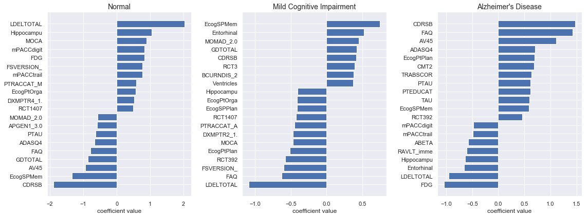
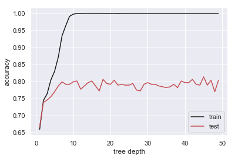

## Contents
{:.no_toc}
*  
{: toc}


<br>
The goal of this notebook is to perform some simple modeling on the imputed data set and identify the most important features for prediction. The data includes features with well-known links to Alzheimer's disease. If our data cleaning, imputation, and pre-processing has been done correctly, we should be able to identify these features such as **Amyloid Beta** and **Tau** protein measurements as significant predictors.

**Import libraries**


```python
%matplotlib inline
import os
import numpy as np
import pandas as pd
import matplotlib
import matplotlib.pyplot as plt
import seaborn as sns
sns.set()
from sklearn.preprocessing import MinMaxScaler
from sklearn.decomposition import PCA
from sklearn.model_selection import train_test_split
from sklearn.model_selection import cross_val_score
from sklearn.model_selection import KFold
from sklearn.metrics import accuracy_score
from sklearn.model_selection import cross_val_score
from sklearn.model_selection import LeaveOneOut
from sklearn.model_selection import KFold
from sklearn.linear_model import LogisticRegressionCV
from sklearn.tree import DecisionTreeClassifier

import statsmodels.api as sm
from statsmodels.regression.linear_model import OLS

from ADNI_utilities import define_terms, describe_meta_data, paths_with_ext, append_meta_cols
```


**Import Imputed Data**


```python
imp_df = pd.read_csv("../data/Per_Patient/pat_merge_imputed_lasso_ada.csv")
imp_df.head()
```


<div>
<style scoped>
    .dataframe tbody tr th:only-of-type {
        vertical-align: middle;
    }

    .dataframe tbody tr th {
        vertical-align: top;
    }

    .dataframe thead th {
        text-align: right;
    }
</style>
<table border="1" class="dataframe">
  <thead>
    <tr style="text-align: right;">
      <th></th>
      <th>RID</th>
      <th>AGE</th>
      <th>PTEDUCAT</th>
      <th>FDG</th>
      <th>AV45</th>
      <th>ABETA</th>
      <th>TAU</th>
      <th>PTAU</th>
      <th>CDRSB</th>
      <th>ADAS11</th>
      <th>...</th>
      <th>NXOTHER_2.0</th>
      <th>DXMPTR5_1.0</th>
      <th>NXFINGER_2.0</th>
      <th>MOMAD_1.0</th>
      <th>MOMAD_2.0</th>
      <th>NXMOTOR_2.0</th>
      <th>NXTENDON_2.0</th>
      <th>NXVISUAL_2.0</th>
      <th>NXHEEL_2.0</th>
      <th>NXGAIT_2.0</th>
    </tr>
  </thead>
  <tbody>
    <tr>
      <th>0</th>
      <td>2</td>
      <td>0.537838</td>
      <td>0.7500</td>
      <td>0.667996</td>
      <td>0.120293</td>
      <td>0.719561</td>
      <td>0.176637</td>
      <td>0.144414</td>
      <td>0.00</td>
      <td>0.250059</td>
      <td>...</td>
      <td>0</td>
      <td>1</td>
      <td>0</td>
      <td>0</td>
      <td>0</td>
      <td>0</td>
      <td>0</td>
      <td>0</td>
      <td>0</td>
      <td>0</td>
    </tr>
    <tr>
      <th>1</th>
      <td>3</td>
      <td>0.727027</td>
      <td>0.8750</td>
      <td>0.386992</td>
      <td>0.298280</td>
      <td>0.361000</td>
      <td>0.130902</td>
      <td>0.132411</td>
      <td>0.45</td>
      <td>0.515585</td>
      <td>...</td>
      <td>0</td>
      <td>1</td>
      <td>0</td>
      <td>0</td>
      <td>0</td>
      <td>0</td>
      <td>0</td>
      <td>0</td>
      <td>0</td>
      <td>0</td>
    </tr>
    <tr>
      <th>2</th>
      <td>4</td>
      <td>0.354054</td>
      <td>0.3750</td>
      <td>0.455381</td>
      <td>0.039562</td>
      <td>0.867333</td>
      <td>0.059918</td>
      <td>0.047232</td>
      <td>0.10</td>
      <td>0.335833</td>
      <td>...</td>
      <td>0</td>
      <td>1</td>
      <td>0</td>
      <td>0</td>
      <td>0</td>
      <td>0</td>
      <td>0</td>
      <td>0</td>
      <td>0</td>
      <td>0</td>
    </tr>
    <tr>
      <th>3</th>
      <td>5</td>
      <td>0.521622</td>
      <td>0.7500</td>
      <td>0.595319</td>
      <td>0.748069</td>
      <td>0.231533</td>
      <td>0.210656</td>
      <td>0.227054</td>
      <td>0.00</td>
      <td>0.203187</td>
      <td>...</td>
      <td>0</td>
      <td>1</td>
      <td>0</td>
      <td>0</td>
      <td>0</td>
      <td>0</td>
      <td>0</td>
      <td>0</td>
      <td>0</td>
      <td>0</td>
    </tr>
    <tr>
      <th>4</th>
      <td>6</td>
      <td>0.702703</td>
      <td>0.5625</td>
      <td>0.413852</td>
      <td>0.287194</td>
      <td>0.603774</td>
      <td>0.174573</td>
      <td>0.178761</td>
      <td>0.05</td>
      <td>0.437544</td>
      <td>...</td>
      <td>0</td>
      <td>1</td>
      <td>0</td>
      <td>0</td>
      <td>0</td>
      <td>0</td>
      <td>1</td>
      <td>0</td>
      <td>0</td>
      <td>0</td>
    </tr>
  </tbody>
</table>
<p>5 rows × 207 columns</p>
</div>


**Split the data**

Since we have multiple potential response variables in our data, we should separate the predictors and the response variables into different data frames.


```python
resp_set = ["DX_BASE","DX_FINAL","DX_CHANGE","DXCOMB","DX_bl"]
col_set = imp_df.columns.tolist()
is_resp = [any([resp in col for resp in resp_set]) for col in col_set]
resp_cols = imp_df.columns[is_resp]

print("Response columns:\n{}".format(resp_cols))
```


    Response columns:
    Index(['DX_BASE_2.0', 'DX_BASE_3.0', 'DXCOMB_2.0', 'DXCOMB_3.0',
           'DX_FINAL_2.0', 'DX_FINAL_3.0', 'DX_CHANGE_2.0', 'DX_CHANGE_4.0',
           'DX_CHANGE_5.0', 'DX_CHANGE_6.0', 'DX_CHANGE_7.0', 'DX_CHANGE_8.0',
           'DX_CHANGE_9.0', 'DX_bl_CN', 'DX_bl_MCI'],
          dtype='object')
    

As we can see from the list above, the response variables have been one-hot-encoded. We can reverse engineer the original classifications to pass in as the response vector for our models.


```python
resp_data = []
for resp in resp_set:
    
    # get subset of columns corresponding to currest prefix
    is_subset = [resp in col for col in col_set]
    subset_cols = imp_df.columns[is_subset]
    
    # convert train data to column index of true value
    tmp = np.argmax(imp_df[subset_cols].values,1)+1
    tmp[~imp_df[subset_cols].values.any(1)] = 0
    resp_data.append(tmp)
```


```python
imp_df = imp_df.drop(columns=resp_cols, axis=1)
for col, data in zip(resp_set, resp_data):
    imp_df[col] = pd.Series(np.array(data), index=imp_df.index)
```


Now we can divide the data into train and test splits


```python
train_df, test_df = train_test_split(imp_df, test_size=0.2, shuffle=True)

y_train = train_df[resp_set]
x_train = train_df.drop(columns=resp_set, axis=1)
y_test = test_df[resp_set]
x_test = test_df.drop(columns=resp_set, axis=1)
```


## Logistic Regression

To train a model, we'll need to select a response variable from the set of:
- baseline diagnosis `DX_BASE`
- ADNI merge baseline diagnosis `DX_bl`
- final diagnosis `DX_FINAL`
- change in diagnosis from baseline to final `DX_CHANGE`

If we want to develop a model to predict ultimate diagnosis based on baseline measures, it makes sense to choose `DX_FINAL` as the response variable.


```python
resp_var = 'DX_FINAL'
logit = LogisticRegressionCV(Cs=10,cv=3, solver='newton-cg', multi_class='multinomial', max_iter=100)
logit = logit.fit(x_train.values, y_train[resp_var].values)
```


    C:\Users\winsl0w\Anaconda3\lib\site-packages\scipy\optimize\linesearch.py:462: LineSearchWarning: The line search algorithm did not converge
      warn('The line search algorithm did not converge', LineSearchWarning)
    C:\Users\winsl0w\Anaconda3\lib\site-packages\scipy\optimize\linesearch.py:313: LineSearchWarning: The line search algorithm did not converge
      warn('The line search algorithm did not converge', LineSearchWarning)
    C:\Users\winsl0w\Anaconda3\lib\site-packages\sklearn\utils\optimize.py:203: ConvergenceWarning: newton-cg failed to converge. Increase the number of iterations.
      "number of iterations.", ConvergenceWarning)
    C:\Users\winsl0w\Anaconda3\lib\site-packages\sklearn\utils\optimize.py:203: ConvergenceWarning: newton-cg failed to converge. Increase the number of iterations.
      "number of iterations.", ConvergenceWarning)
    C:\Users\winsl0w\Anaconda3\lib\site-packages\sklearn\utils\optimize.py:203: ConvergenceWarning: newton-cg failed to converge. Increase the number of iterations.
      "number of iterations.", ConvergenceWarning)
    


```python
plt.plot(np.log(1/logit.Cs_), logit.scores_[0].mean(0), lw=2)
plt.ylim(0,1)
plt.xlabel("log(alpha)")
plt.ylabel("mean accuracy")
plt.title("Logistic Regression - alpha cross validation");
```


From the plot above we can see the optimal value for our regularization parameter is somewhere between 0-100.


```python
print("Train accuracy = {0:.3f}".format(logit.score(x_train.values, y_train[resp_var].values)))
print("Test accuracy = {0:.3f}".format(logit.score(x_test.values, y_test[resp_var].values)))
```


The performancy of the model is significantly worse on the test data, suggesting that the model is likely overfit. Many of the coefficients are likely to be very close to zero. To get some sense of the coefficients of our models, we can start by plotting the log histogram of our coefficient magnitudes to help separate the values.


```python
plt.hist(np.log(np.abs(logit.coef_.flatten())))
plt.ylabel("count")
plt.xlabel("log(coefficient magnitude)");
```


```python
f, ax = plt.subplots(1,3, figsize=(16,6))
coef_mag = np.abs(logit.coef_)
class_names = ["Normal","Mild Cognitive Impairment","Alzheimer's Disease"]

for i in range(len(ax)):
    
    # get indices of top parameters
    coef_idx = np.argsort(coef_mag[i,:])[-20:]
    coef_idx = coef_idx[np.argsort(logit.coef_[i,coef_idx])]
    
    # create horizontal bar plot
    ax[i].barh(np.arange(len(coef_idx)), logit.coef_[i,coef_idx], align='center', color='b')
    ax[i].set_yticks(np.arange(len(coef_idx)))
    y_labels = [col[:10] for col in x_train.columns[coef_idx].tolist()]
    ax[i].set_yticklabels(y_labels)
    ax[i].set_xlabel('coefficient value')
    ax[i].set_title(class_names[i], FontSize=14)
    
plt.tight_layout()
```





From the coefficient values above, we can see that many of the model coefficients match our expectations. For example, Tau, pTau, and the clinical dementia rating are all significantly positively predictive of Alzheimer's disease. However, there are some confusing results as well that will warrant further investigation. For example, Amyloid Beta levels in the cerebrospinal fluid are negatively predictive of Alzheimer's, which does not match our expectation.

## Random Forest Classifier

Given that the logistic regression model above was overfit, one simple thing to try is an ensemble classifier such as random forest that will offer the low model variance advantage of bagging. Let's try it out and see if the performance on the test set improves.


```python
from sklearn.ensemble import RandomForestClassifier
resp_var = 'DX_FINAL'
depths = np.arange(1,50,1)
train_acc = np.empty(depths.shape[0])
test_acc = np.empty(depths.shape[0])

for i, depth in enumerate(depths):
    
    # train temp model
    rfc = RandomForestClassifier(n_estimators=50, criterion='entropy', max_depth=depth)
    rfc = rfc.fit(x_train.values, y_train[resp_var].values)
    train_acc[i] = rfc.score(x_train.values, y_train[resp_var].values)
    test_acc[i] = rfc.score(x_test.values, y_test[resp_var].values)
    
plt.plot(depths, train_acc, color='k', label="train")
plt.plot(depths, test_acc, color='r', label="test");
plt.xlabel("tree depth")
plt.ylabel("accuracy")
plt.legend();
```





```python
rand_forest = RandomForestClassifier(n_estimators=100, criterion='entropy', max_depth=6)
rand_forest = rand_forest.fit(x_train.values, y_train[resp_var].values)
```


```python
print("Train accuracy = {0:.3f}".format(rand_forest.score(x_train.values, y_train[resp_var].values)))
print("Test accuracy = {0:.3f}".format(rand_forest.score(x_test.values, y_test[resp_var].values)))
```


    Train accuracy = 0.874
    Test accuracy = 0.787
    
