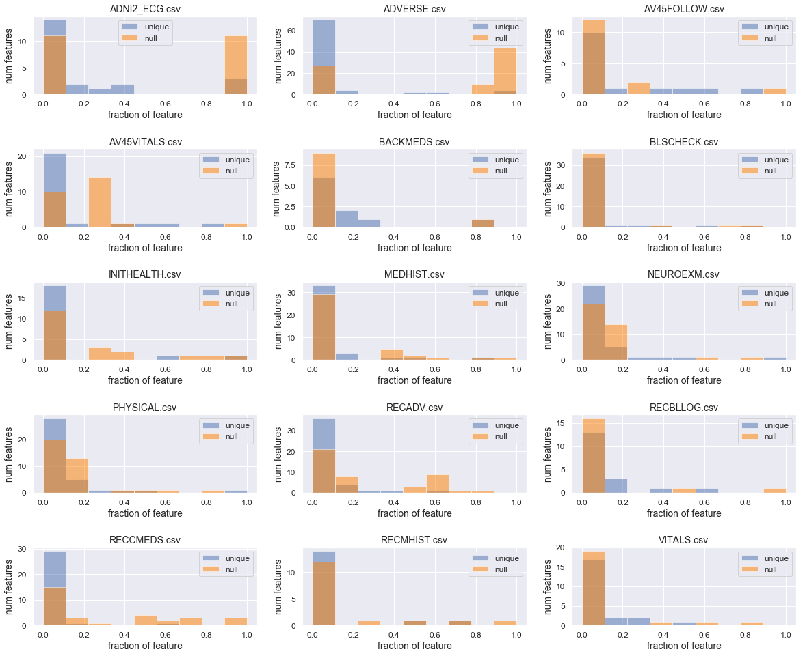

## Contents
{:.no_toc}
*  
{: toc}


The purpose of this notebook is to explore and clean the medical history data available in ADNI.

**Import libraries**


```python
%matplotlib inline
import os
import numpy as np
import pandas as pd
import matplotlib as mpl
import matplotlib.pyplot as plt
import seaborn as sns
sns.set()

import statsmodels.api as sm
from statsmodels.regression.linear_model import OLS

# import custom dependencies
from ADNI_utilities import define_terms, describe_meta_data, paths_with_ext, append_meta_cols
```


```python
# define figure defaults
mpl.rc('axes', labelsize=10, titlesize=14)
mpl.rc('figure', figsize=[6,4], titlesize=14)
mpl.rc('legend', fontsize=12)
mpl.rc('lines', linewidth=2, color='k')
mpl.rc('xtick', labelsize=10)
mpl.rc('ytick', labelsize=10)
```


## Data meta analysis

There are a lot of medical history data files. Before looking in depth at specific data, it may be helpful to inspect some summary information on each data set. To start we can profile the following for each file:

- number of records
- number of patients
- number of duplicate entries per patient
- ADNI phases covered


```python
# import adni dictionary
adni_dict_df = pd.read_csv("../data/study info/DATADIC.csv")
```


```python
csv_paths = paths_with_ext(directory="../data/Medical_History/")
for path in csv_paths:
    print("\n" + path + "\n")
    df = pd.read_csv(path, low_memory=False)
    describe_meta_data(df)
```


    
    ../data/Medical_History/ADNI2_ECG.csv
    
    No phases listed
    Num Entries: 14
    Num Columns: 22
    Num Patients: 14
    Records per Patient: 1-1
    Phases spanned per patient: 0-0
    Patients w/ Duplicates: 14
    
    ../data/Medical_History/ADVERSE.csv
    
    Phases:	 ['ADNI3']
    Num Entries: 253
    Num Columns: 83
    Num Patients: 239
    Records per Patient: 1-2
    Phases spanned per patient: 1-1
    Patients w/ Duplicates: 14
    
    ../data/Medical_History/AV45FOLLOW.csv
    
    Phases:	 ['ADNIGO' 'ADNI2']
    Num Entries: 1744
    Num Columns: 15
    Num Patients: 1080
    Records per Patient: 1-6
    Phases spanned per patient: 1-2
    Patients w/ Duplicates: 344
    
    ../data/Medical_History/AV45VITALS.csv
    
    Phases:	 ['ADNIGO' 'ADNI2']
    Num Entries: 1802
    Num Columns: 26
    Num Patients: 1098
    Records per Patient: 1-6
    Phases spanned per patient: 1-2
    Patients w/ Duplicates: 377
    
    ../data/Medical_History/BACKMEDS.csv
    
    Phases:	 ['ADNIGO' 'ADNI2' 'ADNI3']
    Num Entries: 9568
    Num Columns: 10
    Num Patients: 2257
    Records per Patient: 1-13
    Phases spanned per patient: 1-3
    Patients w/ Duplicates: 1543
    
    ../data/Medical_History/BLSCHECK.csv
    
    Phases:	 ['ADNI1' 'ADNIGO' 'ADNI2']
    Num Entries: 2549
    Num Columns: 39
    Num Patients: 2153
    Records per Patient: 1-3
    Phases spanned per patient: 1-2
    Patients w/ Duplicates: 10
    
    ../data/Medical_History/INITHEALTH.csv
    
    Phases:	 ['ADNI3']
    Num Entries: 10432
    Num Columns: 20
    Num Patients: 893
    Records per Patient: 1-60
    Phases spanned per patient: 1-1
    Patients w/ Duplicates: 864
    
    ../data/Medical_History/MEDHIST.csv
    
    Phases:	 ['ADNI1' 'ADNIGO' 'ADNI2']
    Num Entries: 3082
    Num Columns: 39
    Num Patients: 2491
    Records per Patient: 1-3
    Phases spanned per patient: 1-3
    Patients w/ Duplicates: 0
    
    ../data/Medical_History/NEUROEXM.csv
    
    Phases:	 ['ADNI1' 'ADNIGO' 'ADNI2' 'ADNI3']
    Num Entries: 3152
    Num Columns: 38
    Num Patients: 2944
    Records per Patient: 1-2
    Phases spanned per patient: 1-2
    Patients w/ Duplicates: 0
    
    ../data/Medical_History/PHYSICAL.csv
    
    Phases:	 ['ADNI1' 'ADNIGO' 'ADNI2' 'ADNI3']
    Num Entries: 3208
    Num Columns: 37
    Num Patients: 3000
    Records per Patient: 1-2
    Phases spanned per patient: 1-2
    Patients w/ Duplicates: 0
    
    ../data/Medical_History/RECADV.csv
    
    Phases:	 ['ADNI1' 'ADNIGO' 'ADNI2']
    Num Entries: 19385
    Num Columns: 43
    Num Patients: 1796
    Records per Patient: 1-74
    Phases spanned per patient: 1-3
    Patients w/ Duplicates: 1673
    
    ../data/Medical_History/RECBLLOG.csv
    
    Phases:	 ['ADNI1' 'ADNIGO' 'ADNI2']
    Num Entries: 12848
    Num Columns: 18
    Num Patients: 2130
    Records per Patient: 1-37
    Phases spanned per patient: 1-3
    Patients w/ Duplicates: 1731
    
    ../data/Medical_History/RECCMEDS.csv
    
    Phases:	 ['ADNI1' 'ADNIGO' 'ADNI2' 'ADNI3']
    Num Entries: 54018
    Num Columns: 31
    Num Patients: 3028
    Records per Patient: 1-167
    Phases spanned per patient: 1-4
    Patients w/ Duplicates: 2924
    
    ../data/Medical_History/RECMHIST.csv
    
    Phases:	 ['ADNI1' 'ADNIGO' 'ADNI2']
    Num Entries: 30798
    Num Columns: 16
    Num Patients: 2484
    Records per Patient: 1-100
    Phases spanned per patient: 1-3
    Patients w/ Duplicates: 2437
    
    ../data/Medical_History/VITALS.csv
    
    Phases:	 ['ADNI1' 'ADNIGO' 'ADNI2' 'ADNI3']
    Num Entries: 12843
    Num Columns: 22
    Num Patients: 3089
    Records per Patient: 1-16
    Phases spanned per patient: 1-4
    Patients w/ Duplicates: 2069
    

From the above summary we can see the files vary quite a lot in the number of entries, number of patients, and number of duplicate entries per patient. From the names of the files we can infer some of the information that might be contained in these files. For example, `INITHEALTH` and `BLSCHECK` likely contain some kind of intial or baseline health assessment. We can also se that `INITHEALTH` covers ADNI1-ANDIGO and `BLSCHECK` covers ADNI3.

We can further profile the data by looking at the distribution of duplicate entries and missingness in the columns of each data set.


```python
# get all csv files under directory
csv_paths = paths_with_ext(directory="../data/Medical_History/")
nrows = np.ceil(np.sqrt(len(csv_paths)))
ncols = np.ceil(len(csv_paths)/nrows)

plt.figure(figsize=(20,12))
# iterate over files
for i,path in enumerate(csv_paths):
    
    # initialize new plot
    plt.subplot(nrows,ncols,i+1)
    
    # read in df and record length
    df = pd.read_csv(path, low_memory=False)
    L = df.shape[0]
    
    # compute fraction of each column that is unique and fraction that is null
    frac_unique = df.apply(lambda x: x.unique().shape[0]/L)
    frac_null = df.isnull().apply(lambda x: np.sum(x)/L)
    
    # plot histograms of nullity and duplicity
    plt.hist(frac_unique, color='b', label="unique", alpha=0.5, bins=np.linspace(0,1,10))
    plt.hist(frac_null, color=(1,.5,0), label="null", alpha=0.5, bins=np.linspace(0,1,10))
    plt.legend()
    plt.xlabel("fraction of feature", FontSize=12)
    plt.ylabel("num features")
    plt.title(os.path.basename(path))

plt.subplots_adjust(hspace=0.5)
plt.gcf().savefig("test.pdf")
```





From the above plots we can see the quite a few of the data sets are likely to have substantial nullity, including:
`ADNI2_ECG`, `ADVERSE`, `AV45VITALS`, `INITHEALTH`, and `RECCMEDS`. None of the files seem to have a substantial presence of duplicity.

## NEUROLOGICAL EXAM RESULTS

Let's start with the neurological exam results. These records span all phases of ADNI and are likely to be highly relevant to alzheimer's diagnoses.


```python
# intialize neuroexam results and describe entries
nex_df = pd.read_csv("../data/Medical_History/NEUROEXM.csv")

# print table summary
describe_meta_data(nex_df)

# create dictionary_df for NEUROEXM table
nex_dict = define_terms(nex_df, adni_dict_df, table_name="NEUROEXM");
nex_dict
```


    Phases:	 ['ADNI1' 'ADNIGO' 'ADNI2' 'ADNI3']
    Num Entries: 3152
    Num Columns: 38
    Num Patients: 2944
    Records per Patient: 1-2
    Phases spanned per patient: 1-2
    Patients w/ Duplicates: 0
    


<div>
<style scoped>
    .dataframe tbody tr th:only-of-type {
        vertical-align: middle;
    }

    .dataframe tbody tr th {
        vertical-align: top;
    }

    .dataframe thead th {
        text-align: right;
    }
</style>
<table border="1" class="dataframe">
  <thead>
    <tr style="text-align: right;">
      <th></th>
      <th>FLDNAME</th>
      <th>TYPE</th>
      <th>TBLNAME</th>
      <th>TEXT</th>
      <th>CODE</th>
    </tr>
  </thead>
  <tbody>
    <tr>
      <th>0</th>
      <td>NaN</td>
      <td>NaN</td>
      <td>NaN</td>
      <td>NaN</td>
      <td>NaN</td>
    </tr>
    <tr>
      <th>1</th>
      <td>ID</td>
      <td>N</td>
      <td>NEUROEXM</td>
      <td>Record ID</td>
      <td>"crfname","Neurological Exam","indexes","adni_...</td>
    </tr>
    <tr>
      <th>2</th>
      <td>RID</td>
      <td>N</td>
      <td>NEUROEXM</td>
      <td>Participant roster ID</td>
      <td>NaN</td>
    </tr>
    <tr>
      <th>3</th>
      <td>SITEID</td>
      <td>N</td>
      <td>NEUROEXM</td>
      <td>Site ID</td>
      <td>NaN</td>
    </tr>
    <tr>
      <th>4</th>
      <td>VISCODE</td>
      <td>T</td>
      <td>NEUROEXM</td>
      <td>Visit code</td>
      <td>NaN</td>
    </tr>
    <tr>
      <th>5</th>
      <td>VISCODE2</td>
      <td>T</td>
      <td>NEUROEXM</td>
      <td>Translated visit code</td>
      <td>NaN</td>
    </tr>
    <tr>
      <th>6</th>
      <td>USERDATE</td>
      <td>S</td>
      <td>NEUROEXM</td>
      <td>Date record created</td>
      <td>NaN</td>
    </tr>
    <tr>
      <th>7</th>
      <td>USERDATE2</td>
      <td>S</td>
      <td>NEUROEXM</td>
      <td>Date record last updated</td>
      <td>NaN</td>
    </tr>
    <tr>
      <th>8</th>
      <td>EXAMDATE</td>
      <td>D</td>
      <td>NEUROEXM</td>
      <td>Examination Date</td>
      <td>NaN</td>
    </tr>
    <tr>
      <th>9</th>
      <td>NXVISUAL</td>
      <td>N</td>
      <td>NEUROEXM</td>
      <td>1. Significant Visual Impairment</td>
      <td>1=Absent; 2=Present</td>
    </tr>
    <tr>
      <th>10</th>
      <td>NXVISDES</td>
      <td>T</td>
      <td>NEUROEXM</td>
      <td>Details &lt;!--Significant Visual Impairment--&gt;</td>
      <td>NaN</td>
    </tr>
    <tr>
      <th>11</th>
      <td>NXAUDITO</td>
      <td>N</td>
      <td>NEUROEXM</td>
      <td>2. Significant Auditory Impairment</td>
      <td>1=Absent; 2=Present</td>
    </tr>
    <tr>
      <th>12</th>
      <td>NXAUDDES</td>
      <td>T</td>
      <td>NEUROEXM</td>
      <td>Details &lt;!--Significant Auditory Impairment--&gt;</td>
      <td>NaN</td>
    </tr>
    <tr>
      <th>13</th>
      <td>NXTREMOR</td>
      <td>N</td>
      <td>NEUROEXM</td>
      <td>3. Tremor</td>
      <td>1=Absent; 2=Present</td>
    </tr>
    <tr>
      <th>14</th>
      <td>NXTREDES</td>
      <td>T</td>
      <td>NEUROEXM</td>
      <td>Details &lt;!--Tremor--&gt;</td>
      <td>NaN</td>
    </tr>
    <tr>
      <th>15</th>
      <td>NXCONSCI</td>
      <td>N</td>
      <td>NEUROEXM</td>
      <td>4. Level of Consciousness</td>
      <td>1=Normal; 2=Abnormal</td>
    </tr>
    <tr>
      <th>16</th>
      <td>NXCONDES</td>
      <td>T</td>
      <td>NEUROEXM</td>
      <td>Details &lt;!--Level of Consciousness--&gt;</td>
      <td>NaN</td>
    </tr>
    <tr>
      <th>17</th>
      <td>NXNERVE</td>
      <td>N</td>
      <td>NEUROEXM</td>
      <td>5. Cranial Nerves</td>
      <td>1=Normal; 2=Abnormal</td>
    </tr>
    <tr>
      <th>18</th>
      <td>NXNERDES</td>
      <td>T</td>
      <td>NEUROEXM</td>
      <td>Details &lt;!--Cranial Nerves--&gt;</td>
      <td>NaN</td>
    </tr>
    <tr>
      <th>19</th>
      <td>NXMOTOR</td>
      <td>N</td>
      <td>NEUROEXM</td>
      <td>6. Motor Strength</td>
      <td>1=Normal; 2=Abnormal</td>
    </tr>
    <tr>
      <th>20</th>
      <td>NXMOTDES</td>
      <td>T</td>
      <td>NEUROEXM</td>
      <td>Details &lt;!--Motor Strength--&gt;</td>
      <td>NaN</td>
    </tr>
    <tr>
      <th>21</th>
      <td>NXFINGER</td>
      <td>N</td>
      <td>NEUROEXM</td>
      <td>7a. Cerebellar - Finger to Nose</td>
      <td>1=Normal; 2=Abnormal</td>
    </tr>
    <tr>
      <th>22</th>
      <td>NXFINDES</td>
      <td>T</td>
      <td>NEUROEXM</td>
      <td>Details &lt;!--Cerebellar - Finger to Nose--&gt;</td>
      <td>NaN</td>
    </tr>
    <tr>
      <th>23</th>
      <td>NXHEEL</td>
      <td>N</td>
      <td>NEUROEXM</td>
      <td>7b. Cerebellar - Heel to Shin</td>
      <td>1=Normal; 2=Abnormal</td>
    </tr>
    <tr>
      <th>24</th>
      <td>NXHEEDES</td>
      <td>T</td>
      <td>NEUROEXM</td>
      <td>Details &lt;!--Cerebellar - Heel to Shin--&gt;</td>
      <td>NaN</td>
    </tr>
    <tr>
      <th>25</th>
      <td>NXSENSOR</td>
      <td>N</td>
      <td>NEUROEXM</td>
      <td>8. Sensory</td>
      <td>1=Normal; 2=Abnormal</td>
    </tr>
    <tr>
      <th>26</th>
      <td>NXSENDES</td>
      <td>T</td>
      <td>NEUROEXM</td>
      <td>Details &lt;!--Sensory--&gt;</td>
      <td>NaN</td>
    </tr>
    <tr>
      <th>27</th>
      <td>NXTENDON</td>
      <td>N</td>
      <td>NEUROEXM</td>
      <td>9. Deep Tendon Reflexes</td>
      <td>1=Normal; 2=Abnormal</td>
    </tr>
    <tr>
      <th>28</th>
      <td>NXTENDES</td>
      <td>T</td>
      <td>NEUROEXM</td>
      <td>Details &lt;!--Deep Tendon Reflexes--&gt;</td>
      <td>NaN</td>
    </tr>
    <tr>
      <th>29</th>
      <td>NXPLANTA</td>
      <td>N</td>
      <td>NEUROEXM</td>
      <td>10. Plantar Reflexes</td>
      <td>1=Normal; 2=Abnormal</td>
    </tr>
    <tr>
      <th>30</th>
      <td>NXPLADES</td>
      <td>T</td>
      <td>NEUROEXM</td>
      <td>Details &lt;!--Plantar Reflexes--&gt;</td>
      <td>NaN</td>
    </tr>
    <tr>
      <th>31</th>
      <td>NXGAIT</td>
      <td>N</td>
      <td>NEUROEXM</td>
      <td>11. Gait</td>
      <td>1=Normal; 2=Abnormal</td>
    </tr>
    <tr>
      <th>32</th>
      <td>NXGAIDES</td>
      <td>T</td>
      <td>NEUROEXM</td>
      <td>Details &lt;!--Gait--&gt;</td>
      <td>NaN</td>
    </tr>
    <tr>
      <th>33</th>
      <td>NXOTHER</td>
      <td>N</td>
      <td>NEUROEXM</td>
      <td>12. Other</td>
      <td>1=Normal; 2=Abnormal</td>
    </tr>
    <tr>
      <th>34</th>
      <td>NXOTHSPE</td>
      <td>T</td>
      <td>NEUROEXM</td>
      <td>Details &lt;!--Other--&gt;</td>
      <td>NaN</td>
    </tr>
    <tr>
      <th>35</th>
      <td>NXGENCOM</td>
      <td>T</td>
      <td>NEUROEXM</td>
      <td>13. General Comments</td>
      <td>NaN</td>
    </tr>
    <tr>
      <th>36</th>
      <td>NXABNORM</td>
      <td>N</td>
      <td>NEUROEXM</td>
      <td>14. Based on Neurological Examination, clinici...</td>
      <td>1=Findings consistent with eligibility for stu...</td>
    </tr>
    <tr>
      <th>37</th>
      <td>NaN</td>
      <td>NaN</td>
      <td>NaN</td>
      <td>NaN</td>
      <td>NaN</td>
    </tr>
  </tbody>
</table>
</div>


Many of the columns ending in `DES` are for doctor comments on the exams. The information in these will be hard to utilize; so we can drop them from the dataframe.


```python
# drop description categories
desc_columns = [col for col in nex_df.columns if "DES" in col]
nex_df = nex_df.drop(columns=desc_columns, axis=1)
```


Next we should inspect the data types and make sure the format of each column makes sense.


```python
# print data types for each col
nex_df.dtypes
```


    Phase            object
    ID                int64
    RID               int64
    SITEID            int64
    VISCODE          object
    VISCODE2         object
    USERDATE         object
    USERDATE2        object
    EXAMDATE         object
    NXVISUAL        float64
    NXAUDITO        float64
    NXTREMOR        float64
    NXCONSCI        float64
    NXNERVE         float64
    NXMOTOR         float64
    NXFINGER        float64
    NXHEEL          float64
    NXSENSOR        float64
    NXTENDON        float64
    NXPLANTA        float64
    NXGAIT          float64
    NXOTHER         float64
    NXOTHSPE         object
    NXGENCOM         object
    NXABNORM        float64
    update_stamp     object
    dtype: object


From the list above, it looks like the measures we are interested in are the columns with dtype = `float64`. The remaining columns all appear to be patient or visit meta data. However, it is worth noting that each of the columns with exam results essential take the form of `Normal` or `Abnormal`, which are categorical in nature. We should convert these to either boolean or integer before moving on. Before converting to `int64` we should check the format of missing values in the data. ADNI frequently uses `NaN`, `-1`, and `-4` to signify missing values.


```python
# replace missing values with -1
nex_df.replace({np.nan:-1, -4:-1}, inplace=True)

# define col list with exam results
nex_cols = nex_df.columns[(nex_df.dtypes == 'float64').values]

# convert columns in list to int
nex_df[nex_cols] = nex_df[nex_cols].values.astype(int)
```


## Medical History

Next we'll investigate patient medical history as above.


```python
# read in the data and print df summary
med_df = pd.read_csv("../data/Medical_History/MEDHIST.csv")
describe_meta_data(med_df)

# create dictionary_df for MEDHIST table
med_dict = define_terms(med_df, adni_dict_df, table_name="MEDHIST");
med_dict
```


    Phases:	 ['ADNI1' 'ADNIGO' 'ADNI2']
    Num Entries: 3082
    Num Columns: 39
    Num Patients: 2491
    Records per Patient: 1-3
    Phases spanned per patient: 1-3
    Patients w/ Duplicates: 0
    


<div>
<style scoped>
    .dataframe tbody tr th:only-of-type {
        vertical-align: middle;
    }

    .dataframe tbody tr th {
        vertical-align: top;
    }

    .dataframe thead th {
        text-align: right;
    }
</style>
<table border="1" class="dataframe">
  <thead>
    <tr style="text-align: right;">
      <th></th>
      <th>FLDNAME</th>
      <th>TYPE</th>
      <th>TBLNAME</th>
      <th>TEXT</th>
      <th>CODE</th>
    </tr>
  </thead>
  <tbody>
    <tr>
      <th>0</th>
      <td>NaN</td>
      <td>NaN</td>
      <td>NaN</td>
      <td>NaN</td>
      <td>NaN</td>
    </tr>
    <tr>
      <th>1</th>
      <td>ID</td>
      <td>N</td>
      <td>MEDHIST</td>
      <td>Record ID</td>
      <td>"crfname","Medical History","indexes","adni_me...</td>
    </tr>
    <tr>
      <th>2</th>
      <td>RID</td>
      <td>N</td>
      <td>MEDHIST</td>
      <td>Participant roster ID</td>
      <td>NaN</td>
    </tr>
    <tr>
      <th>3</th>
      <td>SITEID</td>
      <td>N</td>
      <td>MEDHIST</td>
      <td>Site ID</td>
      <td>NaN</td>
    </tr>
    <tr>
      <th>4</th>
      <td>VISCODE</td>
      <td>T</td>
      <td>MEDHIST</td>
      <td>Visit code</td>
      <td>NaN</td>
    </tr>
    <tr>
      <th>5</th>
      <td>VISCODE2</td>
      <td>T</td>
      <td>MEDHIST</td>
      <td>Translated visit code</td>
      <td>NaN</td>
    </tr>
    <tr>
      <th>6</th>
      <td>USERDATE</td>
      <td>S</td>
      <td>MEDHIST</td>
      <td>Date record created</td>
      <td>NaN</td>
    </tr>
    <tr>
      <th>7</th>
      <td>USERDATE2</td>
      <td>S</td>
      <td>MEDHIST</td>
      <td>Date record last updated</td>
      <td>NaN</td>
    </tr>
    <tr>
      <th>8</th>
      <td>EXAMDATE</td>
      <td>D</td>
      <td>MEDHIST</td>
      <td>Examination Date</td>
      <td>NaN</td>
    </tr>
    <tr>
      <th>9</th>
      <td>MHSOURCE</td>
      <td>N</td>
      <td>MEDHIST</td>
      <td>Information Source</td>
      <td>1=Participant Visit;2=Telephone Call</td>
    </tr>
    <tr>
      <th>10</th>
      <td>MHPSYCH</td>
      <td>N</td>
      <td>MEDHIST</td>
      <td>1. Psychiatric</td>
      <td>1=Yes; 0=No</td>
    </tr>
    <tr>
      <th>11</th>
      <td>MH2NEURL</td>
      <td>N</td>
      <td>MEDHIST</td>
      <td>2. Neurologic (other than AD)</td>
      <td>1=Yes; 0=No</td>
    </tr>
    <tr>
      <th>12</th>
      <td>MH3HEAD</td>
      <td>N</td>
      <td>MEDHIST</td>
      <td>3. Head, Eyes, Ears, Nose and Throat</td>
      <td>1=Yes; 0=No</td>
    </tr>
    <tr>
      <th>13</th>
      <td>MH4CARD</td>
      <td>N</td>
      <td>MEDHIST</td>
      <td>4. Cardiovascular</td>
      <td>1=Yes; 0=No</td>
    </tr>
    <tr>
      <th>14</th>
      <td>MH5RESP</td>
      <td>N</td>
      <td>MEDHIST</td>
      <td>5. Respiratory</td>
      <td>1=Yes; 0=No</td>
    </tr>
    <tr>
      <th>15</th>
      <td>MH6HEPAT</td>
      <td>N</td>
      <td>MEDHIST</td>
      <td>6. Hepatic</td>
      <td>1=Yes; 0=No</td>
    </tr>
    <tr>
      <th>16</th>
      <td>MH7DERM</td>
      <td>N</td>
      <td>MEDHIST</td>
      <td>7. Dermatologic-Connective Tissue</td>
      <td>1=Yes; 0=No</td>
    </tr>
    <tr>
      <th>17</th>
      <td>MH8MUSCL</td>
      <td>N</td>
      <td>MEDHIST</td>
      <td>8. Musculoskeletal</td>
      <td>1=Yes; 0=No</td>
    </tr>
    <tr>
      <th>18</th>
      <td>MH9ENDO</td>
      <td>N</td>
      <td>MEDHIST</td>
      <td>9. Endocrine-Metabolic</td>
      <td>1=Yes; 0=No</td>
    </tr>
    <tr>
      <th>19</th>
      <td>MH10GAST</td>
      <td>N</td>
      <td>MEDHIST</td>
      <td>10. Gastrointestinal</td>
      <td>1=Yes; 0=No</td>
    </tr>
    <tr>
      <th>20</th>
      <td>MH11HEMA</td>
      <td>N</td>
      <td>MEDHIST</td>
      <td>11. Hematopoietic-Lymphatic</td>
      <td>1=Yes; 0=No</td>
    </tr>
    <tr>
      <th>21</th>
      <td>MH12RENA</td>
      <td>N</td>
      <td>MEDHIST</td>
      <td>12. Renal-Genitourinary</td>
      <td>1=Yes; 0=No</td>
    </tr>
    <tr>
      <th>22</th>
      <td>MH13ALLE</td>
      <td>N</td>
      <td>MEDHIST</td>
      <td>13. Allergies or Drug Sensitivities</td>
      <td>1=Yes; 0=No</td>
    </tr>
    <tr>
      <th>23</th>
      <td>MH14ALCH</td>
      <td>N</td>
      <td>MEDHIST</td>
      <td>14. Alcohol Abuse</td>
      <td>1=Yes; 0=No</td>
    </tr>
    <tr>
      <th>24</th>
      <td>MH14AALCH</td>
      <td>N</td>
      <td>MEDHIST</td>
      <td>14a. During period of alcohol abuse, estimate ...</td>
      <td>0..30</td>
    </tr>
    <tr>
      <th>25</th>
      <td>MH14BALCH</td>
      <td>N</td>
      <td>MEDHIST</td>
      <td>14b. Duration of abuse (years)</td>
      <td>1..99</td>
    </tr>
    <tr>
      <th>26</th>
      <td>MH14CALCH</td>
      <td>N</td>
      <td>MEDHIST</td>
      <td>14c. Period of time since end of abuse (years)</td>
      <td>0..99</td>
    </tr>
    <tr>
      <th>27</th>
      <td>MH15DRUG</td>
      <td>N</td>
      <td>MEDHIST</td>
      <td>15. Drug Abuse</td>
      <td>1=Yes; 0=No</td>
    </tr>
    <tr>
      <th>28</th>
      <td>MH15ADRUG</td>
      <td>N</td>
      <td>MEDHIST</td>
      <td>15a.  Duration of abuse (years):</td>
      <td>1..99</td>
    </tr>
    <tr>
      <th>29</th>
      <td>MH15BDRUG</td>
      <td>N</td>
      <td>MEDHIST</td>
      <td>15b.  Period of time since end of abuse (years):</td>
      <td>0..99</td>
    </tr>
    <tr>
      <th>30</th>
      <td>MH16SMOK</td>
      <td>N</td>
      <td>MEDHIST</td>
      <td>16. Smoking</td>
      <td>1=Yes; 0=No</td>
    </tr>
    <tr>
      <th>31</th>
      <td>MH16ASMOK</td>
      <td>N</td>
      <td>MEDHIST</td>
      <td>16a. During periods of smoking, the average nu...</td>
      <td>0..10</td>
    </tr>
    <tr>
      <th>32</th>
      <td>MH16BSMOK</td>
      <td>N</td>
      <td>MEDHIST</td>
      <td>16b. Duration (years)</td>
      <td>1..99</td>
    </tr>
    <tr>
      <th>33</th>
      <td>MH16CSMOK</td>
      <td>N</td>
      <td>MEDHIST</td>
      <td>16c. If no longer smoking, provide period of t...</td>
      <td>0..99</td>
    </tr>
    <tr>
      <th>34</th>
      <td>MH17MALI</td>
      <td>N</td>
      <td>MEDHIST</td>
      <td>17. Malignancy</td>
      <td>1=Yes; 0=No</td>
    </tr>
    <tr>
      <th>35</th>
      <td>MH18SURG</td>
      <td>N</td>
      <td>MEDHIST</td>
      <td>18. Major Surgical Procedures</td>
      <td>1=Yes; 0=No</td>
    </tr>
    <tr>
      <th>36</th>
      <td>MH19OTHR</td>
      <td>N</td>
      <td>MEDHIST</td>
      <td>19. Other (if none, select "No")</td>
      <td>1=Yes; 0=No</td>
    </tr>
    <tr>
      <th>37</th>
      <td>MHCOMMEN</td>
      <td>T</td>
      <td>MEDHIST</td>
      <td>General Comments</td>
      <td>NaN</td>
    </tr>
    <tr>
      <th>38</th>
      <td>NaN</td>
      <td>NaN</td>
      <td>NaN</td>
      <td>NaN</td>
      <td>NaN</td>
    </tr>
  </tbody>
</table>
</div>


From the term definitions above we can see that there are many interesting details about patient medical history such surgical history, psychiatric history, history of drug or alchohol abuse etc. These features are primarily categorical (ie. yes/no) or a discrete duration. Checking the data type of the columns reveals that the categorical variables are encoded as `int64` and durations are encoded as `float64`. The features of interest correspond to columns 10-35.


```python
# record the columns of interest
med_cols = med_df.columns[10:36]
```


To handle missingness, we'll enforce all missing values to be `-1`.


```python
# set nan and -4 to -1
med_df.replace({np.nan:-1, -4:-1}, inplace=True)
```


## Baseline Symptoms / Initial Health

The names of `BLSCHECK` and `INITHEALTH` and the phases covered by each file suggest that these files contain the same type of information but for different phases. Let's see if they can be easily combined by looking at the features in each.

**INITHEALTH**


```python
# read in the data and print df summary
init_df = pd.read_csv("../data/Medical_History/INITHEALTH.csv")
describe_meta_data(init_df)

# create dictionary_df for MEDHIST table
init_dict = define_terms(init_df, adni_dict_df, table_name="INITHEALTH");
init_dict
```


    Phases:	 ['ADNI3']
    Num Entries: 10432
    Num Columns: 20
    Num Patients: 893
    Records per Patient: 1-60
    Phases spanned per patient: 1-1
    Patients w/ Duplicates: 864
    


<div>
<style scoped>
    .dataframe tbody tr th:only-of-type {
        vertical-align: middle;
    }

    .dataframe tbody tr th {
        vertical-align: top;
    }

    .dataframe thead th {
        text-align: right;
    }
</style>
<table border="1" class="dataframe">
  <thead>
    <tr style="text-align: right;">
      <th></th>
      <th>FLDNAME</th>
      <th>TYPE</th>
      <th>TBLNAME</th>
      <th>TEXT</th>
      <th>CODE</th>
    </tr>
  </thead>
  <tbody>
    <tr>
      <th>0</th>
      <td>NaN</td>
      <td>NaN</td>
      <td>NaN</td>
      <td>NaN</td>
      <td>NaN</td>
    </tr>
    <tr>
      <th>1</th>
      <td>ID</td>
      <td>N</td>
      <td>INITHEALTH</td>
      <td>NaN</td>
      <td>NaN</td>
    </tr>
    <tr>
      <th>2</th>
      <td>RID</td>
      <td>N</td>
      <td>INITHEALTH</td>
      <td>NaN</td>
      <td>NaN</td>
    </tr>
    <tr>
      <th>3</th>
      <td>SITEID</td>
      <td>N</td>
      <td>INITHEALTH</td>
      <td>NaN</td>
      <td>NaN</td>
    </tr>
    <tr>
      <th>4</th>
      <td>VISCODE</td>
      <td>T</td>
      <td>INITHEALTH</td>
      <td>NaN</td>
      <td>NaN</td>
    </tr>
    <tr>
      <th>5</th>
      <td>USERDATE</td>
      <td>S</td>
      <td>INITHEALTH</td>
      <td>NaN</td>
      <td>NaN</td>
    </tr>
    <tr>
      <th>6</th>
      <td>USERDATE2</td>
      <td>S</td>
      <td>INITHEALTH</td>
      <td>NaN</td>
      <td>NaN</td>
    </tr>
    <tr>
      <th>7</th>
      <td>IHNUM</td>
      <td>N</td>
      <td>INITHEALTH</td>
      <td>Condition Number</td>
      <td>NaN</td>
    </tr>
    <tr>
      <th>8</th>
      <td>IHSYMPTOM</td>
      <td>N</td>
      <td>INITHEALTH</td>
      <td>System/Category</td>
      <td>1=Psychiatric;2=Neurologic (other than Cogniti...</td>
    </tr>
    <tr>
      <th>9</th>
      <td>IHDESC</td>
      <td>T</td>
      <td>INITHEALTH</td>
      <td>Description/Condition</td>
      <td>NaN</td>
    </tr>
    <tr>
      <th>10</th>
      <td>IHSURG</td>
      <td>N</td>
      <td>INITHEALTH</td>
      <td>Is this a surgery?</td>
      <td>0=No;1=Yes</td>
    </tr>
    <tr>
      <th>11</th>
      <td>IHSURGDATE</td>
      <td>D</td>
      <td>INITHEALTH</td>
      <td>If Yes, surgery date</td>
      <td>NaN</td>
    </tr>
    <tr>
      <th>12</th>
      <td>IHPRESENT</td>
      <td>N</td>
      <td>INITHEALTH</td>
      <td>Is this a condition or symptom present in the ...</td>
      <td>0=No;1=Yes</td>
    </tr>
    <tr>
      <th>13</th>
      <td>IHCHRON</td>
      <td>N</td>
      <td>INITHEALTH</td>
      <td>Chronicity</td>
      <td>1=Single occurrence;2=Intermittent;3=Persistent</td>
    </tr>
    <tr>
      <th>14</th>
      <td>IHSEVER</td>
      <td>N</td>
      <td>INITHEALTH</td>
      <td>Severity</td>
      <td>1=Mild;2=Moderate;3=Severe</td>
    </tr>
    <tr>
      <th>15</th>
      <td>IHDTONSET</td>
      <td>D</td>
      <td>INITHEALTH</td>
      <td>Onset Date</td>
      <td>NaN</td>
    </tr>
    <tr>
      <th>16</th>
      <td>IHONGOING</td>
      <td>N</td>
      <td>INITHEALTH</td>
      <td>Is symptom/condition ongoing?</td>
      <td>0=No;1=Yes</td>
    </tr>
    <tr>
      <th>17</th>
      <td>IHCEASE</td>
      <td>D</td>
      <td>INITHEALTH</td>
      <td>Cease Date</td>
      <td>NaN</td>
    </tr>
    <tr>
      <th>18</th>
      <td>IHCOMM</td>
      <td>T</td>
      <td>INITHEALTH</td>
      <td>Comments:</td>
      <td>NaN</td>
    </tr>
    <tr>
      <th>19</th>
      <td>NaN</td>
      <td>NaN</td>
      <td>NaN</td>
      <td>NaN</td>
      <td>NaN</td>
    </tr>
  </tbody>
</table>
</div>


**BLSCHECK**


```python
# read in the data and print df summary
bls_df = pd.read_csv("../data/Medical_History/BLSCHECK.csv")
describe_meta_data(bls_df)

# create dictionary_df for MEDHIST table
bls_dict = define_terms(bls_df, adni_dict_df, table_name="BLSCHECK");
bls_dict
```


    Phases:	 ['ADNI1' 'ADNIGO' 'ADNI2']
    Num Entries: 2549
    Num Columns: 39
    Num Patients: 2153
    Records per Patient: 1-3
    Phases spanned per patient: 1-2
    Patients w/ Duplicates: 10
    


<div>
<style scoped>
    .dataframe tbody tr th:only-of-type {
        vertical-align: middle;
    }

    .dataframe tbody tr th {
        vertical-align: top;
    }

    .dataframe thead th {
        text-align: right;
    }
</style>
<table border="1" class="dataframe">
  <thead>
    <tr style="text-align: right;">
      <th></th>
      <th>FLDNAME</th>
      <th>TYPE</th>
      <th>TBLNAME</th>
      <th>TEXT</th>
      <th>CODE</th>
    </tr>
  </thead>
  <tbody>
    <tr>
      <th>0</th>
      <td>NaN</td>
      <td>NaN</td>
      <td>NaN</td>
      <td>NaN</td>
      <td>NaN</td>
    </tr>
    <tr>
      <th>1</th>
      <td>ID</td>
      <td>N</td>
      <td>BLSCHECK</td>
      <td>Record ID</td>
      <td>"crfname","Baseline Symptoms Checklist","index...</td>
    </tr>
    <tr>
      <th>2</th>
      <td>RID</td>
      <td>N</td>
      <td>BLSCHECK</td>
      <td>Participant roster ID</td>
      <td>NaN</td>
    </tr>
    <tr>
      <th>3</th>
      <td>SITEID</td>
      <td>N</td>
      <td>BLSCHECK</td>
      <td>Site ID</td>
      <td>NaN</td>
    </tr>
    <tr>
      <th>4</th>
      <td>VISCODE</td>
      <td>T</td>
      <td>BLSCHECK</td>
      <td>Visit code</td>
      <td>NaN</td>
    </tr>
    <tr>
      <th>5</th>
      <td>VISCODE2</td>
      <td>T</td>
      <td>BLSCHECK</td>
      <td>Translated visit code</td>
      <td>NaN</td>
    </tr>
    <tr>
      <th>6</th>
      <td>USERDATE</td>
      <td>S</td>
      <td>BLSCHECK</td>
      <td>Date record created</td>
      <td>NaN</td>
    </tr>
    <tr>
      <th>7</th>
      <td>USERDATE2</td>
      <td>S</td>
      <td>BLSCHECK</td>
      <td>Date record last updated</td>
      <td>NaN</td>
    </tr>
    <tr>
      <th>8</th>
      <td>EXAMDATE</td>
      <td>D</td>
      <td>BLSCHECK</td>
      <td>Examination Date</td>
      <td>NaN</td>
    </tr>
    <tr>
      <th>9</th>
      <td>BCNAUSEA</td>
      <td>N</td>
      <td>BLSCHECK</td>
      <td>1. Nausea</td>
      <td>1=Absent; 2=Present</td>
    </tr>
    <tr>
      <th>10</th>
      <td>BCVOMIT</td>
      <td>N</td>
      <td>BLSCHECK</td>
      <td>2. Vomiting</td>
      <td>1=Absent; 2=Present</td>
    </tr>
    <tr>
      <th>11</th>
      <td>BCDIARRH</td>
      <td>N</td>
      <td>BLSCHECK</td>
      <td>3. Diarrhea</td>
      <td>1=Absent; 2=Present</td>
    </tr>
    <tr>
      <th>12</th>
      <td>BCCONSTP</td>
      <td>N</td>
      <td>BLSCHECK</td>
      <td>4. Constipation</td>
      <td>1=Absent; 2=Present</td>
    </tr>
    <tr>
      <th>13</th>
      <td>BCABDOMN</td>
      <td>N</td>
      <td>BLSCHECK</td>
      <td>5. Abdominal discomfort</td>
      <td>1=Absent; 2=Present</td>
    </tr>
    <tr>
      <th>14</th>
      <td>BCSWEATN</td>
      <td>N</td>
      <td>BLSCHECK</td>
      <td>6. Sweating</td>
      <td>1=Absent; 2=Present</td>
    </tr>
    <tr>
      <th>15</th>
      <td>BCDIZZY</td>
      <td>N</td>
      <td>BLSCHECK</td>
      <td>7. Dizziness</td>
      <td>1=Absent; 2=Present</td>
    </tr>
    <tr>
      <th>16</th>
      <td>BCENERGY</td>
      <td>N</td>
      <td>BLSCHECK</td>
      <td>8. Low energy</td>
      <td>1=Absent; 2=Present</td>
    </tr>
    <tr>
      <th>17</th>
      <td>BCDROWSY</td>
      <td>N</td>
      <td>BLSCHECK</td>
      <td>9. Drowsiness</td>
      <td>1=Absent; 2=Present</td>
    </tr>
    <tr>
      <th>18</th>
      <td>BCVISION</td>
      <td>N</td>
      <td>BLSCHECK</td>
      <td>10. Blurred vision</td>
      <td>1=Absent; 2=Present</td>
    </tr>
    <tr>
      <th>19</th>
      <td>BCHDACHE</td>
      <td>N</td>
      <td>BLSCHECK</td>
      <td>11. Headache</td>
      <td>1=Absent; 2=Present</td>
    </tr>
    <tr>
      <th>20</th>
      <td>BCDRYMTH</td>
      <td>N</td>
      <td>BLSCHECK</td>
      <td>12. Dry mouth</td>
      <td>1=Absent; 2=Present</td>
    </tr>
    <tr>
      <th>21</th>
      <td>BCBREATH</td>
      <td>N</td>
      <td>BLSCHECK</td>
      <td>13. Shortness of breath</td>
      <td>1=Absent; 2=Present</td>
    </tr>
    <tr>
      <th>22</th>
      <td>BCCOUGH</td>
      <td>N</td>
      <td>BLSCHECK</td>
      <td>14. Coughing</td>
      <td>1=Absent; 2=Present</td>
    </tr>
    <tr>
      <th>23</th>
      <td>BCPALPIT</td>
      <td>N</td>
      <td>BLSCHECK</td>
      <td>15. Palpitations</td>
      <td>1=Absent; 2=Present</td>
    </tr>
    <tr>
      <th>24</th>
      <td>BCCHEST</td>
      <td>N</td>
      <td>BLSCHECK</td>
      <td>16. Chest pain</td>
      <td>1=Absent; 2=Present</td>
    </tr>
    <tr>
      <th>25</th>
      <td>BCURNDIS</td>
      <td>N</td>
      <td>BLSCHECK</td>
      <td>17. Urinary discomfort (e.g., burning)</td>
      <td>1=Absent; 2=Present</td>
    </tr>
    <tr>
      <th>26</th>
      <td>BCURNFRQ</td>
      <td>N</td>
      <td>BLSCHECK</td>
      <td>18. Urinary frequency</td>
      <td>1=Absent; 2=Present</td>
    </tr>
    <tr>
      <th>27</th>
      <td>BCANKLE</td>
      <td>N</td>
      <td>BLSCHECK</td>
      <td>19. Ankle swelling</td>
      <td>1=Absent; 2=Present</td>
    </tr>
    <tr>
      <th>28</th>
      <td>BCMUSCLE</td>
      <td>N</td>
      <td>BLSCHECK</td>
      <td>20. Musculoskeletal pain</td>
      <td>1=Absent; 2=Present</td>
    </tr>
    <tr>
      <th>29</th>
      <td>BCRASH</td>
      <td>N</td>
      <td>BLSCHECK</td>
      <td>21. Rash</td>
      <td>1=Absent; 2=Present</td>
    </tr>
    <tr>
      <th>30</th>
      <td>BCINSOMN</td>
      <td>N</td>
      <td>BLSCHECK</td>
      <td>22. Insomnia</td>
      <td>1=Absent; 2=Present</td>
    </tr>
    <tr>
      <th>31</th>
      <td>BCDPMOOD</td>
      <td>N</td>
      <td>BLSCHECK</td>
      <td>23. Depressed mood</td>
      <td>1=Absent; 2=Present</td>
    </tr>
    <tr>
      <th>32</th>
      <td>BCCRYING</td>
      <td>N</td>
      <td>BLSCHECK</td>
      <td>24. Crying</td>
      <td>1=Absent; 2=Present</td>
    </tr>
    <tr>
      <th>33</th>
      <td>BCELMOOD</td>
      <td>N</td>
      <td>BLSCHECK</td>
      <td>25. Elevated mood</td>
      <td>1=Absent; 2=Present</td>
    </tr>
    <tr>
      <th>34</th>
      <td>BCWANDER</td>
      <td>N</td>
      <td>BLSCHECK</td>
      <td>26. Wandering</td>
      <td>1=Absent; 2=Present</td>
    </tr>
    <tr>
      <th>35</th>
      <td>BCFALL</td>
      <td>N</td>
      <td>BLSCHECK</td>
      <td>27. Fall</td>
      <td>1=Absent; 2=Present</td>
    </tr>
    <tr>
      <th>36</th>
      <td>BCOTHER</td>
      <td>N</td>
      <td>BLSCHECK</td>
      <td>28. Other</td>
      <td>1=Absent; 2=Present</td>
    </tr>
    <tr>
      <th>37</th>
      <td>BCSPECIF</td>
      <td>T</td>
      <td>BLSCHECK</td>
      <td>If Other symptoms/diagnosis, specify:</td>
      <td>NaN</td>
    </tr>
    <tr>
      <th>38</th>
      <td>NaN</td>
      <td>NaN</td>
      <td>NaN</td>
      <td>NaN</td>
      <td>NaN</td>
    </tr>
  </tbody>
</table>
</div>


The column names make it pretty clear that these do not contain the same information. The `BLSCHECK` data set seems relatively comprehensive in terms of patient over all health. It covers a lot of patients and covers most of the ADNI phases. The symptom columns correspond to columns 9-35. We should record these for later use and ensure that the data types are all `int64` (these measures are all binary) and that the missing value is set to `-1`.


```python
# record bls columns
bls_cols = bls_df.columns[9:36]

# set missing value
bls_df.replace({np.nan:-1, -4:-1}, inplace=True)

# check data type
bls_df[bls_cols].dtypes.unique()
```


    array([dtype('float64')], dtype=object)


```python
# convert data type from float to int
bls_df[bls_cols] = bls_df[bls_cols].values.astype(int)
```


## PATIENT VITAL SIGNS

These data points contain a lot of measurements across time. A quick and dirty approach is to compute patient averages, although this fails to capture any information about how the measurements change across time for each patient. We could also create additional metrics that capture some of this information (eg. avg change per unit time)


```python
# import data and get dictionary
vitals_df = pd.read_csv("../data/Medical_History/VITALS.csv")
vitals_dict = define_terms(vitals_df, adni_dict_df, table_name = "VITALS")
vitals_dict
```


<div>
<style scoped>
    .dataframe tbody tr th:only-of-type {
        vertical-align: middle;
    }

    .dataframe tbody tr th {
        vertical-align: top;
    }

    .dataframe thead th {
        text-align: right;
    }
</style>
<table border="1" class="dataframe">
  <thead>
    <tr style="text-align: right;">
      <th></th>
      <th>FLDNAME</th>
      <th>TYPE</th>
      <th>TBLNAME</th>
      <th>TEXT</th>
      <th>CODE</th>
    </tr>
  </thead>
  <tbody>
    <tr>
      <th>0</th>
      <td>NaN</td>
      <td>NaN</td>
      <td>NaN</td>
      <td>NaN</td>
      <td>NaN</td>
    </tr>
    <tr>
      <th>1</th>
      <td>ID</td>
      <td>N</td>
      <td>VITALS</td>
      <td>Record ID</td>
      <td>"crfname","Vital Signs","indexes","adni_vitals...</td>
    </tr>
    <tr>
      <th>2</th>
      <td>RID</td>
      <td>N</td>
      <td>VITALS</td>
      <td>Participant roster ID</td>
      <td>NaN</td>
    </tr>
    <tr>
      <th>3</th>
      <td>SITEID</td>
      <td>N</td>
      <td>VITALS</td>
      <td>Site ID</td>
      <td>NaN</td>
    </tr>
    <tr>
      <th>4</th>
      <td>VISCODE</td>
      <td>T</td>
      <td>VITALS</td>
      <td>Visit code</td>
      <td>NaN</td>
    </tr>
    <tr>
      <th>5</th>
      <td>VISCODE2</td>
      <td>T</td>
      <td>VITALS</td>
      <td>Translated visit code</td>
      <td>NaN</td>
    </tr>
    <tr>
      <th>6</th>
      <td>USERDATE</td>
      <td>S</td>
      <td>VITALS</td>
      <td>Date record created</td>
      <td>NaN</td>
    </tr>
    <tr>
      <th>7</th>
      <td>USERDATE2</td>
      <td>S</td>
      <td>VITALS</td>
      <td>Date record last updated</td>
      <td>NaN</td>
    </tr>
    <tr>
      <th>8</th>
      <td>EXAMDATE</td>
      <td>D</td>
      <td>VITALS</td>
      <td>Examination Date</td>
      <td>NaN</td>
    </tr>
    <tr>
      <th>9</th>
      <td>VSWEIGHT</td>
      <td>N</td>
      <td>VITALS</td>
      <td>1a. Weight</td>
      <td>NaN</td>
    </tr>
    <tr>
      <th>10</th>
      <td>VSWTUNIT</td>
      <td>N</td>
      <td>VITALS</td>
      <td>1b. Weight Units</td>
      <td>1=pounds; 2=kilograms</td>
    </tr>
    <tr>
      <th>11</th>
      <td>VSHEIGHT</td>
      <td>N</td>
      <td>VITALS</td>
      <td>2a. Height</td>
      <td>NaN</td>
    </tr>
    <tr>
      <th>12</th>
      <td>VSHTUNIT</td>
      <td>N</td>
      <td>VITALS</td>
      <td>2b. Height Units</td>
      <td>1=inches; 2=centimeters</td>
    </tr>
    <tr>
      <th>13</th>
      <td>VSBPSYS</td>
      <td>N</td>
      <td>VITALS</td>
      <td>Systolic - mmHg</td>
      <td>76..250</td>
    </tr>
    <tr>
      <th>14</th>
      <td>VSBPDIA</td>
      <td>N</td>
      <td>VITALS</td>
      <td>Diastolic - mmHg</td>
      <td>36..130</td>
    </tr>
    <tr>
      <th>15</th>
      <td>VSPULSE</td>
      <td>N</td>
      <td>VITALS</td>
      <td>4. Seated Pulse Rate (per minute)</td>
      <td>40..130</td>
    </tr>
    <tr>
      <th>16</th>
      <td>VSRESP</td>
      <td>N</td>
      <td>VITALS</td>
      <td>5. Respirations (per minute)</td>
      <td>6..40</td>
    </tr>
    <tr>
      <th>17</th>
      <td>VSTEMP</td>
      <td>N</td>
      <td>VITALS</td>
      <td>6a. Temperature</td>
      <td>NaN</td>
    </tr>
    <tr>
      <th>18</th>
      <td>VSTMPSRC</td>
      <td>N</td>
      <td>VITALS</td>
      <td>6b. Temperature Source</td>
      <td>1=Oral; 2=Tympanic; 3=Other</td>
    </tr>
    <tr>
      <th>19</th>
      <td>VSTMPUNT</td>
      <td>N</td>
      <td>VITALS</td>
      <td>6c. Temperature Units</td>
      <td>1=Fahrenheit; 2=Celsius</td>
    </tr>
    <tr>
      <th>20</th>
      <td>VSCOMM</td>
      <td>T</td>
      <td>VITALS</td>
      <td>7. Comments regarding vital signs:</td>
      <td>NaN</td>
    </tr>
    <tr>
      <th>21</th>
      <td>NaN</td>
      <td>NaN</td>
      <td>NaN</td>
      <td>NaN</td>
      <td>NaN</td>
    </tr>
  </tbody>
</table>
</div>


The patient vitals signs are contained in columns `9-19`. We can see from the column descriptions that some of these contain the units that vitals measurents were recorded in. We should convert all units to metric standard and drop the columns containing units information.

We can define a function to convert units.


```python
# scales units in the specified columns by the values specified in a conversion dictionary {unit_type: conversion_factor}
def normalize_units(df, data_cols, unit_cols, conv_dicts):
    # df - dataframe containing data with unit listings
    # data_cols - df columns containing data to be converted
    # unit_cols - df columns containing unit keys
    # conv_dict - list of dictionaries specifying unit key: unit conversion factor
    
    # iterate over columns to perform units conversions on
    for i, col in enumerate(data_cols):
        
        # grab values and iterate over units to normalize
        v = df[col].values
        u = df[unit_cols[i]].values
        for key in conv_dicts[i]:
            v[u==key] = v[u==key] * conv_dicts[i][key]
            
        # update dataframe
        df[col] = v
        
    return(df)
```


```python
# define conversion dictionaries for [weight, height, temp] units
conv = [{1: 0.453592, 2: 1}, {1: 2.54, 2: 1}, {1: (5/9), 2: 1}]

# convert lbs to kg, inches to cm
vitals_df = normalize_units(vitals_df, ["VSWEIGHT","VSHEIGHT","VSTEMP"], ["VSWTUNIT","VSHTUNIT","VSTMPUNT"], conv)
vitals_df["VSTEMP"] = vitals_df["VSTEMP"] - (32*(5/9))
```


With the units standardized, we can record the columns to keep and ensure that all columns have data type `float64` with standard missing value of `-1`.


```python
# columns to keep
vitals_cols = ["VSWEIGHT","VSHEIGHT","VSBPSYS","VSBPDIA","VSPULSE","VSRESP","VSTEMP"]

# ensure standard missing units
vitals_df.replace({np.nan:-1, -4:-1}, inplace=True)

vitals_df[vitals_cols].dtypes.unique()
```


    array([dtype('float64')], dtype=object)


## Saving the data to file

With the columns from each data set hand-picked, the appropriate data types selected, and the missingness standardized, we can write the new cleaned dataframes to file.


```python
# intialize dataframe list and empty placeholder
all_dfs = [nex_df, med_df, bls_df, vitals_df]
all_df_cols = [nex_cols, med_cols, bls_cols, vitals_cols]
df_names = ["neuroexams","medhist","blsymptoms","vitals"]

# iterate over dataframes
for i,df in enumerate(all_dfs):
    
    # ensure RID is in column list for indexing
    cols = all_df_cols[i]
    cols = append_meta_cols(df.columns, cols)
    
    # write data to csv
    to_write = df[cols]
    to_write.to_csv("../data/Cleaned/" + df_names[i] + "_clean.csv")
```

