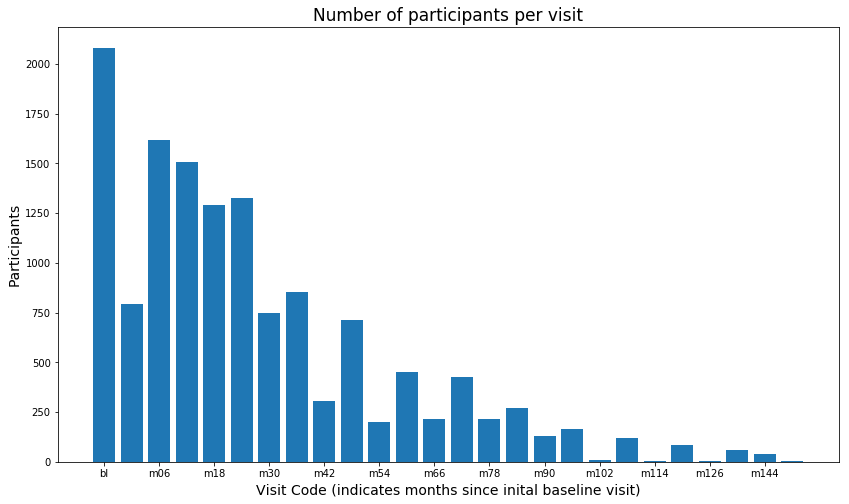

## Contents
{:.no_toc}
*  
{: toc}


```python
from IPython.core.display import HTML
with open("./project.css") as css:
    styles = css.read()
HTML(styles)
```


<style>
    table {
        display: inline-block
    }
    .rendered_html td, .rendered_html th {text-align: left;}
</style>


## ADNI

The overarching goal of the Alzheimer's Disease Neuroimaging Initiative (ADNI) is to identify biomarkers of Alzheimer’s disease. Specifically the study aims at identifying those biomarkers that can be used in the earliest (pre-dementia) prediction of Alzheimer's Disease (AD). The study began in 2004, a time when biomarkers for Alzheimer’s disease which could be used for diagnostics in pre-dementia individuals were virtually unknown. There are four categories of biomarkers in the scope of the initiative: (clinical, imaging, genetic, and biochemical).

There have been ADNI 4 study phases to date with the following goals:

<!-- Begin ADNI Phase table -->

| Study Phase | Goal | Dates | Cohort |
|:---: |:--- |:--- | --- |
| ADNI 1 | Develop biomarkers as outcome measures for clinical trials | 2004-2009 | 200 elderly controls<br>400 MCI<br>200 AD |
| ADNI GO | Examine biomarkers in earlier stages of disease | 2009-2011 | Existing ADNI-1 +<br>200 early MCI |
| ADNI 2 | Develop biomarkers as predictors of cognitive decline, and as outcome measures | 2011-2016 | Existing ADNI-1 and ADNI-GO +<br>150 elderly controls<br>100 early MCI<br>150 late MCI<br>150 AD |
| ADNI 3 | Study the use of tau PET and functional imaging techniques in clinical trials | 2016 - present | Existing ADNI-1, ADNI-GO, ADNI-2 +<br>133 elderly controls<br>151 MCI<br>87 AD |

<!-- End ADNI phase table -->

## ADNI Data
Before looking at a single observation or feature, there is a lot of information we can glean from reviewing ADNI metadata. There are over 250 datasets in the ADNI data inventory spanning the 4 study phases (ADNI 1, GO, 2, 3) - and this number does not include the archives. These studies are longitudinal. ADNI-1 started in 2004 and ADNI-3 continues today. Although there is potentially a wealth of information, insights, and predictive power in these data, their data collection methods and longitudinal nature present many challenges.

One challenge is that all biometrics within the scope of the study are not collected across all study phases. Also, within each phase, not all participants had all measurements taken. For example, in ADNI-1, $100\%$ of the cohort had a 1.5 Tesla (1.5T) MRI, $50\%$ had a PET scan. Of the $50\%$ that didn't have a PET scan, $25\%$ had a 3T MRI. Finally, only $20\%$ of the ADNI-1 cohort had a lumbar puncture (L.P.) to collect cerebral spinal fluid (CSF).

Other data challenges are related to the longitudinal nature of the studies across the different phases. In each successive phase of the study, participants were rolled over from previous phases while new participants were also added - *(cohort details can be seen in the table above)*. However, existing participants in the study must provide their consent to be included in each subsequent phase. Furthermore, an obvious, but nonetheless real, complication with this population is that a participant could be removed from the study at any time due to significant deterioration in health or death. 

The result is that each phase of the study produces a richer set of longitudinal data than the previous study because of the rollover participants. The downside of this design is the inherent introduction of missingness into the data due to the recently joined participants.

### An initial look at the data.
Given the breadth of available data and the challenges mentioned above, deciding what data to use to start EDA is a non-trivial task. Fortunately, there is a combined dataset available consisting of key ADNI tables merged into a single table based on the patient identifier or `RID`. As is common with most ADNI datasets, each observation represents a single visit for a participant. This means that a single participant (`RID`) may appear multiple times in the dataset. The number of occurrences will generally depend on what phase the participant entered the study.

Let's take an initial look at the merged dataset.


```python
import pandas as pd
import numpy as np
import matplotlib.pyplot as plt
import ADNI_utilities as utils

from pandas.plotting import scatter_matrix
from sklearn.preprocessing import MinMaxScaler
from sklearn.multiclass import OneVsRestClassifier
from sklearn.neighbors import KNeighborsClassifier
from sklearn.svm import LinearSVC
from sklearn.svm import SVC
from sklearn.tree import DecisionTreeClassifier
from sklearn.ensemble import AdaBoostClassifier
from sklearn.ensemble import BaggingClassifier
from sklearn.ensemble import RandomForestRegressor
from sklearn.gaussian_process import GaussianProcessClassifier
from sklearn.gaussian_process.kernels import RationalQuadratic
from sklearn.gaussian_process.kernels import RBF
from sklearn import linear_model
from sklearn.linear_model import LogisticRegression
from sklearn.svm import SVR


### Stacking libraries require mlxtend
### conda install mlxtend --channel conda-forge
from mlxtend.classifier import StackingCVClassifier
from mlxtend.regressor import StackingCVRegressor

"""
conda config --add channels conda-forge
conda install -y mlxtend
conda update -y pandas
conda update -y numpy
conda update -y scikit-learn --no-channel-priority
"""
```


    '\nconda config --add channels conda-forge\nconda install -y mlxtend\nconda update -y pandas\nconda update -y numpy\nconda update -y scikit-learn --no-channel-priority\n'


```python
adni_merge = pd.read_csv('../data/ADNIMERGE.csv', low_memory=False)
```


```python
print("The shape of the dataset is {}.".format(adni_merge.shape))
print("There are {} unique participants in the dataset."
      .format(len(adni_merge.RID.unique())))
print("There is an average of {:.2f} rows in the data per participant."
      .format(len(adni_merge)/len(adni_merge.RID.unique())))
```


    The shape of the dataset is (13632, 113).
    There are 2081 unique participants in the dataset.
    There is an average of 6.55 rows in the data per participant.
    

As seen above, the dataset contains $2081$ unique study participants spanning $13632$ visits. The data is longitudinal based on participant visits spaced roughly six months apart. The `VISCODE` feature represents the visit in which the measurements and evaluations were captured. The initial evaluation measurements are identified by `VISCODE` = `'bl'`, which stands for baseline. Below are the unique `VISCODE` values in the dataset:


```python
adni_merge.sort_values(by='Month')['VISCODE'].unique()
```


    array(['bl', 'm03', 'm06', 'm12', 'm18', 'm24', 'm36', 'm30', 'm42',
           'm48', 'm54', 'm60', 'm66', 'm72', 'm78', 'm84', 'm90', 'm96',
           'm102', 'm108', 'm114', 'm120', 'm126', 'm132', 'm144', 'm156'],
          dtype=object)


Let's visualize the number of study participants per `VISCODE`.


```python
adni_by_month = adni_merge.groupby(by='M').count()
particpants = adni_by_month['RID']
visits = adni_merge.sort_values(by='M')['VISCODE'].unique()

fig, ax = plt.subplots(1, 1, figsize=(14,8))

ax.set_title('Number of participants per visit', size=17)
ax.set_xticks(range(0, 26, 2))
ax.set_xlabel('Visit Code (indicates months since inital baseline visit)', size=14)
ax.set_ylabel('Participants', size=14)
ax.bar(visits, particpants)

plt.show()
```





Based on the design of the study as discussed above, we expect there to be a lot of missing data in this data set. Let's take a look.


```python
missing_data = utils.calculate_missing_data(adni_merge)

missing_data.head(10)
```


    There are a total of 507270 missing values.
    Out of 113 features in the dataset, 93 have missing values.
    
    Quartiles of missing data:
          Num Missing  Pct. Missing
    0.25       3839.0     28.161678
    0.50       6185.0     45.371185
    0.75       7758.0     56.910211
    1.00      13632.0    100.000000
    


<div>
<style scoped>
    .dataframe tbody tr th:only-of-type {
        vertical-align: middle;
    }

    .dataframe tbody tr th {
        vertical-align: top;
    }

    .dataframe thead th {
        text-align: right;
    }
</style>
<table border="1" class="dataframe">
  <thead>
    <tr style="text-align: right;">
      <th></th>
      <th>Num Missing</th>
      <th>Pct. Missing</th>
    </tr>
  </thead>
  <tbody>
    <tr>
      <th>FLDSTRENG_bl</th>
      <td>13632.0</td>
      <td>100.000000</td>
    </tr>
    <tr>
      <th>FLDSTRENG</th>
      <td>13632.0</td>
      <td>100.000000</td>
    </tr>
    <tr>
      <th>PIB_bl</th>
      <td>13483.0</td>
      <td>98.906984</td>
    </tr>
    <tr>
      <th>PIB</th>
      <td>13409.0</td>
      <td>98.364143</td>
    </tr>
    <tr>
      <th>PTAU</th>
      <td>11262.0</td>
      <td>82.614437</td>
    </tr>
    <tr>
      <th>ABETA</th>
      <td>11261.0</td>
      <td>82.607101</td>
    </tr>
    <tr>
      <th>TAU</th>
      <td>11261.0</td>
      <td>82.607101</td>
    </tr>
    <tr>
      <th>AV45</th>
      <td>11122.0</td>
      <td>81.587441</td>
    </tr>
    <tr>
      <th>FDG</th>
      <td>10125.0</td>
      <td>74.273768</td>
    </tr>
    <tr>
      <th>DIGITSCOR</th>
      <td>9832.0</td>
      <td>72.124413</td>
    </tr>
  </tbody>
</table>
</div>


We've noticed that the numbers of non-null values for `PTAU`, `ABETA`, and `TAU` are suspiciously close to the number of unique participants. The fact that these features all have almost the exact same number of missing values could be an artifact of how and when these data were collected. Perhaps these were collected on the initial baseline `bl` visit.


```python
missing_proteins = missing_data.loc[['TAU', 'PTAU', 'ABETA']]
missing_proteins['Num Values Present'] = len(adni_merge) - missing_proteins['Num Missing']
missing_proteins['Num Participants'] = len(adni_merge.RID.unique())
missing_proteins
```


<div>
<style scoped>
    .dataframe tbody tr th:only-of-type {
        vertical-align: middle;
    }

    .dataframe tbody tr th {
        vertical-align: top;
    }

    .dataframe thead th {
        text-align: right;
    }
</style>
<table border="1" class="dataframe">
  <thead>
    <tr style="text-align: right;">
      <th></th>
      <th>Num Missing</th>
      <th>Pct. Missing</th>
      <th>Num Values Present</th>
      <th>Num Participants</th>
    </tr>
  </thead>
  <tbody>
    <tr>
      <th>TAU</th>
      <td>11261.0</td>
      <td>82.607101</td>
      <td>2371.0</td>
      <td>2081</td>
    </tr>
    <tr>
      <th>PTAU</th>
      <td>11262.0</td>
      <td>82.614437</td>
      <td>2370.0</td>
      <td>2081</td>
    </tr>
    <tr>
      <th>ABETA</th>
      <td>11261.0</td>
      <td>82.607101</td>
      <td>2371.0</td>
      <td>2081</td>
    </tr>
  </tbody>
</table>
</div>


There are many options to deal with the variable number of visits in the merged data set. Instead of vertically stacking the visits as in the merged dataset, we could split on `VISCODE` and stack the data *horizontally* creating wide rows with many more features. However, this is essentially transposing the data and moving the missing values from deep columns to wide rows. Another option is to split the data into multiple subsets of data based on `VISCODE` and deal with them separately. As shown in the "*Participants per visit*" figure, every participant had at least a baseline visit. This subset should provide the most complete and uniform representation of the data.


```python
baseline = adni_merge[adni_merge['VISCODE'] == 'bl'].copy()
print('Shape of the baseline visit subset: ', baseline.shape)

baseline.head()
```


    Shape of the baseline visit subset:  (2081, 113)
    


<div>
<style scoped>
    .dataframe tbody tr th:only-of-type {
        vertical-align: middle;
    }

    .dataframe tbody tr th {
        vertical-align: top;
    }

    .dataframe thead th {
        text-align: right;
    }
</style>
<table border="1" class="dataframe">
  <thead>
    <tr style="text-align: right;">
      <th></th>
      <th>RID</th>
      <th>PTID</th>
      <th>VISCODE</th>
      <th>SITE</th>
      <th>COLPROT</th>
      <th>ORIGPROT</th>
      <th>EXAMDATE</th>
      <th>DX_bl</th>
      <th>AGE</th>
      <th>PTGENDER</th>
      <th>...</th>
      <th>TAU_bl</th>
      <th>PTAU_bl</th>
      <th>FDG_bl</th>
      <th>PIB_bl</th>
      <th>AV45_bl</th>
      <th>Years_bl</th>
      <th>Month_bl</th>
      <th>Month</th>
      <th>M</th>
      <th>update_stamp</th>
    </tr>
  </thead>
  <tbody>
    <tr>
      <th>0</th>
      <td>2</td>
      <td>011_S_0002</td>
      <td>bl</td>
      <td>11</td>
      <td>ADNI1</td>
      <td>ADNI1</td>
      <td>2005-09-08</td>
      <td>CN</td>
      <td>74.3</td>
      <td>Male</td>
      <td>...</td>
      <td>NaN</td>
      <td>NaN</td>
      <td>1.36665</td>
      <td>NaN</td>
      <td>NaN</td>
      <td>0.0</td>
      <td>0.0</td>
      <td>0</td>
      <td>0</td>
      <td>2018-10-19 22:51:15.0</td>
    </tr>
    <tr>
      <th>1</th>
      <td>3</td>
      <td>011_S_0003</td>
      <td>bl</td>
      <td>11</td>
      <td>ADNI1</td>
      <td>ADNI1</td>
      <td>2005-09-12</td>
      <td>AD</td>
      <td>81.3</td>
      <td>Male</td>
      <td>...</td>
      <td>239.7</td>
      <td>22.83</td>
      <td>1.08355</td>
      <td>NaN</td>
      <td>NaN</td>
      <td>0.0</td>
      <td>0.0</td>
      <td>0</td>
      <td>0</td>
      <td>2018-10-19 22:51:15.0</td>
    </tr>
    <tr>
      <th>5</th>
      <td>4</td>
      <td>022_S_0004</td>
      <td>bl</td>
      <td>22</td>
      <td>ADNI1</td>
      <td>ADNI1</td>
      <td>2005-11-08</td>
      <td>LMCI</td>
      <td>67.5</td>
      <td>Male</td>
      <td>...</td>
      <td>153.1</td>
      <td>13.29</td>
      <td>NaN</td>
      <td>NaN</td>
      <td>NaN</td>
      <td>0.0</td>
      <td>0.0</td>
      <td>0</td>
      <td>0</td>
      <td>2018-10-19 22:51:15.0</td>
    </tr>
    <tr>
      <th>10</th>
      <td>5</td>
      <td>011_S_0005</td>
      <td>bl</td>
      <td>11</td>
      <td>ADNI1</td>
      <td>ADNI1</td>
      <td>2005-09-07</td>
      <td>CN</td>
      <td>73.7</td>
      <td>Male</td>
      <td>...</td>
      <td>337</td>
      <td>33.43</td>
      <td>1.29343</td>
      <td>NaN</td>
      <td>NaN</td>
      <td>0.0</td>
      <td>0.0</td>
      <td>0</td>
      <td>0</td>
      <td>2018-10-19 22:51:15.0</td>
    </tr>
    <tr>
      <th>15</th>
      <td>6</td>
      <td>100_S_0006</td>
      <td>bl</td>
      <td>100</td>
      <td>ADNI1</td>
      <td>ADNI1</td>
      <td>2005-11-29</td>
      <td>LMCI</td>
      <td>80.4</td>
      <td>Female</td>
      <td>...</td>
      <td>NaN</td>
      <td>NaN</td>
      <td>NaN</td>
      <td>NaN</td>
      <td>NaN</td>
      <td>0.0</td>
      <td>0.0</td>
      <td>0</td>
      <td>0</td>
      <td>2018-10-19 22:51:15.0</td>
    </tr>
  </tbody>
</table>
<p>5 rows × 113 columns</p>
</div>


Let's examime the missing data from the baseline visit dataset.


```python
missing_data = utils.calculate_missing_data(baseline)
```


    There are a total of 54057 missing values.
    Out of 113 features in the dataset, 91 have missing values.
    
    Quartiles of missing data:
          Num Missing  Pct. Missing
    0.25         22.0      1.057184
    0.50        728.0     34.983181
    0.75        851.0     40.893801
    1.00       2081.0    100.000000
    

## Filling in Missing Data
Based on the study data, we know that not all biometrics are measured at every visit. Therefore we may be able to pull measures together from different visits to help fill in missing data. Of course since we're dealing with longitudinal data with visits month or years apart, we have to make sure that we only consider measures from visits where the diagnosis code is unchanged.


```python

baseline.sort_values(by='RID')
missing_cols = baseline.columns[baseline.isnull().any()]
viscodes = list(adni_merge.sort_values(by='Month')['VISCODE'].unique())
viscodes.pop(0) # Get rid of 'bl'

missing_values = baseline.isnull().sum().sum()
updated_values = 0

print('Searching...')
for col in missing_cols:
    
    for v in viscodes:
        
        # Get the RIDs with missing values in this colummn.
        # Do this for each VISCODE since we are iteratively
        # updating missing values.
        rids = baseline[baseline[col].isnull()].RID
        
        # Create a DataFrame from adni_merge for the current
        # VISCODE, RIDs, & where current col is not null.
        df = adni_merge.loc[(adni_merge.RID.isin(rids))
                            & (adni_merge.VISCODE == v)
                            & (adni_merge[col].notnull()),
                            baseline.columns] 
               
        if df.empty: # if no matches, continue
            continue
            
        df = df.copy()
        df.sort_values(by='RID', inplace=True)
            
        # Find baseline participants who are also in the current VISCODE
        bl = baseline[baseline.RID.isin(df.RID)].copy()
        bl.sort_values(by='RID', inplace=True)
        df.index = bl.index
        
        # Only keep those where the diagnosis is unchanged & col is not null
        df = df[(df.DX == bl.DX) & (df[col].notnull())]

        if df.empty:  # if DX codes don't match, continue
            continue

        # Update null values in the original baseline DF
        baseline.loc[baseline.index.isin(df.index), col] = df[col]
        updated_values += len(df)

print(f'Updated {updated_values} of {missing_values} missing values.')
```


    Searching...
    Updated 4104 of 54057 missing values.
    


```python
missing_data = utils.calculate_missing_data(baseline)

missing_data.head(10)
```


    There are a total of 49953 missing values.
    Out of 113 features in the dataset, 91 have missing values.
    
    Quartiles of missing data:
          Num Missing  Pct. Missing
    0.25         21.0      1.009130
    0.50        641.0     30.802499
    0.75        832.0     39.980778
    1.00       2081.0    100.000000
    


<div>
<style scoped>
    .dataframe tbody tr th:only-of-type {
        vertical-align: middle;
    }

    .dataframe tbody tr th {
        vertical-align: top;
    }

    .dataframe thead th {
        text-align: right;
    }
</style>
<table border="1" class="dataframe">
  <thead>
    <tr style="text-align: right;">
      <th></th>
      <th>Num Missing</th>
      <th>Pct. Missing</th>
    </tr>
  </thead>
  <tbody>
    <tr>
      <th>FLDSTRENG</th>
      <td>2081.0</td>
      <td>100.000000</td>
    </tr>
    <tr>
      <th>FLDSTRENG_bl</th>
      <td>2081.0</td>
      <td>100.000000</td>
    </tr>
    <tr>
      <th>PIB_bl</th>
      <td>2061.0</td>
      <td>99.038924</td>
    </tr>
    <tr>
      <th>PIB</th>
      <td>1990.0</td>
      <td>95.627102</td>
    </tr>
    <tr>
      <th>DIGITSCOR_bl</th>
      <td>1267.0</td>
      <td>60.884190</td>
    </tr>
    <tr>
      <th>DIGITSCOR</th>
      <td>1264.0</td>
      <td>60.740029</td>
    </tr>
    <tr>
      <th>AV45_bl</th>
      <td>1107.0</td>
      <td>53.195579</td>
    </tr>
    <tr>
      <th>AV45</th>
      <td>971.0</td>
      <td>46.660259</td>
    </tr>
    <tr>
      <th>EcogSPOrgan_bl</th>
      <td>891.0</td>
      <td>42.815954</td>
    </tr>
    <tr>
      <th>PTAU_bl</th>
      <td>866.0</td>
      <td>41.614608</td>
    </tr>
  </tbody>
</table>
</div>


Clearly a lot of missing data remain and we will likely have to explore methods to impute these values. Before doing that however, we will explore the data a little closer to see if there are features that should be dropped due to high correlation, lack of information, or other reasons.

`FLDSTRENG` and `FLDSTRENG_bl` are providing absolutely no information so we can drop them.


```python
baseline = baseline.drop(labels=['FLDSTRENG', 'FLDSTRENG_bl'], axis=1)
```


There appears to be a lot of features with similar, if not identical, information such as `TAU`, `TAU_bl`, `AV45`, `AV45_bl`. Let's examine this pattern to see if these pairs are highly correlated.


```python
corr_df = baseline.corr()
cols = baseline.columns
col1, col2, corr = [], [], []

for col in cols:
    if '_bl' in col.lower(): 
        drop_bl = col[0:-3]
        if (drop_bl in cols):
            if (col in corr_df.index and corr_df.loc[col][drop_bl] > .8):
                col1.append(col)
                col2.append(drop_bl)
                corr.append(corr_df.loc[col][drop_bl])

bl_corr_df = pd.DataFrame({"Baseline column": col1, 'Alternate column': col2, "Correlation": corr})
bl_corr_df
```


<div>
<style scoped>
    .dataframe tbody tr th:only-of-type {
        vertical-align: middle;
    }

    .dataframe tbody tr th {
        vertical-align: top;
    }

    .dataframe thead th {
        text-align: right;
    }
</style>
<table border="1" class="dataframe">
  <thead>
    <tr style="text-align: right;">
      <th></th>
      <th>Baseline column</th>
      <th>Alternate column</th>
      <th>Correlation</th>
    </tr>
  </thead>
  <tbody>
    <tr>
      <th>0</th>
      <td>CDRSB_bl</td>
      <td>CDRSB</td>
      <td>1.0</td>
    </tr>
    <tr>
      <th>1</th>
      <td>ADAS11_bl</td>
      <td>ADAS11</td>
      <td>1.0</td>
    </tr>
    <tr>
      <th>2</th>
      <td>ADAS13_bl</td>
      <td>ADAS13</td>
      <td>1.0</td>
    </tr>
    <tr>
      <th>3</th>
      <td>ADASQ4_bl</td>
      <td>ADASQ4</td>
      <td>1.0</td>
    </tr>
    <tr>
      <th>4</th>
      <td>MMSE_bl</td>
      <td>MMSE</td>
      <td>1.0</td>
    </tr>
    <tr>
      <th>5</th>
      <td>RAVLT_immediate_bl</td>
      <td>RAVLT_immediate</td>
      <td>1.0</td>
    </tr>
    <tr>
      <th>6</th>
      <td>RAVLT_learning_bl</td>
      <td>RAVLT_learning</td>
      <td>1.0</td>
    </tr>
    <tr>
      <th>7</th>
      <td>RAVLT_forgetting_bl</td>
      <td>RAVLT_forgetting</td>
      <td>1.0</td>
    </tr>
    <tr>
      <th>8</th>
      <td>RAVLT_perc_forgetting_bl</td>
      <td>RAVLT_perc_forgetting</td>
      <td>1.0</td>
    </tr>
    <tr>
      <th>9</th>
      <td>LDELTOTAL_BL</td>
      <td>LDELTOTAL</td>
      <td>1.0</td>
    </tr>
    <tr>
      <th>10</th>
      <td>DIGITSCOR_bl</td>
      <td>DIGITSCOR</td>
      <td>1.0</td>
    </tr>
    <tr>
      <th>11</th>
      <td>TRABSCOR_bl</td>
      <td>TRABSCOR</td>
      <td>1.0</td>
    </tr>
    <tr>
      <th>12</th>
      <td>FAQ_bl</td>
      <td>FAQ</td>
      <td>1.0</td>
    </tr>
    <tr>
      <th>13</th>
      <td>mPACCdigit_bl</td>
      <td>mPACCdigit</td>
      <td>1.0</td>
    </tr>
    <tr>
      <th>14</th>
      <td>mPACCtrailsB_bl</td>
      <td>mPACCtrailsB</td>
      <td>1.0</td>
    </tr>
    <tr>
      <th>15</th>
      <td>Ventricles_bl</td>
      <td>Ventricles</td>
      <td>1.0</td>
    </tr>
    <tr>
      <th>16</th>
      <td>Hippocampus_bl</td>
      <td>Hippocampus</td>
      <td>1.0</td>
    </tr>
    <tr>
      <th>17</th>
      <td>WholeBrain_bl</td>
      <td>WholeBrain</td>
      <td>1.0</td>
    </tr>
    <tr>
      <th>18</th>
      <td>Entorhinal_bl</td>
      <td>Entorhinal</td>
      <td>1.0</td>
    </tr>
    <tr>
      <th>19</th>
      <td>Fusiform_bl</td>
      <td>Fusiform</td>
      <td>1.0</td>
    </tr>
    <tr>
      <th>20</th>
      <td>MidTemp_bl</td>
      <td>MidTemp</td>
      <td>1.0</td>
    </tr>
    <tr>
      <th>21</th>
      <td>ICV_bl</td>
      <td>ICV</td>
      <td>1.0</td>
    </tr>
    <tr>
      <th>22</th>
      <td>MOCA_bl</td>
      <td>MOCA</td>
      <td>1.0</td>
    </tr>
    <tr>
      <th>23</th>
      <td>EcogPtMem_bl</td>
      <td>EcogPtMem</td>
      <td>1.0</td>
    </tr>
    <tr>
      <th>24</th>
      <td>EcogPtLang_bl</td>
      <td>EcogPtLang</td>
      <td>1.0</td>
    </tr>
    <tr>
      <th>25</th>
      <td>EcogPtVisspat_bl</td>
      <td>EcogPtVisspat</td>
      <td>1.0</td>
    </tr>
    <tr>
      <th>26</th>
      <td>EcogPtPlan_bl</td>
      <td>EcogPtPlan</td>
      <td>1.0</td>
    </tr>
    <tr>
      <th>27</th>
      <td>EcogPtOrgan_bl</td>
      <td>EcogPtOrgan</td>
      <td>1.0</td>
    </tr>
    <tr>
      <th>28</th>
      <td>EcogPtDivatt_bl</td>
      <td>EcogPtDivatt</td>
      <td>1.0</td>
    </tr>
    <tr>
      <th>29</th>
      <td>EcogPtTotal_bl</td>
      <td>EcogPtTotal</td>
      <td>1.0</td>
    </tr>
    <tr>
      <th>30</th>
      <td>EcogSPMem_bl</td>
      <td>EcogSPMem</td>
      <td>1.0</td>
    </tr>
    <tr>
      <th>31</th>
      <td>EcogSPLang_bl</td>
      <td>EcogSPLang</td>
      <td>1.0</td>
    </tr>
    <tr>
      <th>32</th>
      <td>EcogSPVisspat_bl</td>
      <td>EcogSPVisspat</td>
      <td>1.0</td>
    </tr>
    <tr>
      <th>33</th>
      <td>EcogSPPlan_bl</td>
      <td>EcogSPPlan</td>
      <td>1.0</td>
    </tr>
    <tr>
      <th>34</th>
      <td>EcogSPOrgan_bl</td>
      <td>EcogSPOrgan</td>
      <td>1.0</td>
    </tr>
    <tr>
      <th>35</th>
      <td>EcogSPDivatt_bl</td>
      <td>EcogSPDivatt</td>
      <td>1.0</td>
    </tr>
    <tr>
      <th>36</th>
      <td>EcogSPTotal_bl</td>
      <td>EcogSPTotal</td>
      <td>1.0</td>
    </tr>
    <tr>
      <th>37</th>
      <td>FDG_bl</td>
      <td>FDG</td>
      <td>1.0</td>
    </tr>
    <tr>
      <th>38</th>
      <td>PIB_bl</td>
      <td>PIB</td>
      <td>1.0</td>
    </tr>
    <tr>
      <th>39</th>
      <td>AV45_bl</td>
      <td>AV45</td>
      <td>1.0</td>
    </tr>
  </tbody>
</table>
</div>


These features indeed contain duplicate information so we can drop one of each pair.


```python
baseline = baseline.drop(labels=bl_corr_df['Baseline column'].values, axis=1)
print("The new shape of the baseline subset is {}.".format(baseline.shape))
```


    The new shape of the baseline subset is (2081, 71).
    


```python
baseline.columns.sort_values()
```


    Index(['ABETA', 'ABETA_bl', 'ADAS11', 'ADAS13', 'ADASQ4', 'AGE', 'APOE4',
           'AV45', 'CDRSB', 'COLPROT', 'DIGITSCOR', 'DX', 'DX_bl', 'EXAMDATE',
           'EXAMDATE_bl', 'EcogPtDivatt', 'EcogPtLang', 'EcogPtMem', 'EcogPtOrgan',
           'EcogPtPlan', 'EcogPtTotal', 'EcogPtVisspat', 'EcogSPDivatt',
           'EcogSPLang', 'EcogSPMem', 'EcogSPOrgan', 'EcogSPPlan', 'EcogSPTotal',
           'EcogSPVisspat', 'Entorhinal', 'FAQ', 'FDG', 'FSVERSION',
           'FSVERSION_bl', 'Fusiform', 'Hippocampus', 'ICV', 'IMAGEUID',
           'LDELTOTAL', 'M', 'MMSE', 'MOCA', 'MidTemp', 'Month', 'Month_bl',
           'ORIGPROT', 'PIB', 'PTAU', 'PTAU_bl', 'PTEDUCAT', 'PTETHCAT',
           'PTGENDER', 'PTID', 'PTMARRY', 'PTRACCAT', 'RAVLT_forgetting',
           'RAVLT_immediate', 'RAVLT_learning', 'RAVLT_perc_forgetting', 'RID',
           'SITE', 'TAU', 'TAU_bl', 'TRABSCOR', 'VISCODE', 'Ventricles',
           'WholeBrain', 'Years_bl', 'mPACCdigit', 'mPACCtrailsB', 'update_stamp'],
          dtype='object')


We still have some columns that look very similar. These may contain non-numeric values such as strings or NaNs, or possibly they are really uncorrelated.


```python
cols = ['ABETA', 'DX', 'EXAMDATE','FSVERSION',  'PTAU', 'TAU']

bl_missing = []
missing = []
matching_vals = []

for col in cols:
    missing.append(baseline[col].isnull().sum())
    bl_missing.append(baseline[col+'_bl'].isnull().sum())
    match = (baseline[col] == baseline[col+'_bl']).sum()
    matching_vals.append((match + min(missing[-1], bl_missing[-1]))/len(baseline) * 100)
                 
bl_dupes = pd.DataFrame({'Missing Values': missing,
                            'Baseline Missing Values': bl_missing,
                            'Percent Matching': matching_vals}, index=cols)
bl_dupes
```


<div>
<style scoped>
    .dataframe tbody tr th:only-of-type {
        vertical-align: middle;
    }

    .dataframe tbody tr th {
        vertical-align: top;
    }

    .dataframe thead th {
        text-align: right;
    }
</style>
<table border="1" class="dataframe">
  <thead>
    <tr style="text-align: right;">
      <th></th>
      <th>Missing Values</th>
      <th>Baseline Missing Values</th>
      <th>Percent Matching</th>
    </tr>
  </thead>
  <tbody>
    <tr>
      <th>ABETA</th>
      <td>832</td>
      <td>866</td>
      <td>98.366170</td>
    </tr>
    <tr>
      <th>DX</th>
      <td>25</td>
      <td>16</td>
      <td>24.939933</td>
    </tr>
    <tr>
      <th>EXAMDATE</th>
      <td>0</td>
      <td>0</td>
      <td>100.000000</td>
    </tr>
    <tr>
      <th>FSVERSION</th>
      <td>346</td>
      <td>357</td>
      <td>99.471408</td>
    </tr>
    <tr>
      <th>PTAU</th>
      <td>832</td>
      <td>866</td>
      <td>98.366170</td>
    </tr>
    <tr>
      <th>TAU</th>
      <td>832</td>
      <td>866</td>
      <td>98.366170</td>
    </tr>
  </tbody>
</table>
</div>


All of the pairs are nearly exact duplicates except `DX`|`DX_bl`, so we can drop one of the duplicate columns. The baseline versions have slightly more missing data, so we'll drop those. Then we'll take a look at `DX` vs.`DX_bl`.


```python
dupe_cols = [col + '_bl' for col in cols]

del dupe_cols[dupe_cols.index('DX_bl')]

baseline = baseline.drop(labels=dupe_cols, axis=1)
```


```python
baseline.drop_duplicates('DX_bl')[['DX_bl', 'DX']]
```


<div>
<style scoped>
    .dataframe tbody tr th:only-of-type {
        vertical-align: middle;
    }

    .dataframe tbody tr th {
        vertical-align: top;
    }

    .dataframe thead th {
        text-align: right;
    }
</style>
<table border="1" class="dataframe">
  <thead>
    <tr style="text-align: right;">
      <th></th>
      <th>DX_bl</th>
      <th>DX</th>
    </tr>
  </thead>
  <tbody>
    <tr>
      <th>0</th>
      <td>CN</td>
      <td>CN</td>
    </tr>
    <tr>
      <th>1</th>
      <td>AD</td>
      <td>Dementia</td>
    </tr>
    <tr>
      <th>5</th>
      <td>LMCI</td>
      <td>MCI</td>
    </tr>
    <tr>
      <th>48</th>
      <td>SMC</td>
      <td>CN</td>
    </tr>
    <tr>
      <th>2848</th>
      <td>EMCI</td>
      <td>MCI</td>
    </tr>
    <tr>
      <th>11389</th>
      <td>NaN</td>
      <td>NaN</td>
    </tr>
  </tbody>
</table>
</div>


Although similar, the diagnoses in `DX_bl` are more specific than those in `DX`. We'll use the more standard diagnosis codes in `DX`. However `DX_bl` has slightly less missingness so we'll keep that column and remap some of the values to match `DX` where needed.


```python
baseline = baseline.drop(labels=['DX'], axis=1)

baseline.DX_bl = baseline.DX_bl.replace('LMCI','MCI')
baseline.DX_bl = baseline.DX_bl.replace('EMCI','MCI')
baseline.DX_bl = baseline.DX_bl.replace('SMC','CN')
```


We also have some participants for which we have no diagnosis code, so these records will not be useful and can be dropped.


```python
missing_dx = len(baseline[baseline['DX_bl'].isnull()])
baseline = baseline.dropna(axis=0, subset=['DX_bl'])
print(f'Removed {missing_dx} participants with no diagnosis code.')
```


    Removed 16 participants with no diagnosis code.
    

`PTID` is also duplicative. It is a combination of `RID` and `SITE`.


```python
baseline = baseline.drop(labels='PTID', axis=1)
```


```python
print("The new shape of the baseline subset is {}.".format(baseline.shape))
utils.calculate_missing_data(baseline)
```


    The new shape of the baseline subset is (2065, 64).
    There are a total of 20821 missing values.
    Out of 64 features in the dataset, 44 have missing values.
    
    Quartiles of missing data:
          Num Missing  Pct. Missing
    0.25        22.75      1.101695
    0.50       541.50     26.222760
    0.75       649.00     31.428571
    1.00      1974.00     95.593220
    


<div>
<style scoped>
    .dataframe tbody tr th:only-of-type {
        vertical-align: middle;
    }

    .dataframe tbody tr th {
        vertical-align: top;
    }

    .dataframe thead th {
        text-align: right;
    }
</style>
<table border="1" class="dataframe">
  <thead>
    <tr style="text-align: right;">
      <th></th>
      <th>Num Missing</th>
      <th>Pct. Missing</th>
    </tr>
  </thead>
  <tbody>
    <tr>
      <th>PIB</th>
      <td>1974.0</td>
      <td>95.593220</td>
    </tr>
    <tr>
      <th>DIGITSCOR</th>
      <td>1248.0</td>
      <td>60.435835</td>
    </tr>
    <tr>
      <th>AV45</th>
      <td>956.0</td>
      <td>46.295400</td>
    </tr>
    <tr>
      <th>ABETA</th>
      <td>816.0</td>
      <td>39.515738</td>
    </tr>
    <tr>
      <th>TAU</th>
      <td>816.0</td>
      <td>39.515738</td>
    </tr>
    <tr>
      <th>PTAU</th>
      <td>816.0</td>
      <td>39.515738</td>
    </tr>
    <tr>
      <th>EcogSPOrgan</th>
      <td>670.0</td>
      <td>32.445521</td>
    </tr>
    <tr>
      <th>EcogSPDivatt</th>
      <td>656.0</td>
      <td>31.767554</td>
    </tr>
    <tr>
      <th>EcogSPVisspat</th>
      <td>654.0</td>
      <td>31.670702</td>
    </tr>
    <tr>
      <th>EcogSPPlan</th>
      <td>651.0</td>
      <td>31.525424</td>
    </tr>
    <tr>
      <th>EcogSPTotal</th>
      <td>649.0</td>
      <td>31.428571</td>
    </tr>
    <tr>
      <th>EcogSPMem</th>
      <td>649.0</td>
      <td>31.428571</td>
    </tr>
    <tr>
      <th>EcogSPLang</th>
      <td>648.0</td>
      <td>31.380145</td>
    </tr>
    <tr>
      <th>MOCA</th>
      <td>647.0</td>
      <td>31.331719</td>
    </tr>
    <tr>
      <th>EcogPtOrgan</th>
      <td>644.0</td>
      <td>31.186441</td>
    </tr>
    <tr>
      <th>FDG</th>
      <td>643.0</td>
      <td>31.138015</td>
    </tr>
    <tr>
      <th>EcogPtDivatt</th>
      <td>642.0</td>
      <td>31.089588</td>
    </tr>
    <tr>
      <th>EcogPtLang</th>
      <td>640.0</td>
      <td>30.992736</td>
    </tr>
    <tr>
      <th>EcogPtVisspat</th>
      <td>640.0</td>
      <td>30.992736</td>
    </tr>
    <tr>
      <th>EcogPtPlan</th>
      <td>639.0</td>
      <td>30.944310</td>
    </tr>
    <tr>
      <th>EcogPtMem</th>
      <td>638.0</td>
      <td>30.895884</td>
    </tr>
    <tr>
      <th>EcogPtTotal</th>
      <td>638.0</td>
      <td>30.895884</td>
    </tr>
    <tr>
      <th>Entorhinal</th>
      <td>445.0</td>
      <td>21.549637</td>
    </tr>
    <tr>
      <th>Fusiform</th>
      <td>445.0</td>
      <td>21.549637</td>
    </tr>
    <tr>
      <th>MidTemp</th>
      <td>445.0</td>
      <td>21.549637</td>
    </tr>
    <tr>
      <th>Hippocampus</th>
      <td>398.0</td>
      <td>19.273608</td>
    </tr>
    <tr>
      <th>Ventricles</th>
      <td>358.0</td>
      <td>17.336562</td>
    </tr>
    <tr>
      <th>WholeBrain</th>
      <td>346.0</td>
      <td>16.755448</td>
    </tr>
    <tr>
      <th>APOE4</th>
      <td>340.0</td>
      <td>16.464891</td>
    </tr>
    <tr>
      <th>FSVERSION</th>
      <td>330.0</td>
      <td>15.980630</td>
    </tr>
    <tr>
      <th>IMAGEUID</th>
      <td>330.0</td>
      <td>15.980630</td>
    </tr>
    <tr>
      <th>ICV</th>
      <td>330.0</td>
      <td>15.980630</td>
    </tr>
    <tr>
      <th>TRABSCOR</th>
      <td>26.0</td>
      <td>1.259080</td>
    </tr>
    <tr>
      <th>FAQ</th>
      <td>13.0</td>
      <td>0.629540</td>
    </tr>
    <tr>
      <th>RAVLT_perc_forgetting</th>
      <td>8.0</td>
      <td>0.387409</td>
    </tr>
    <tr>
      <th>ADAS13</th>
      <td>8.0</td>
      <td>0.387409</td>
    </tr>
    <tr>
      <th>ADAS11</th>
      <td>6.0</td>
      <td>0.290557</td>
    </tr>
    <tr>
      <th>LDELTOTAL</th>
      <td>3.0</td>
      <td>0.145278</td>
    </tr>
    <tr>
      <th>RAVLT_forgetting</th>
      <td>3.0</td>
      <td>0.145278</td>
    </tr>
    <tr>
      <th>RAVLT_learning</th>
      <td>3.0</td>
      <td>0.145278</td>
    </tr>
    <tr>
      <th>RAVLT_immediate</th>
      <td>3.0</td>
      <td>0.145278</td>
    </tr>
    <tr>
      <th>ADASQ4</th>
      <td>3.0</td>
      <td>0.145278</td>
    </tr>
    <tr>
      <th>mPACCdigit</th>
      <td>2.0</td>
      <td>0.096852</td>
    </tr>
    <tr>
      <th>mPACCtrailsB</th>
      <td>2.0</td>
      <td>0.096852</td>
    </tr>
  </tbody>
</table>
</div>


In the new dataset, it is clear that `PIB` will not be useful and can be removed. PIB or *PiB* stands for **Pi**ttsburgh Compound-**B** - a synthetic radiotracer developed for use in PET scans to visualize and measure A$\beta$ deposits in the brain.


```python
baseline = baseline.drop(labels='PIB', axis=1)
```


There are other features in the data that we are confindent won't be helpful in predicting AD. These include features such as `SITE`, `update_stamp`, `EXAMDATE`, etc. We will remove them.


```python
baseline = baseline.drop(labels=['update_stamp', 'Years_bl', 'SITE', 'VISCODE', 'COLPROT', 'ORIGPROT',
                                 'Month_bl', 'M', 'EXAMDATE', 'IMAGEUID'], axis=1)
```


```python
baseline.columns.sort_values()
```


    Index(['ABETA', 'ADAS11', 'ADAS13', 'ADASQ4', 'AGE', 'APOE4', 'AV45', 'CDRSB',
           'DIGITSCOR', 'DX_bl', 'EcogPtDivatt', 'EcogPtLang', 'EcogPtMem',
           'EcogPtOrgan', 'EcogPtPlan', 'EcogPtTotal', 'EcogPtVisspat',
           'EcogSPDivatt', 'EcogSPLang', 'EcogSPMem', 'EcogSPOrgan', 'EcogSPPlan',
           'EcogSPTotal', 'EcogSPVisspat', 'Entorhinal', 'FAQ', 'FDG', 'FSVERSION',
           'Fusiform', 'Hippocampus', 'ICV', 'LDELTOTAL', 'MMSE', 'MOCA',
           'MidTemp', 'Month', 'PTAU', 'PTEDUCAT', 'PTETHCAT', 'PTGENDER',
           'PTMARRY', 'PTRACCAT', 'RAVLT_forgetting', 'RAVLT_immediate',
           'RAVLT_learning', 'RAVLT_perc_forgetting', 'RID', 'TAU', 'TRABSCOR',
           'Ventricles', 'WholeBrain', 'mPACCdigit', 'mPACCtrailsB'],
          dtype='object')


We have some non-numeric data in `ABETA`, `TAU`, and `PTAU`, such as '>1300' or '<80'. We'll remove the `>` and `<` characters and change the dtype to float64.


```python
def remove_gt_lt(val):
    if type(val) == str:
        return float(val.replace('>', '').replace('<', ''))
    else:
        return val
    
    
for col in ['ABETA', 'TAU', 'PTAU']:
    values = baseline[col].values
    baseline[col] = list(map(remove_gt_lt, values))
```


```python
baseline['PTEDUCAT'] = baseline.PTEDUCAT.astype('float')
```


At this point, we have cleaned the data by removing duplicate/highly correlated or informationless features and filling in missing values that can be found within the collected data. To deal with the remaining missingness, we will impute values. But first we have to make a decision about whether to normalize the data before or after imputation. We have decided to standardize the data before imputing missing values. We reason that imputing on the data before standardization may cover up or dilute any bias present in the data. Also, standardizing the data before imputation is preferred if we use modeling to impute missing data.

There are additional (potentially valuable) data that are not included in the Merged data set. These data have been cleaned and put into a format such that we can join them to the merged data set. We will do that before performing any imputation.


```python
baseline.index = baseline['RID']
baseline = baseline.drop(labels='RID', axis=1)
```


```python
pat_data = pd.read_csv('../data/Per_Patient/patient_firstidx_merge.csv', index_col='RID', na_values='-1')
```


Let's identify and remove any duplicate columns.


```python
dupes = list(set(baseline.columns) & set(pat_data.columns))
pat_data = pat_data.drop(labels=dupes, axis=1)
print(f'Dropped duplicate columns: {dupes}')
```


    Dropped duplicate columns: ['ABETA', 'PTEDUCAT', 'PTETHCAT', 'PTMARRY', 'TAU', 'PTRACCAT', 'PTGENDER', 'PTAU']
    

Now we'll merge the ADNI_Merge dataset and cleaned Per_Patient dataset that we've built and curated from raw data files.


```python
pat_comb = pd.merge(baseline, pat_data, on='RID')

pat_comb = pat_comb.dropna(axis='columns', thresh=1)
```


Save the file before imputing.


```python
pat_comb.to_csv('../data/Per_Patient/pat_merge_b4_impute.csv')
```


Our goal is to strike a balance between keeping as much data as possible and reducing noise introduced by imputing columns that are nearly completely void of information. We will explore the relationship between these by imputing with different thresholds for missing data.


```python
def drop_missing_cols(data, threshold):
    """Drops cols from data that missing values above the threshold.
    
    # Arguments:
        data: The data to drop missing cols from
        threshold: float 0:1, the max allowable percentage of missing values
        
    # Returns
        The data with missing cols dropped.
    """
    cols = data.columns.values

    # Drop columns that don't have at least 1 - threshold non-NA values
    data = data.dropna(axis='columns', thresh=np.floor(data.shape[0] * (1 - threshold)))

    print('Dropped columns due to missingness:\n', set(cols) ^ set(data.columns.values))
    return data
```


Now we will prepare the categorical variables. Depending on the study, some categorical features use text values like `AD`, `MCI`, `MALE`, `FEMALE`, etc., and some use numerical codes. The per-patient data have been cleaned to and standardized to use numeric values. We will read in a file that identifies the correct dtypes per column.


```python
def get_combined_data(missing_thresh):
    """Gets the raw combined (ADNI_Merge and Per_Patient) datasets. The
    categorical features will have a dtype of 'int'. 
    
    # Returns:
        Returns the combined (ADNI_Merge and Per_Patient) datasets and lists
        of the categorical and non-categorical features.
    """
    # Read in the combined (Merged and Per Patient) dataset
    pat_comb = pd.read_csv('../data/Per_Patient/pat_merge_b4_impute.csv', index_col='RID')
    
    # Drop cols based on missing threshold
    pat_comb = drop_missing_cols(pat_comb, missing_thresh)

    # Import the dtypes. Categorical variables are represented as int64 as opposed to floats.
    dtypes = pd.read_csv('../data/Per_Patient/patient_firstidx_dtypes.csv', index_col='feature_name')

    # Categoricals from baseline
    categoricals = ['PTETHCAT', 'PTGENDER', 'PTRACCAT', 'PTMARRY', 'FSVERSION', 'APOE4', 'DX_bl']
    for cat in categoricals:
        if cat not in pat_comb.columns:
            categoricals.pop(categoricals.index(cat))

    # Collect categorical columns from pat_data based on dtype=int64
    for i in dtypes.index:
        # RID is the index so skip it
        if i == 'RID':
            continue
        # If dtype is int, the it's categorical
        if 'int' in dtypes.loc[i].data_type and i in pat_comb.columns:
            categoricals.append(i)

    # Remove any dupes
    categoricals = list(set(categoricals))
    non_cat = list(set(pat_comb.columns) ^ set(categoricals))
    return pat_comb, categoricals, non_cat
```


```python
missing_thresh = .5
```


At this point, we have cleaned the data by removing duplicate/highly correlated or informationless features and filling in missing values that can be found within the collected data. To deal with the remaining missingness, we will impute values. But first we have to make a decision about whether to normalize the data before or after imputation. We have decided to normalize the data before imputing missing values. We reason that imputing on the data before normalization may cover up or dilute any bias present in the data. Also, normalizing the data before imputation is preferred if we use modeling to impute missing data.


```python
pat_comb, categoricals, non_cat = get_combined_data(missing_thresh)
```


    Dropped columns due to missingness:
     {'DXMPTR1', 'MH14AALCH', 'MH16ASMOK', 'HMT95', 'CMT2', 'HMT93', 'DXMPTR4', 'MH15ADRUG', 'CMT3', 'HMT96', 'HMT21', 'DXNORM', 'DIGITSCOR', 'DADAD', 'MH16BSMOK', 'DXMPTR2', 'HMT20', 'AXT117', 'DXNODEP', 'HMT69', 'DXMPTR5', 'MH15BDRUG', 'UAT3', 'UAT2', 'MH16CSMOK', 'MH14BALCH', 'MH14CALCH', 'BAT324', 'DXMPTR3', 'HMT98', 'HMT70'}
    


```python
pat_comb = utils.scale_cols(data=pat_comb, cols=non_cat, scaler=MinMaxScaler())
```


    /home/ec2-user/anaconda3/lib/python3.6/site-packages/sklearn/preprocessing/data.py:323: DataConversionWarning: Data with input dtype int64, float64 were all converted to float64 by MinMaxScaler.
      return self.partial_fit(X, y)
    

Next we'll use a combination of stacking and grid search to see the effects of missingness and different models on imputation and predictive models. We'll start by defining the classifiers and regressors that we want to evaluate for imputing the missing data.


```python
def make_clf_stack():
    """Convenience function to create a stacking meta classifier.
    
    # Returns:
        A Stacking CV Classifier and a parameter grid.
    """
    # Define classification estimators and their param grids
    cl_params = {}

    # SVC
    svc = SVC(gamma='scale', decision_function_shape='ovr', probability=True, class_weight='balanced')
    bclf = BaggingClassifier(svc, max_samples=.5, max_features=.5, n_estimators=10, n_jobs=-1)
    clf1 = OneVsRestClassifier(bclf, n_jobs=-1)
    cl_params['onevsrestclassifier__estimator__base_estimator__kernel'] = ['linear', 'rbf']
    cl_params['onevsrestclassifier__estimator__base_estimator__C'] = 10. ** np.arange(-2, 2)

    # AdaBoost
    dtc = DecisionTreeClassifier(max_features="auto", class_weight="balanced", max_depth=None)
    clf2 = AdaBoostClassifier(base_estimator=dtc)
    cl_params['adaboostclassifier__base_estimator__criterion'] = ["gini"]
    cl_params['adaboostclassifier__n_estimators'] = [100]

    # KNN
    clf3 = KNeighborsClassifier(n_jobs=-1)
    cl_params['kneighborsclassifier__n_neighbors'] = [2, 5, 10, 100]

    # Meta-classifier
    meta_clf = LogisticRegression(solver='lbfgs', n_jobs=-1, multi_class='auto')
    #cl_params['meta-logisticregression__C'] = [0.1, 1, 10.0]

    # Stacking-Classifier
    sclf = StackingCVClassifier(classifiers=[clf1, clf2, clf3],
                                meta_classifier=meta_clf)
    
    return sclf, cl_params
```


```python
impute_thresh = .25
sclf, cl_params = make_clf_stack()

pat_comb, imputed_cols, scores, errors = utils.impute_values_classification(pat_comb,
                                                      cols=categoricals,
                                                      estimator=sclf,
                                                      param_grid=cl_params,
                                                      impute_thresh=impute_thresh)
```


    Imputing feature 1 of 80: MH3HEAD
    Imputing feature 2 of 80: BCDIZZY
    

    /home/ec2-user/anaconda3/lib/python3.6/site-packages/sklearn/externals/joblib/externals/loky/process_executor.py:706: UserWarning: A worker stopped while some jobs were given to the executor. This can be caused by a too short worker timeout or by a memory leak.
      "timeout or by a memory leak.", UserWarning
    

    Imputing feature 3 of 80: BCANKLE
    

    /home/ec2-user/anaconda3/lib/python3.6/site-packages/sklearn/externals/joblib/externals/loky/process_executor.py:706: UserWarning: A worker stopped while some jobs were given to the executor. This can be caused by a too short worker timeout or by a memory leak.
      "timeout or by a memory leak.", UserWarning
    

    Imputing feature 4 of 80: DXDEP
    

    /home/ec2-user/anaconda3/lib/python3.6/site-packages/sklearn/externals/joblib/externals/loky/process_executor.py:706: UserWarning: A worker stopped while some jobs were given to the executor. This can be caused by a too short worker timeout or by a memory leak.
      "timeout or by a memory leak.", UserWarning
    

    Imputing feature 5 of 80: MH17MALI
    

    /home/ec2-user/anaconda3/lib/python3.6/site-packages/sklearn/externals/joblib/externals/loky/process_executor.py:706: UserWarning: A worker stopped while some jobs were given to the executor. This can be caused by a too short worker timeout or by a memory leak.
      "timeout or by a memory leak.", UserWarning
    

    Imputing feature 6 of 80: NXSENSOR
    

    /home/ec2-user/anaconda3/lib/python3.6/site-packages/sklearn/externals/joblib/externals/loky/process_executor.py:706: UserWarning: A worker stopped while some jobs were given to the executor. This can be caused by a too short worker timeout or by a memory leak.
      "timeout or by a memory leak.", UserWarning
    

    Imputing feature 7 of 80: BCINSOMN
    

    /home/ec2-user/anaconda3/lib/python3.6/site-packages/sklearn/externals/joblib/externals/loky/process_executor.py:706: UserWarning: A worker stopped while some jobs were given to the executor. This can be caused by a too short worker timeout or by a memory leak.
      "timeout or by a memory leak.", UserWarning
    

    Imputing feature 8 of 80: FSVERSION
    Error fitting values for FSVERSION
    Cross-Sectional FreeSurfer (5.1)                       916
    Cross-Sectional FreeSurfer (FreeSurfer Version 4.3)    819
    Name: FSVERSION, dtype: int64
    Imputing feature 9 of 80: NXVISUAL
    Imputing feature 10 of 80: PTHAND
    

    /home/ec2-user/anaconda3/lib/python3.6/site-packages/sklearn/externals/joblib/externals/loky/process_executor.py:706: UserWarning: A worker stopped while some jobs were given to the executor. This can be caused by a too short worker timeout or by a memory leak.
      "timeout or by a memory leak.", UserWarning
    

    Imputing feature 11 of 80: MH2NEURL
    

    /home/ec2-user/anaconda3/lib/python3.6/site-packages/sklearn/externals/joblib/externals/loky/process_executor.py:706: UserWarning: A worker stopped while some jobs were given to the executor. This can be caused by a too short worker timeout or by a memory leak.
      "timeout or by a memory leak.", UserWarning
    

    Imputing feature 12 of 80: NXAUDITO
    

    /home/ec2-user/anaconda3/lib/python3.6/site-packages/sklearn/externals/joblib/externals/loky/process_executor.py:706: UserWarning: A worker stopped while some jobs were given to the executor. This can be caused by a too short worker timeout or by a memory leak.
      "timeout or by a memory leak.", UserWarning
    

    Imputing feature 13 of 80: BCDROWSY
    

    /home/ec2-user/anaconda3/lib/python3.6/site-packages/sklearn/externals/joblib/externals/loky/process_executor.py:706: UserWarning: A worker stopped while some jobs were given to the executor. This can be caused by a too short worker timeout or by a memory leak.
      "timeout or by a memory leak.", UserWarning
    

    Imputing feature 14 of 80: BCURNFRQ
    

    /home/ec2-user/anaconda3/lib/python3.6/site-packages/sklearn/externals/joblib/externals/loky/process_executor.py:706: UserWarning: A worker stopped while some jobs were given to the executor. This can be caused by a too short worker timeout or by a memory leak.
      "timeout or by a memory leak.", UserWarning
    

    Imputing feature 15 of 80: NXABNORM
    

    /home/ec2-user/anaconda3/lib/python3.6/site-packages/sklearn/model_selection/_split.py:652: Warning: The least populated class in y has only 2 members, which is too few. The minimum number of members in any class cannot be less than n_splits=5.
      % (min_groups, self.n_splits)), Warning)
    

    Error fitting values for NXABNORM
    1.0    2046
    2.0       2
    Name: NXABNORM, dtype: int64
    Imputing feature 16 of 80: BCVOMIT
    Error fitting values for BCVOMIT
    1.0    1719
    2.0      20
    Name: BCVOMIT, dtype: int64
    Imputing feature 17 of 80: BCSWEATN
    Imputing feature 18 of 80: MOMAD
    

    /home/ec2-user/anaconda3/lib/python3.6/site-packages/sklearn/externals/joblib/externals/loky/process_executor.py:706: UserWarning: A worker stopped while some jobs were given to the executor. This can be caused by a too short worker timeout or by a memory leak.
      "timeout or by a memory leak.", UserWarning
    

    Imputing feature 19 of 80: DADDEM
    

    /home/ec2-user/anaconda3/lib/python3.6/site-packages/sklearn/externals/joblib/externals/loky/process_executor.py:706: UserWarning: A worker stopped while some jobs were given to the executor. This can be caused by a too short worker timeout or by a memory leak.
      "timeout or by a memory leak.", UserWarning
    

    Imputing feature 20 of 80: MH13ALLE
    

    /home/ec2-user/anaconda3/lib/python3.6/site-packages/sklearn/externals/joblib/externals/loky/process_executor.py:706: UserWarning: A worker stopped while some jobs were given to the executor. This can be caused by a too short worker timeout or by a memory leak.
      "timeout or by a memory leak.", UserWarning
    

    Imputing feature 21 of 80: NXCONSCI
    

    /home/ec2-user/anaconda3/lib/python3.6/site-packages/sklearn/model_selection/_split.py:652: Warning: The least populated class in y has only 3 members, which is too few. The minimum number of members in any class cannot be less than n_splits=5.
      % (min_groups, self.n_splits)), Warning)
    

    Error fitting values for NXCONSCI
    1.0    2047
    2.0       3
    Name: NXCONSCI, dtype: int64
    Imputing feature 22 of 80: NXTREMOR
    Imputing feature 23 of 80: BCELMOOD
    Error fitting values for BCELMOOD
    1.0    1720
    2.0      19
    Name: BCELMOOD, dtype: int64
    Imputing feature 25 of 80: BCENERGY
    Imputing feature 27 of 80: NXHEEL
    Error fitting values for NXHEEL
    1.0    2015
    2.0      34
    Name: NXHEEL, dtype: int64
    Imputing feature 28 of 80: BCABDOMN
    Imputing feature 29 of 80: DX_BASE
    

    /home/ec2-user/anaconda3/lib/python3.6/site-packages/sklearn/externals/joblib/externals/loky/process_executor.py:706: UserWarning: A worker stopped while some jobs were given to the executor. This can be caused by a too short worker timeout or by a memory leak.
      "timeout or by a memory leak.", UserWarning
    

    Imputing feature 30 of 80: APGEN2
    Error fitting values for APGEN2
    3.0    911
    4.0    809
    2.0      5
    Name: APGEN2, dtype: int64
    Imputing feature 31 of 80: MH16SMOK
    Imputing feature 32 of 80: MH10GAST
    

    /home/ec2-user/anaconda3/lib/python3.6/site-packages/sklearn/externals/joblib/externals/loky/process_executor.py:706: UserWarning: A worker stopped while some jobs were given to the executor. This can be caused by a too short worker timeout or by a memory leak.
      "timeout or by a memory leak.", UserWarning
    

    Imputing feature 33 of 80: MH14ALCH
    

    /home/ec2-user/anaconda3/lib/python3.6/site-packages/sklearn/externals/joblib/externals/loky/process_executor.py:706: UserWarning: A worker stopped while some jobs were given to the executor. This can be caused by a too short worker timeout or by a memory leak.
      "timeout or by a memory leak.", UserWarning
    

    Imputing feature 35 of 80: BCBREATH
    

    /home/ec2-user/anaconda3/lib/python3.6/site-packages/sklearn/externals/joblib/externals/loky/process_executor.py:706: UserWarning: A worker stopped while some jobs were given to the executor. This can be caused by a too short worker timeout or by a memory leak.
      "timeout or by a memory leak.", UserWarning
    

    Imputing feature 36 of 80: DX_CHANGE
    

    /home/ec2-user/anaconda3/lib/python3.6/site-packages/sklearn/model_selection/_split.py:652: Warning: The least populated class in y has only 4 members, which is too few. The minimum number of members in any class cannot be less than n_splits=5.
      % (min_groups, self.n_splits)), Warning)
    

    Error fitting values for DX_CHANGE
    1.0    659
    5.0    573
    9.0    325
    8.0    288
    4.0     85
    2.0     60
    7.0     20
    6.0      4
    Name: DX_CHANGE, dtype: int64
    Imputing feature 37 of 80: BCWANDER
    Error fitting values for BCWANDER
    1.0    1732
    2.0       7
    Name: BCWANDER, dtype: int64
    Imputing feature 38 of 80: NXPLANTA
    Imputing feature 39 of 80: DX_FINAL
    

    /home/ec2-user/anaconda3/lib/python3.6/site-packages/sklearn/externals/joblib/externals/loky/process_executor.py:706: UserWarning: A worker stopped while some jobs were given to the executor. This can be caused by a too short worker timeout or by a memory leak.
      "timeout or by a memory leak.", UserWarning
    

    Imputing feature 40 of 80: BCCONSTP
    

    /home/ec2-user/anaconda3/lib/python3.6/site-packages/sklearn/externals/joblib/externals/loky/process_executor.py:706: UserWarning: A worker stopped while some jobs were given to the executor. This can be caused by a too short worker timeout or by a memory leak.
      "timeout or by a memory leak.", UserWarning
    

    Imputing feature 41 of 80: MOMDEM
    

    /home/ec2-user/anaconda3/lib/python3.6/site-packages/sklearn/externals/joblib/externals/loky/process_executor.py:706: UserWarning: A worker stopped while some jobs were given to the executor. This can be caused by a too short worker timeout or by a memory leak.
      "timeout or by a memory leak.", UserWarning
    

    Error fitting values for MOMDEM
    0.0    1203
    1.0     822
    2.0      33
    Name: MOMDEM, dtype: int64
    Imputing feature 42 of 80: MH18SURG
    Imputing feature 43 of 80: NXNERVE
    

    /home/ec2-user/anaconda3/lib/python3.6/site-packages/sklearn/externals/joblib/externals/loky/process_executor.py:706: UserWarning: A worker stopped while some jobs were given to the executor. This can be caused by a too short worker timeout or by a memory leak.
      "timeout or by a memory leak.", UserWarning
    

    Imputing feature 44 of 80: MHPSYCH
    

    /home/ec2-user/anaconda3/lib/python3.6/site-packages/sklearn/externals/joblib/externals/loky/process_executor.py:706: UserWarning: A worker stopped while some jobs were given to the executor. This can be caused by a too short worker timeout or by a memory leak.
      "timeout or by a memory leak.", UserWarning
    

    Imputing feature 45 of 80: MH6HEPAT
    

    /home/ec2-user/anaconda3/lib/python3.6/site-packages/sklearn/externals/joblib/externals/loky/process_executor.py:706: UserWarning: A worker stopped while some jobs were given to the executor. This can be caused by a too short worker timeout or by a memory leak.
      "timeout or by a memory leak.", UserWarning
    

    Imputing feature 46 of 80: NXOTHER
    

    /home/ec2-user/anaconda3/lib/python3.6/site-packages/sklearn/externals/joblib/externals/loky/process_executor.py:706: UserWarning: A worker stopped while some jobs were given to the executor. This can be caused by a too short worker timeout or by a memory leak.
      "timeout or by a memory leak.", UserWarning
    

    Imputing feature 48 of 80: BCCOUGH
    

    /home/ec2-user/anaconda3/lib/python3.6/site-packages/sklearn/externals/joblib/externals/loky/process_executor.py:706: UserWarning: A worker stopped while some jobs were given to the executor. This can be caused by a too short worker timeout or by a memory leak.
      "timeout or by a memory leak.", UserWarning
    

    Imputing feature 49 of 80: BCMUSCLE
    

    /home/ec2-user/anaconda3/lib/python3.6/site-packages/sklearn/externals/joblib/externals/loky/process_executor.py:706: UserWarning: A worker stopped while some jobs were given to the executor. This can be caused by a too short worker timeout or by a memory leak.
      "timeout or by a memory leak.", UserWarning
    

    Imputing feature 50 of 80: BCNAUSEA
    Imputing feature 51 of 80: BCFALL
    

    /home/ec2-user/anaconda3/lib/python3.6/site-packages/sklearn/externals/joblib/externals/loky/process_executor.py:706: UserWarning: A worker stopped while some jobs were given to the executor. This can be caused by a too short worker timeout or by a memory leak.
      "timeout or by a memory leak.", UserWarning
    

    Imputing feature 52 of 80: DXCOMB
    

    /home/ec2-user/anaconda3/lib/python3.6/site-packages/sklearn/externals/joblib/externals/loky/process_executor.py:706: UserWarning: A worker stopped while some jobs were given to the executor. This can be caused by a too short worker timeout or by a memory leak.
      "timeout or by a memory leak.", UserWarning
    

    Imputing feature 54 of 80: BCDPMOOD
    

    /home/ec2-user/anaconda3/lib/python3.6/site-packages/sklearn/externals/joblib/externals/loky/process_executor.py:706: UserWarning: A worker stopped while some jobs were given to the executor. This can be caused by a too short worker timeout or by a memory leak.
      "timeout or by a memory leak.", UserWarning
    

    Imputing feature 55 of 80: DXPARK
    Error fitting values for DXPARK
    0.0    1228
    1.0      11
    Name: DXPARK, dtype: int64
    Imputing feature 57 of 80: MH9ENDO
    Imputing feature 58 of 80: MH12RENA
    

    /home/ec2-user/anaconda3/lib/python3.6/site-packages/sklearn/externals/joblib/externals/loky/process_executor.py:706: UserWarning: A worker stopped while some jobs were given to the executor. This can be caused by a too short worker timeout or by a memory leak.
      "timeout or by a memory leak.", UserWarning
    

    Imputing feature 59 of 80: APGEN1
    

    /home/ec2-user/anaconda3/lib/python3.6/site-packages/sklearn/externals/joblib/externals/loky/process_executor.py:706: UserWarning: A worker stopped while some jobs were given to the executor. This can be caused by a too short worker timeout or by a memory leak.
      "timeout or by a memory leak.", UserWarning
    

    Imputing feature 60 of 80: BCURNDIS
    Error fitting values for BCURNDIS
    1.0    1699
    2.0      40
    Name: BCURNDIS, dtype: int64
    Imputing feature 61 of 80: BCPALPIT
    Imputing feature 62 of 80: MH15DRUG
    Error fitting values for MH15DRUG
    0.0    1726
    1.0      13
    Name: MH15DRUG, dtype: int64
    Imputing feature 63 of 80: NXGAIT
    Imputing feature 64 of 80: BCCHEST
    

    /home/ec2-user/anaconda3/lib/python3.6/site-packages/sklearn/externals/joblib/externals/loky/process_executor.py:706: UserWarning: A worker stopped while some jobs were given to the executor. This can be caused by a too short worker timeout or by a memory leak.
      "timeout or by a memory leak.", UserWarning
    

    Error fitting values for BCCHEST
    1.0    1707
    2.0      32
    Name: BCCHEST, dtype: int64
    Imputing feature 65 of 80: BCHDACHE
    Imputing feature 66 of 80: MH4CARD
    

    /home/ec2-user/anaconda3/lib/python3.6/site-packages/sklearn/externals/joblib/externals/loky/process_executor.py:706: UserWarning: A worker stopped while some jobs were given to the executor. This can be caused by a too short worker timeout or by a memory leak.
      "timeout or by a memory leak.", UserWarning
    

    Imputing feature 67 of 80: NXMOTOR
    

    /home/ec2-user/anaconda3/lib/python3.6/site-packages/sklearn/externals/joblib/externals/loky/process_executor.py:706: UserWarning: A worker stopped while some jobs were given to the executor. This can be caused by a too short worker timeout or by a memory leak.
      "timeout or by a memory leak.", UserWarning
    

    Imputing feature 68 of 80: BCDRYMTH
    Imputing feature 69 of 80: MH5RESP
    Imputing feature 70 of 80: BCDIARRH
    Imputing feature 71 of 80: BCRASH
    Imputing feature 72 of 80: MH8MUSCL
    Imputing feature 73 of 80: NXTENDON
    

    /home/ec2-user/anaconda3/lib/python3.6/site-packages/sklearn/externals/joblib/externals/loky/process_executor.py:706: UserWarning: A worker stopped while some jobs were given to the executor. This can be caused by a too short worker timeout or by a memory leak.
      "timeout or by a memory leak.", UserWarning
    

    Imputing feature 74 of 80: MH7DERM
    

    /home/ec2-user/anaconda3/lib/python3.6/site-packages/sklearn/externals/joblib/externals/loky/process_executor.py:706: UserWarning: A worker stopped while some jobs were given to the executor. This can be caused by a too short worker timeout or by a memory leak.
      "timeout or by a memory leak.", UserWarning
    

    Imputing feature 76 of 80: BCCRYING
    

    /home/ec2-user/anaconda3/lib/python3.6/site-packages/sklearn/externals/joblib/externals/loky/process_executor.py:706: UserWarning: A worker stopped while some jobs were given to the executor. This can be caused by a too short worker timeout or by a memory leak.
      "timeout or by a memory leak.", UserWarning
    

    Imputing feature 77 of 80: BCVISION
    Imputing feature 78 of 80: APOE4
    

    /home/ec2-user/anaconda3/lib/python3.6/site-packages/sklearn/externals/joblib/externals/loky/process_executor.py:706: UserWarning: A worker stopped while some jobs were given to the executor. This can be caused by a too short worker timeout or by a memory leak.
      "timeout or by a memory leak.", UserWarning
    /home/ec2-user/anaconda3/lib/python3.6/site-packages/sklearn/model_selection/_search.py:841: DeprecationWarning: The default of the `iid` parameter will change from True to False in version 0.22 and will be removed in 0.24. This will change numeric results when test-set sizes are unequal.
      DeprecationWarning)
    

    Imputing feature 79 of 80: NXFINGER
    

    /home/ec2-user/anaconda3/lib/python3.6/site-packages/sklearn/externals/joblib/externals/loky/process_executor.py:706: UserWarning: A worker stopped while some jobs were given to the executor. This can be caused by a too short worker timeout or by a memory leak.
      "timeout or by a memory leak.", UserWarning
    /home/ec2-user/anaconda3/lib/python3.6/site-packages/sklearn/externals/joblib/externals/loky/process_executor.py:706: UserWarning: A worker stopped while some jobs were given to the executor. This can be caused by a too short worker timeout or by a memory leak.
      "timeout or by a memory leak.", UserWarning
    

    Imputing feature 80 of 80: MH11HEMA
    

    /home/ec2-user/anaconda3/lib/python3.6/site-packages/sklearn/externals/joblib/externals/loky/process_executor.py:706: UserWarning: A worker stopped while some jobs were given to the executor. This can be caused by a too short worker timeout or by a memory leak.
      "timeout or by a memory leak.", UserWarning
    


```python
clf_data_file = f'../data/Imputed/Combined/data_missing{missing_thresh}_StackingCVClassifier_impute{impute_thresh}.csv'
pat_comb.to_csv(clf_data_file)
```


```python
models, m_score = list(map(list, zip(*scores)))

def name_model(model, col):
    nm = model.__repr__().split('(')[0]
    return f"{col}_{missing_thresh}_{nm}_{impute_thresh}"

model_names = [name_model(model, col) for model, col in zip(models, imputed_cols)]


scores_pd = pd.DataFrame({'Score': m_score, 'Model': model_names}, index=imputed_cols)
scores_pd.index.name = 'Feature'
clf_scores_file = f'../data/Imputed/Combined/scores_missing{missing_thresh}_StackingCVClassifier_impute{impute_thresh}.csv'
scores_pd.to_csv(clf_scores_file)
```


```python
scores_pd = pd.read_csv(clf_scores_file, index_col='Feature')
scores_pd.head()
```


<div>
<style scoped>
    .dataframe tbody tr th:only-of-type {
        vertical-align: middle;
    }

    .dataframe tbody tr th {
        vertical-align: top;
    }

    .dataframe thead th {
        text-align: right;
    }
</style>
<table border="1" class="dataframe">
  <thead>
    <tr style="text-align: right;">
      <th></th>
      <th>Score</th>
      <th>Model</th>
    </tr>
    <tr>
      <th>Feature</th>
      <th></th>
      <th></th>
    </tr>
  </thead>
  <tbody>
    <tr>
      <th>MH3HEAD</th>
      <td>0.654399</td>
      <td>MH3HEAD_0.5_StackingCVClassifier_0.25</td>
    </tr>
    <tr>
      <th>BCDIZZY</th>
      <td>0.867740</td>
      <td>BCDIZZY_0.5_StackingCVClassifier_0.25</td>
    </tr>
    <tr>
      <th>BCANKLE</th>
      <td>0.901668</td>
      <td>BCANKLE_0.5_StackingCVClassifier_0.25</td>
    </tr>
    <tr>
      <th>DXDEP</th>
      <td>0.923423</td>
      <td>DXDEP_0.5_StackingCVClassifier_0.25</td>
    </tr>
    <tr>
      <th>MH17MALI</th>
      <td>0.764807</td>
      <td>MH17MALI_0.5_StackingCVClassifier_0.25</td>
    </tr>
  </tbody>
</table>
</div>


```python
err_file = f'../data/Imputed/Combined/errors_missing{missing_thresh}_StackingCVClassifier_impute{impute_thresh}.csv'
try:
    pd.Series(errors).to_csv(err_file)
except:
    print(errors)
```


Impute missing continuous variables.


```python
def make_reg_stack():
    """Convenience function to create a stacking meta regressor.
    
    # Returns:
        A Stacking CV Regressor and a parameter grid.
    """
    # Define regression estimators and their param grids
    reg_params = {}

    # Lasso estimator
    reg1 = linear_model.Lasso(selection='random', max_iter=3000)
    reg_params['lasso__alpha'] = [.001, .01, .1]
    
    # Ridge estimator
    reg2 = linear_model.Ridge(max_iter=3000)
    reg_params['ridge__alpha'] = [.001, .01, .1]
    
    reg3 = SVR(kernel='rbf', gamma='auto')
    reg_params['svr__C'] = [.01, 1, 10, 100]
    
    # RandomForest estimator
    meta_reg = RandomForestRegressor(n_estimators=100, n_jobs=-1, oob_score=True)
    reg_params['meta-randomforestregressor__min_samples_leaf'] = [3, 10, 50, 100]


    reg_stack = StackingCVRegressor(regressors=(reg1, reg2, reg3),
                            meta_regressor=meta_reg, 
                            use_features_in_secondary=True)
    
    return reg_stack, reg_params
```


```python
impute_thresh = .25
pat_comb = pd.read_csv(clf_data_file, index_col='RID', na_values='-1')
```


```python
reg_stack, reg_params = make_reg_stack()
pat_comb, imputed_cols, scores = utils.impute_values_regression(pat_comb,
                                                      cols=non_cat,
                                                      estimator=reg_stack,
                                                      param_grid=reg_params)
```


    Imputing feature 1 of 85: RCT1407
    Imputing feature 2 of 85: EcogPtMem
    Imputing feature 3 of 85: FDG
    Imputing feature 4 of 85: RCT11
    Imputing feature 5 of 85: MOCA
    Imputing feature 6 of 85: EcogPtTotal
    Imputing feature 7 of 85: RCT29
    Imputing feature 9 of 85: EcogSPMem
    Imputing feature 10 of 85: WholeBrain
    Imputing feature 11 of 85: MidTemp
    Imputing feature 12 of 85: HMT10
    Imputing feature 13 of 85: EcogSPDivatt
    Imputing feature 14 of 85: RCT4
    Imputing feature 15 of 85: EcogSPOrgan
    Imputing feature 16 of 85: HMT40
    Imputing feature 17 of 85: HMT12
    Imputing feature 18 of 85: RCT8
    Imputing feature 19 of 85: RCT1
    Imputing feature 20 of 85: EcogSPLang
    Imputing feature 21 of 85: EcogPtDivatt
    Imputing feature 23 of 85: HMT19
    Imputing feature 24 of 85: RCT6
    Imputing feature 25 of 85: RCT183
    Imputing feature 26 of 85: HMT11
    

    /home/ec2-user/anaconda3/lib/python3.6/site-packages/sklearn/model_selection/_search.py:841: DeprecationWarning: The default of the `iid` parameter will change from True to False in version 0.22 and will be removed in 0.24. This will change numeric results when test-set sizes are unequal.
      DeprecationWarning)
    

    Imputing feature 27 of 85: GDTOTAL
    Imputing feature 28 of 85: FAQ
    Imputing feature 29 of 85: RCT20
    Imputing feature 30 of 85: RCT5
    Imputing feature 31 of 85: Fusiform
    Imputing feature 32 of 85: HMT7
    Imputing feature 33 of 85: EcogSPPlan
    Imputing feature 34 of 85: HMT13
    Imputing feature 35 of 85: RCT9
    Imputing feature 36 of 85: RCT14
    

    /home/ec2-user/anaconda3/lib/python3.6/site-packages/sklearn/model_selection/_search.py:841: DeprecationWarning: The default of the `iid` parameter will change from True to False in version 0.22 and will be removed in 0.24. This will change numeric results when test-set sizes are unequal.
      DeprecationWarning)
    

    Imputing feature 38 of 85: EcogPtPlan
    Imputing feature 39 of 85: AV45
    Imputing feature 40 of 85: ICV
    Imputing feature 41 of 85: HMT3
    Imputing feature 42 of 85: HMT8
    Imputing feature 43 of 85: MMSCORE
    Imputing feature 44 of 85: EcogPtLang
    Imputing feature 45 of 85: RCT12
    Imputing feature 46 of 85: EcogSPTotal
    Imputing feature 47 of 85: RCT3
    

    /home/ec2-user/anaconda3/lib/python3.6/site-packages/sklearn/model_selection/_search.py:841: DeprecationWarning: The default of the `iid` parameter will change from True to False in version 0.22 and will be removed in 0.24. This will change numeric results when test-set sizes are unequal.
      DeprecationWarning)
    

    Imputing feature 48 of 85: HMT18
    Imputing feature 49 of 85: HMT2
    Imputing feature 50 of 85: HMT17
    Imputing feature 51 of 85: BAT126
    Imputing feature 52 of 85: ABETA
    Imputing feature 53 of 85: ADASQ4
    Imputing feature 54 of 85: HMT15
    Imputing feature 55 of 85: mPACCtrailsB
    Imputing feature 57 of 85: LDELTOTAL
    Imputing feature 58 of 85: HMT16
    Imputing feature 59 of 85: ADAS11
    Imputing feature 60 of 85: EcogPtOrgan
    


```python
final_data_file = f'../data/Imputed/Combined/data_missing{missing_thresh}_StackingCVRegressor_impute{impute_thresh}.csv'
pat_comb.to_csv(final_data_file)
```


```python
models, m_score = list(map(list, zip(*scores)))

def name_model(model, col):
    nm = model.__repr__().split('(')[0]
    return f"{col}_{missing_thresh}_{nm}_{impute_thresh}"

model_names = [name_model(model, col) for model, col in zip(models, imputed_cols)]
```


```python
scores_pd = pd.read_csv(clf_scores_file, index_col='Feature')
df = pd.DataFrame({'Score': m_score, 'Model': model_names}, index=imputed_cols)
df.index.name = 'Feature'
scores_pd = pd.concat([scores_pd, df], sort=True)
final_scores_file = f'../data/Imputed/Combined/scores_missing{missing_thresh}_StackingCVRegressor_impute{impute_thresh}.csv'
scores_pd.to_csv(final_scores_file)
```


```python
scores_pd.head()
```

