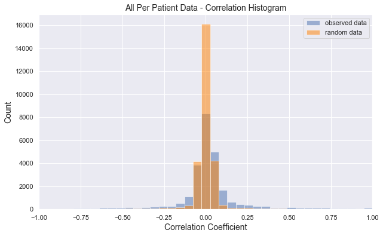
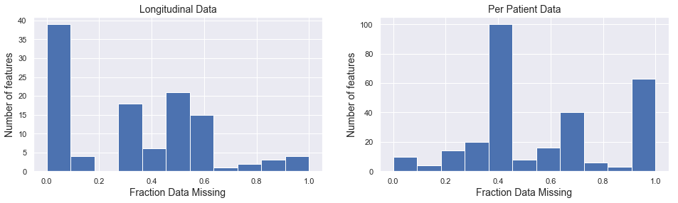
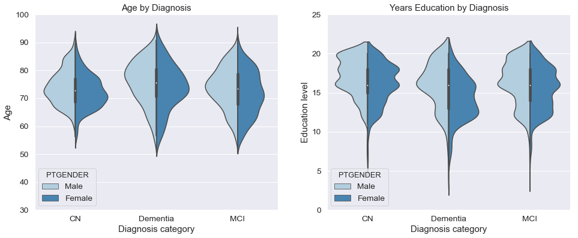
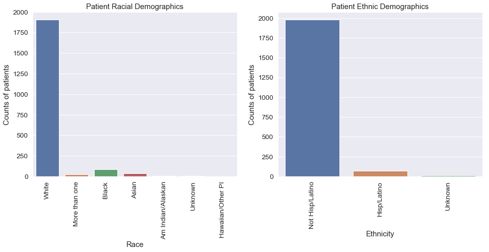

title: 
notebook: 
section: 
subsection: 

## Contents
{:.no_toc}
*  
{: toc}


```python
import pandas as pd 
import datetime
import numpy as np 
import scipy as sp
from scipy.stats import mode
import matplotlib
import matplotlib.pyplot as plt
import seaborn as sns
sns.set()
from pandas.plotting import scatter_matrix
from sklearn.preprocessing import Imputer
from sklearn.metrics import mean_squared_error
from sklearn.model_selection import train_test_split
```


## Computing the distribution of correlation coefficients


```python
raw_df = pd.read_csv("../data/Per_Patient/patient_firstidx_merge.csv", low_memory=False)
merge_df = pd.read_csv("../data/ADNIMERGE.csv", low_memory=False)
```


```python
drop_cols=["PTID","VISCODE","SITE","COLPROT","ORIGPROT","EXAMDATE","M","Month"]
```


```python
by_vis = merge_df.groupby("VISCODE")
bl_df = by_vis.get_group("bl")
```


```python
bl_df = bl_df.set_index("RID")
bl_df = bl_df.drop(columns=drop_cols, axis=1)
bl_df = bl_df.drop(columns=bl_df.columns[bl_df.dtypes==np.object],axis=1)
```


```python
raw_df.replace({-1: np.nan}, inplace=True)
raw_df = raw_df.set_index("RID")
```


```python
mdf = pd.concat((bl_df,raw_df), axis=1)
```


```python
r=mdf.corr().values
```


```python
rand_vals = np.random.rand(mdf.shape[0],mdf.shape[1])
rand_vals[mdf.isna()] = np.nan
rand_df = pd.DataFrame(rand_vals)
r_null = rand_df.corr().values
```


```python
plt.figure(figsize=(10,6))
all_coef = np.empty([])
null_coef = np.empty([])
for i in range(r.shape[0]):
    for j in range(i):
        if i != j:
            all_coef = np.append(all_coef,r[i,j])
            null_coef = np.append(null_coef,r_null[i,j])
            
all_coef = all_coef[~np.isnan(all_coef)]
null_coef = null_coef[~np.isnan(null_coef)]
bins = np.linspace(-1,1,40)
plt.hist(all_coef, bins, color='b', alpha=0.5, label="observed data")
plt.hist(null_coef, bins, color=(1,.5,0), alpha=0.5, label="random data")
plt.xlabel("Correlation Coefficient", Fontsize=14)
plt.ylabel("Count", Fontsize=14)
plt.title("All Per Patient Data - Correlation Histogram", Fontsize=14)
plt.xlim([-1,1])
plt.legend();
plt.savefig("../figures/corrcoef_hist.svg")
```





## Missingness


```python
pct_missing = merge_df.isna().sum(0)/merge_df.shape[0]
pct_missing = np.sort(pct_missing)[::-1]

#plt.bar(np.arange(1,pct_missing.shape[0]+1,1),pct_missing, width=1, color=(1,.5,0), alpha=0.5, edgecolor='none')
plt.figure(figsize=(16,4))
plt.subplot(1,2,1)
plt.hist(pct_missing, bins=np.linspace(0,1,12))
plt.title('Longitudinal Data', FontSize=14)
plt.ylabel('Number of features', FontSize=14)
plt.xlabel("Fraction Data Missing", FontSize=14)

plt.subplot(1,2,2)
pct_missing = mdf.isna().sum(0)/mdf.shape[0]
pct_missing = np.sort(pct_missing)[::-1]

#plt.bar(np.arange(1,pct_missing.shape[0]+1,1),pct_missing, width=1, color=(1,.5,0), alpha=0.5, edgecolor='none')
plt.hist(pct_missing, bins=np.linspace(0,1,12))
plt.title('Per Patient Data', FontSize=14)
plt.ylabel('Number of features', FontSize=14)
plt.xlabel("Fraction Data Missing", FontSize=14)
plt.subplots_adjust(wspace=0.2)
plt.savefig("../figures/missingness_hist.svg")
```





## Patient Demographics


```python
def find_final_diagnosis(df): 
    final_diag = []
    groups = df.groupby('RID').groups
    for group in groups: 
        last_index = groups[group][-1]
        diagnosis = df['DX'].loc[last_index]
        final_diag.append(diagnosis)
    return final_diag
```


```python
bl_df = merge_df.dropna(subset=["DX_bl","DX"])
bl_df = bl_df[bl_df['VISCODE'] == 'bl']
final_dx = find_final_diagnosis(bl_df)
bl_df['final_dx'] = final_dx
diagnosis = bl_df[['DX', 'final_dx', 'ORIGPROT']]


# sns.set(font_scale=1.25)
# f, (ax1, ax2, ax3) = plt.subplots(1, 3, figsize= (18, 5))

# ax3.hist(x = diagnosis[['DX', 'final_dx']])
# ax3.set_xlabel('Diagnostic Group')
# ax3.set_ylabel('Number of Patients')
# ax3.legend(['Baseline Diagnosis', 'Final Diagnosis'])
# ax3.set_title('Patient Distribution among Diagnostic groups')


# ax2.hist(diagnosis['ORIGPROT'])
# ax2.set_xlabel('ADNI phases')
# ax2.set_ylabel('Number of Patients')
# ax2.set_title('Patient Distribution among ADNI phases')

# ax1.hist(adnimerge2[['VISCODE']])
# ax1.set_xlabel('Months after initial visit')
# ax1.set_ylabel('Number of Patients')
# ax1.set_title('Patient data is collected over many visits')
# plt.setp(ax1.get_xticklabels(), rotation=30)

# f.savefig("Patient_Demographics.svg", format = 'svg', dpi =1000)
```


```python
# lets sort out just the demographic measures. 
demographics  = bl_df[['DX', 'AGE', 'PTGENDER', 'PTEDUCAT', 'PTRACCAT', 'PTMARRY', 'PTETHCAT']]
```


```python
sns.set(font_scale = 1.25)
f, axes = plt.subplots(1, 2, figsize = (16, 6))

sns.violinplot(x = 'DX', y = 'AGE', hue = 'PTGENDER', \
               data = demographics[['DX', 'AGE', 'PTGENDER']], \
               split=True, palette='Blues', ax = axes[0])
axes[0].set_xlabel('Diagnosis category')
axes[0].set_ylabel('Age')
axes[0].set_ylim([30,100])
axes[0].set_title('Age by Diagnosis')

sns.violinplot(x = 'DX', y = 'PTEDUCAT', hue = 'PTGENDER',\
               data = demographics[['DX', 'PTEDUCAT', 'PTGENDER']],\
               split=True, palette="Blues", ax = axes[1])
axes[1].set_xlabel('Diagnosis category')
axes[1].set_ylabel('Education level')
axes[1].set_ylim([0,25])
axes[1].set_title('Years Education by Diagnosis')

f.savefig("../figures/age_edu_demo.svg")
```


    C:\Users\winsl0w\Anaconda3\lib\site-packages\scipy\stats\stats.py:1713: FutureWarning: Using a non-tuple sequence for multidimensional indexing is deprecated; use `arr[tuple(seq)]` instead of `arr[seq]`. In the future this will be interpreted as an array index, `arr[np.array(seq)]`, which will result either in an error or a different result.
      return np.add.reduce(sorted[indexer] * weights, axis=axis) / sumval
    





```python
sns.set(font_scale = 1.25)
f, axes = plt.subplots(1, 2, figsize = (16, 6))

sns.countplot(x = 'PTRACCAT', data = demographics[['PTRACCAT']], ax = axes[0])
axes[0].set_xlabel('Race')
axes[0].set_ylabel('Counts of patients')
axes[0].set_title("Patient Racial Demographics")
plt.setp(axes[0].get_xticklabels(), rotation=90)


sns.countplot(x = 'PTETHCAT', data = demographics[['PTETHCAT']], ax = axes[1])
axes[1].set_xlabel('Ethnicity')
axes[1].set_ylabel('Counts of patients')
plt.setp(axes[1].get_xticklabels(), rotation=90)
plt.title("Patient Ethnic Demographics")
f.savefig("../figures/racial_demo.pdf")
```




