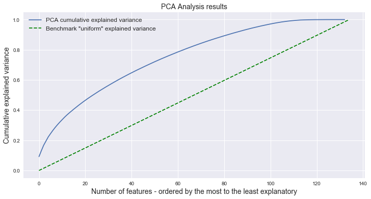

## Contents
{:.no_toc}
*  
{: toc}

## Goal

The goal of this section is to present the modeling strategy we have used to address our research question. We present the different models tested and compare their accuracy on different imputed datasets.

As our response variable is categorical, we will test different classification models paying special attention to the ensemble methods that tend to perform better in problems similar to ours. Since we have more than a 100 features to predict our response variable, dimensionality reduction techniques might be relevant to improve the models' accuracy.

## Modeling approach

In addition to the most used ensemble methods, we have decided also to test some traditional classification algorithms to check if the more complex ensemble methods actually improved accuracy. With this principle in mind, we have selected the following classification algorithms to be tested:
* Logistic classification
* k Nearest Neighbors (kNN)
* Decision Tree
* Bagging
* Ada Boost Classifier
* Random Forests

We have run those classifiers in 5 different datasets:
* Mean-imputed with features with no more than 30% of missing data
* Mean-imputed with features with no more than 50% of missing data
* Model-imputed with features with no more than 30% of missing data
* Model-imputed with features with no more than 50% of missing data
* Model-imputed with features with at least one data point from the original data

The accuracy of each model on the test sets of each dataset is summarized on the table below:

It is easy to check that "non-ensemble" methods did perform worse than the ensemble methods - as expected. Among the different ensemble methods, Bagging (using Decision Trees) showed stronger results than Boosting and Random Forests. It is also interesting to notice that the combination of Bagging and model-based imputation has proven to be the best combination to accurately predict Alzheimer's Disease on our patient base.

More details about the deployment of each model can be found on the "Model Comparison" subsection.

## Dimensionality reduction

We have performed Principal Component Analysis (PCA) to check if we could further improve our results. However, as shown on the "Imputation" section of this report, the correlation between features is not relevant. Therefore, PCA does not concentrate explanatory power on a few components. This finding is corroborated by the following plot:

## Impact of Data Aggregation

A relevant part of this work was to browse through hundreds of datasources provided by ADNI searching for additional features that could be embedded to the orignial ADNI Merge dataset. This effort has yielded significant results. As the plot below shows, running a similar Bagging model on the raw ADNI Merge dataset we have obtained a score XX p.p. lower than the one reported above.

IMAGE PROVING THE POINT ABOVE

We haven't scanned the whole ADNI repository - for example, we left images out of the scope of this project. Therefore, we believe that an important avenue for further improvement can be the addition of other features - like the results of image exams.
